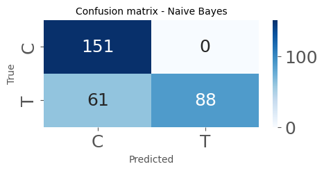

# Data import and cleaning

### Importing packages


```python
import glob
import itertools
import math
import os
import pickle
import shutil
import warnings
from datetime import date, datetime

import matplotlib.pyplot as plt
import numpy as np
import pandas as pd
import seaborn as sns
from scipy import optimize, stats
from scipy.optimize import curve_fit
from scipy.signal import argrelmax, find_peaks, hilbert, peak_widths
from scipy.stats import norm
from tabulate import tabulate
from tkinter import filedialog, Tk
from uncertainties import ufloat, unumpy
from uncertainties.umath import *

from lmfit import Minimizer, Model, Parameters, report_fit
from lmfit.models import LinearModel, SplitLorentzianModel

pd.set_option('display.max_rows', 50)
warnings.filterwarnings('ignore')
plt.style.use('ggplot')
%matplotlib inline
```

### Selecting data folder
#### Creates result folder for output saving


```python
root = Tk()
root.withdraw()
folder_path = filedialog.askdirectory()
print('Folder path: ', folder_path)

file_path = os.path.join(folder_path, '**/*.csv')
result_folder = 'res'
folder = os.path.join(folder_path, result_folder)

if os.path.isdir(folder):
    print('Result folder already exists, cleaning...\n (If an error occurs, consider remove Result folder manually.)')
    try:
        shutil.rmtree(folder)
    except OSError as e:
        print(f"Error: {folder} : {e.strerror}")
os.mkdir(folder)
print('Result folder created.')

print('---------------------------------------------------------------------------\n')
print('Result folder path: ', folder)
print('---------------------------------------------------------------------------\n')

### Logging
log_file = os.path.join(folder, 'log.txt')

with open(log_file, 'w') as f:
    f.write(f"{datetime.now()} - {folder}")
```

    Folder path:  C:/Users/aless/OneDrive/Documentos/UCS/Mestrado/Fase2/Notebooks/Analix/external-agents-detector/external-agents-detector/app/data/source_data
    Result folder already exists, cleaning...
     (If an error occurs, consider remove Result folder manually.)
    Result folder created.
    ---------------------------------------------------------------------------
    
    Result folder path:  C:/Users/aless/OneDrive/Documentos/UCS/Mestrado/Fase2/Notebooks/Analix/external-agents-detector/external-agents-detector/app/data/source_data\res
    ---------------------------------------------------------------------------
    
    

### Acquiring individual files addresses 
#### Splits into group, sensor and time, adding a hash column used for filtering data


```python
files = pd.DataFrame(glob.glob(file_path,recursive = True),columns = ['Path'])

def extract_info(path):
    group = path.split('/')[-1].split('\\')[-3]
    sensor = path.split('/')[-1].split('\\')[-2]
    k = path.rfind('\\')
    time = int(path[k + 1:].replace('.CSV', ''))
    hash = f"{group}-{sensor}-{time}"
    return pd.Series([group, sensor, time, hash])

files[['group', 'sensor', 'time', 'hash']] = files['Path'].apply(extract_info)

addresses = files.rename(columns={'Path': 'address'}).sort_values(
    by=['group','sensor','time','address'], 
    ignore_index=True, 
    ascending=True
)

print('---------------------------------------------------------------------------\n')

text = 'Analysis'

print(text + '\n')

print('---------------------------------------------------------------------------\n')

addresses.head()
```

    ---------------------------------------------------------------------------
    
    Analysis
    
    ---------------------------------------------------------------------------
    
    


<div>
<style scoped>
    .dataframe tbody tr th:only-of-type {
        vertical-align: middle;
    }

    .dataframe tbody tr th {
        vertical-align: top;
    }

    .dataframe thead th {
        text-align: right;
    }
</style>
<table border="1" class="dataframe">
  <thead>
    <tr style="text-align: right;">
      <th></th>
      <th>address</th>
      <th>group</th>
      <th>sensor</th>
      <th>time</th>
      <th>hash</th>
    </tr>
  </thead>
  <tbody>
    <tr>
      <th>0</th>
      <td>C:/Users/aless/OneDrive/Documentos/UCS/Mestrad...</td>
      <td>C</td>
      <td>1</td>
      <td>0</td>
      <td>C-1-0</td>
    </tr>
    <tr>
      <th>1</th>
      <td>C:/Users/aless/OneDrive/Documentos/UCS/Mestrad...</td>
      <td>C</td>
      <td>1</td>
      <td>5</td>
      <td>C-1-5</td>
    </tr>
    <tr>
      <th>2</th>
      <td>C:/Users/aless/OneDrive/Documentos/UCS/Mestrad...</td>
      <td>C</td>
      <td>1</td>
      <td>10</td>
      <td>C-1-10</td>
    </tr>
    <tr>
      <th>3</th>
      <td>C:/Users/aless/OneDrive/Documentos/UCS/Mestrad...</td>
      <td>C</td>
      <td>1</td>
      <td>15</td>
      <td>C-1-15</td>
    </tr>
    <tr>
      <th>4</th>
      <td>C:/Users/aless/OneDrive/Documentos/UCS/Mestrad...</td>
      <td>C</td>
      <td>1</td>
      <td>20</td>
      <td>C-1-20</td>
    </tr>
  </tbody>
</table>
</div>


#### Provides intel on quantity of files to be scanned


```python
space = len(addresses.index)
print('Space: ', space)
today = date.today()

### Logging

files_address_list = f'{datetime.now()} - Address list - OK \n'

with open(log_file, 'a') as f:
    f.write(files_address_list)

addresses = addresses.reset_index(drop=True).set_index('address')
```

    Space:  42
    

### Scans the addresses data frame, reads data of each file and assembles them into a combined data frame, that contains frequency and signal data
### Also, rescales frequency values to signal's order of magnitude (multiplied by $1 \times 10^{-6}$)


```python
def process_path(path):
    group = addresses.loc[path,'group']
    sensor = addresses.loc[path,'sensor']
    time = addresses.loc[path,'time']
    hashed = addresses.loc[path,'hash']

    df_import = pd.DataFrame(pd.read_csv(path, skiprows=range(0, 2)))
    df_import.drop(df_import.columns[2], axis=1, inplace=True)
    df_import.columns.values[0] = 'frequency'
    df_import.columns.values[1] = 'signal'
    df_import['group'] = group
    df_import['sensor'] = sensor                                          
    df_import['time'] = time
    df_import['hash'] = hashed

    return df_import

dfs = addresses.index.map(process_path)
combined_df = pd.concat(dfs, ignore_index=True)

combined_df['frequency'] = combined_df['frequency'] * 1.e-6
combined_df.head()
```


<div>
<style scoped>
    .dataframe tbody tr th:only-of-type {
        vertical-align: middle;
    }

    .dataframe tbody tr th {
        vertical-align: top;
    }

    .dataframe thead th {
        text-align: right;
    }
</style>
<table border="1" class="dataframe">
  <thead>
    <tr style="text-align: right;">
      <th></th>
      <th>frequency</th>
      <th>signal</th>
      <th>group</th>
      <th>sensor</th>
      <th>time</th>
      <th>hash</th>
    </tr>
  </thead>
  <tbody>
    <tr>
      <th>0</th>
      <td>0.4200</td>
      <td>0.557114</td>
      <td>C</td>
      <td>1</td>
      <td>0</td>
      <td>C-1-0</td>
    </tr>
    <tr>
      <th>1</th>
      <td>0.4202</td>
      <td>0.558667</td>
      <td>C</td>
      <td>1</td>
      <td>0</td>
      <td>C-1-0</td>
    </tr>
    <tr>
      <th>2</th>
      <td>0.4204</td>
      <td>0.560101</td>
      <td>C</td>
      <td>1</td>
      <td>0</td>
      <td>C-1-0</td>
    </tr>
    <tr>
      <th>3</th>
      <td>0.4206</td>
      <td>0.560883</td>
      <td>C</td>
      <td>1</td>
      <td>0</td>
      <td>C-1-0</td>
    </tr>
    <tr>
      <th>4</th>
      <td>0.4208</td>
      <td>0.561223</td>
      <td>C</td>
      <td>1</td>
      <td>0</td>
      <td>C-1-0</td>
    </tr>
  </tbody>
</table>
</div>


### Exports combined and addresses data frames to results folder


```python
datasets_export = f'{str(datetime.now())} - Combined and address datasets - EXPORTED \n'

with open(log_file, 'a') as f:
    f.write(datasets_export)
    f.close()
    
combined_df.to_csv(folder + '/combined_df.csv', sep=';', index=False)
addresses.to_csv(folder + '/addresses.csv', sep=';', index=False)
```

# Defining functions

### Split Lorentzian funcion
#### Function used to fit data to model

$$
f(x; A, \mu, \sigma, \sigma_r) = \frac{2 A}{\pi (\sigma+\sigma_r)} \big[\frac{\sigma^2}{(x - \mu)^2 + \sigma^2} * H(\mu-x) + \frac{\sigma_r^2}{(x - \mu)^2 + \sigma_r^2} * H(x-\mu)\big] + (m x + b)
$$

### Applies fitting model (Lorentzian) to each experimental dataset, retrieving a evaluation dataset based on the model. After fitting, applies an optimization function over a Monte Carlo Simulation to find the interesting point: the minimized frequency used to evaluate delocation on passing time of experiment


#### For each instance of time, plots original data, accuracy rate between Monte Carlo Simulation average frequency and minimized average frequency, and fitted curve over original data, pinpointing those values alongside minimal point from original data.


```python
def SplitLorentzianFunc(x, aux):
    # Calculate the amplitude of the Lorentzian function
    amplitude = ((2 * aux[0]) / (np.pi * (aux[2] + aux[3])))
    
    # Calculate the Lorentzian function for the lower and upper halves
    lower_half = ((aux[2] ** 2) / (((x - aux[1]) ** 2) + aux[2] ** 2))
    upper_half = ((aux[3] ** 2) / (((x - aux[1]) ** 2) + aux[3] ** 2))
    
    # Calculate the Heaviside step function for the lower and upper halves
    step_lower = np.heaviside(aux[1] - x, 0)
    step_upper = np.heaviside(x - aux[1], 0)
    
    # Calculate the linear function
    linear_func = (aux[4] * x + aux[5])

    # Return the sum of the Lorentzian function and the linear function
    return (amplitude * ((lower_half * step_lower) + (upper_half * step_upper))) + linear_func

def create_evaluate_df(x_eval, y_eval, hashed):
    evaluate_df = pd.DataFrame(x_eval, columns=['x_eval'])
    evaluate_df['y_eval'] = y_eval
    evaluate_df['hash'] = hashed
    return evaluate_df


def process_data(combined_df, log_file):
    unique_hash = combined_df.hash.unique()
    dfs_params = []
    dfs_eval = []
    frequency_shift = []

    for i in unique_hash:
        hashed = i
        xy0 = combined_df[['frequency','signal']].loc[combined_df['hash'] == hashed]
        xy0 = xy0.reset_index(drop=True)

        interval = 13
        min_value_idx = xy0.loc[xy0['signal'] == xy0['signal'].min()].index[0]
        idx = range(min_value_idx - interval, min_value_idx + interval)

        x = np.array(xy0['frequency'])[idx]
        y = np.array(xy0['signal'])[idx]
        
        # Model parametrization
        peak = SplitLorentzianModel() #prefix='slm_')
        linemod1 = LinearModel() #prefix='lm1_')
        #linemod2 = LinearModel(prefix='lm2_')
        pars = Parameters()
        pars += peak.guess(y, x=x)
        pars += linemod1.make_params(intercept=y.min(), slope=0)
        #pars += linemod2.make_params(intercept=y.min(), slope=0)
        mod = linemod1 + peak # + linemod2

        # Fit model
        result = mod.fit(y, pars, x=x)
        
        # Printing report and related information
        print(result.fit_report(min_correl=0.25))

        ### Logging

        lmfit_report = f'\n{str(datetime.now())} - LMFIT result report {i} \n' + str(result.fit_report(min_correl=0.25))

        with open(log_file, 'a') as f:
            f.write(lmfit_report)
        
        # Determining the point to be evaluated on the frequency shift   
        x_eval = np.linspace(min(x), max(x), num = 10000)
        y_eval = result.eval(result.params, x=x_eval)

        evaluate_df = pd.DataFrame(x_eval, columns=['x_eval'])
        evaluate_df['y_eval'] = y_eval
        evaluate_df['hash'] = hashed
        
        plot_x = evaluate_df['x_eval'].loc[evaluate_df['y_eval'] == evaluate_df['y_eval'].min()]
        plot_y = evaluate_df['y_eval'].loc[evaluate_df['y_eval'] == evaluate_df['y_eval'].min()]

        # Min point
        minimized_freq = []

        n = 1000
        
        for j in range(n):
            aux = np.array([
                np.random.normal( # 0
                    loc=result.params['amplitude'].value, 
                    scale=result.params['amplitude'].stderr
                ),
                np.random.normal( # 1
                    loc=result.params['center'].value, 
                    scale=result.params['center'].stderr
                ), 
                np.random.normal( # 2
                    loc=result.params['sigma'].value, 
                    scale=result.params['sigma'].stderr
                ),
                np.random.normal( # 3
                    loc=result.params['sigma_r'].value, 
                    scale=result.params['sigma_r'].stderr
                ),
                np.random.normal( # 4
                    loc=result.params['slope'].value, 
                    scale=result.params['slope'].stderr
                ),
                np.random.normal( # 5
                    loc=result.params['intercept'].value, 
                    scale=result.params['intercept'].stderr
                    )
                ])

            find_fmin = optimize.fmin(
                lambda x: SplitLorentzianFunc(x, aux),
                xy0['frequency'][min_value_idx], 
                full_output=True,
                disp=0
            )
    
            find_fmin_point = np.array([find_fmin[0].item(), find_fmin[1]])
    
            minimized_freq.append(find_fmin[0])
    
            j = j + 1

        minimized_freq = np.concatenate(minimized_freq).ravel()
        minimized_freq = minimized_freq[(minimized_freq > 0.43) & (minimized_freq < 0.444)]
        
        minimized_freq_mean = np.array(minimized_freq).mean()
        minimized_freq_std = np.array(minimized_freq).std()
        minimized_freq_std_err = minimized_freq_std / np.sqrt(n)
        freq = ufloat(minimized_freq_mean,minimized_freq_std)*1e6
        pfloat = minimized_freq_mean/plot_x.values.item()
        
        values_lst = [
            minimized_freq_mean, 
            minimized_freq_std, 
            minimized_freq_std_err,
            freq,
            hashed
        ]
        
        dfs_params.append(values_lst)
        
        print('\n')
        print('----- Results -----')
        
        def create_result_table(minimized_freq_mean, minimized_freq_std, minimized_freq_std_err, freq, pfloat):
            result_table = [
                ['Optimized frequency mean (fmin)', minimized_freq_mean],
                ['Optimized frequency standard deviation (fmin)', minimized_freq_std],
                ['Optimized frequency standard error (fmin)', minimized_freq_std_err],
                ['Optimized frequency mean with uncertainties', freq],
                ['Accuracy of estimated frequency mean / SMC',pfloat]
            ]
            return result_table
        
        result_table = create_result_table(minimized_freq_mean, minimized_freq_std, minimized_freq_std_err, freq, pfloat)
        print(str(tabulate(result_table)))
        print('\n')
        
        ### Logging
        
        variables_report = f'{datetime.now()} - Results {i} \n' + str(tabulate(result_table)) + '\n'
        
        with open(log_file, 'a') as f:
            f.write(variables_report)
            
        # PLOTING
    
        # Primary data
        plt.figure()
        plt.rcParams.update({'font.size': 18})
        ax = xy0.plot(
            x = 'frequency', 
            y = 'signal', 
            kind='scatter',
            figsize = (16,4), 
            grid=True, 
            legend=True
        )
        ax.set_title(label = 'Initial data ' + hashed, pad=20, fontdict={'fontsize':20})
        ax.set_xlabel('Frequency [MHz]')
        ax.set_ylabel('Signal')
        plt.show()
        print('\n')
        
        #Accuracy between minimized frequency mean and MCS frequency mean
        xfloat = np.linspace(0.98, 1.02, num = 100)
        yfloat = np.linspace(0, 0, num = 100)
        fig = plt.figure(figsize = (16,4))
        plt.plot(xfloat,yfloat)
        plt.plot(pfloat,0,color='k',marker='|', markersize = 15, label='Optimized frequency mean LMFIT / Optimized frequency mean SMC')
        plt.text(
            x=pfloat, 
            y=0.02, 
            s='Accuracy:    {:.8}'.format(pfloat), 
            horizontalalignment='right',
            verticalalignment='baseline'
        ) 
        plt.legend(loc='best')
        plt.title('Accuracy between frequency mean LMFIT and SMC optimized frequency mean', fontsize=20)
        plt.show()
        
        # Fit model data plot    
        fig = plt.figure(figsize = (16,8))
        plt.plot(x, y, 'o')
        plt.plot(x_eval, y_eval, 'r-', label='Best fit')
    
        plt.plot(
            xy0['frequency'][min_value_idx],
            xy0['signal'][min_value_idx],
            marker = 'D',
            color='orange', 
            markersize=8,
            label='Original data minimum frequency'
        )
        
        labels = evaluate_df['hash'].loc[evaluate_df['y_eval'] == evaluate_df['y_eval'].min()]
        
        plt.plot(
            plot_x, 
            plot_y, 
            label='Lorentz minimum frequency (LMFIT)', 
            color='green', 
            marker='s', 
            markersize=8
        )
        plt.plot(
            minimized_freq_mean, 
            plot_y, 
            label='SMC average frequency', 
            color='k', 
            marker='o', 
            markersize=8
        )
        plt.xlabel('Frequency [MHz]')
        plt.ylabel('Signal')
        plt.legend(loc='best')
        plt.title('Signal vs frequency: Lorentz function fit and points of interest '+ hashed, fontsize=20)
        plt.grid(True)
        plt.show()

        global eval_df
        
        dfs_eval.append(evaluate_df)
        
        print('Eval appended.')
        print('--------------------------------\n')
    eval_df = pd.concat(dfs_eval, ignore_index=True)
    param_df = pd.DataFrame(
        dfs_params, 
        columns=[
            'minimized_freq_mean',
            'minimized_freq_std',
            'minimized_freq_std_err',
            'freq_with_unc', 
            'hash'
        ]
    )
    return eval_df, param_df
```

# Running the model builder


```python
eval_df, param_df = process_data(combined_df, log_file)
```

    [[Model]]
        (Model(linear) + Model(split_lorentzian))
    [[Fit Statistics]]
        # fitting method   = leastsq
        # function evals   = 57
        # data points      = 26
        # variables        = 6
        chi-square         = 1.0762e-06
        reduced chi-square = 5.3809e-08
        Akaike info crit   = -430.004968
        Bayesian info crit = -422.456389
        R-squared          = 0.99987217
    [[Variables]]
        amplitude: -6.5548e-04 +/- 1.1665e-05 (1.78%) (init = 0.000562349)
        center:     0.43904624 +/- 6.0215e-06 (0.00%) (init = 0.4389636)
        sigma:      0.00229330 +/- 3.7278e-05 (1.63%) (init = 0.0025)
        sigma_r:    0.00216150 +/- 2.9597e-05 (1.37%) (init = 0.0025)
        fwhm:       0.00445480 +/- 4.0914e-05 (0.92%) == 'sigma+sigma_r'
        height:    -0.09367237 +/- 8.2562e-04 (0.88%) == '2*amplitude/3.1415927/max(0.0000000, (sigma+sigma_r))'
        slope:     -4.08629682 +/- 0.23477583 (5.75%) (init = 0)
        intercept:  2.36979826 +/- 0.10330544 (4.36%) (init = 0.4819135)
    [[Correlations]] (unreported correlations are < 0.250)
        C(slope, intercept)     = -1.0000
        C(sigma, intercept)     = +0.8389
        C(sigma, slope)         = -0.8350
        C(amplitude, sigma)     = -0.7051
        C(sigma_r, slope)       = +0.6686
        C(sigma_r, intercept)   = -0.6631
        C(center, sigma_r)      = -0.5404
        C(amplitude, sigma_r)   = -0.4793
        C(center, sigma)        = +0.4013
        C(center, slope)        = -0.3272
        C(center, intercept)    = +0.3261
        C(amplitude, intercept) = -0.2817
        C(amplitude, slope)     = +0.2739
        C(sigma, sigma_r)       = -0.2681
    
    
    ----- Results -----
    ---------------------------------------------  ----------------------
    Optimized frequency mean (fmin)                0.4391199030496987
    Optimized frequency standard deviation (fmin)  2.1337644445234708e-05
    Optimized frequency standard error (fmin)      6.747555634978163e-07
    Optimized frequency mean with uncertainties    439120+/-21
    Accuracy of estimated frequency mean / SMC     0.9999343005633774
    ---------------------------------------------  ----------------------
    
    
    


    <Figure size 640x480 with 0 Axes>


    

    


    
    
    


    

    


    

    


    Eval appended.
    --------------------------------
    
    [[Model]]
        (Model(linear) + Model(split_lorentzian))
    [[Fit Statistics]]
        # fitting method   = leastsq
        # function evals   = 57
        # data points      = 26
        # variables        = 6
        chi-square         = 1.1045e-06
        reduced chi-square = 5.5225e-08
        Akaike info crit   = -429.329741
        Bayesian info crit = -421.781162
        R-squared          = 0.99986509
    [[Variables]]
        amplitude: -6.3297e-04 +/- 1.1302e-05 (1.79%) (init = 0.0005546912)
        center:     0.43900386 +/- 6.1783e-06 (0.00%) (init = 0.4389636)
        sigma:      0.00222350 +/- 3.6799e-05 (1.66%) (init = 0.0025)
        sigma_r:    0.00216616 +/- 2.9776e-05 (1.37%) (init = 0.0025)
        fwhm:       0.00438966 +/- 4.0547e-05 (0.92%) == 'sigma+sigma_r'
        height:    -0.09179734 +/- 8.1081e-04 (0.88%) == '2*amplitude/3.1415927/max(0.0000000, (sigma+sigma_r))'
        slope:     -3.94616438 +/- 0.23217211 (5.88%) (init = 0)
        intercept:  2.30646523 +/- 0.10217323 (4.43%) (init = 0.4821969)
    [[Correlations]] (unreported correlations are < 0.250)
        C(slope, intercept)     = -1.0000
        C(sigma, intercept)     = +0.8410
        C(sigma, slope)         = -0.8371
        C(amplitude, sigma)     = -0.7074
        C(sigma_r, slope)       = +0.6665
        C(sigma_r, intercept)   = -0.6609
        C(center, sigma_r)      = -0.5520
        C(amplitude, sigma_r)   = -0.4721
        C(center, sigma)        = +0.4267
        C(center, slope)        = -0.3511
        C(center, intercept)    = +0.3500
        C(amplitude, intercept) = -0.2923
        C(amplitude, slope)     = +0.2846
        C(sigma, sigma_r)       = -0.2723
    
    
    ----- Results -----
    ---------------------------------------------  ----------------------------------
    Optimized frequency mean (fmin)                0.43911421875000006
    Optimized frequency standard deviation (fmin)  5.551115123125783e-17
    Optimized frequency standard error (fmin)      1.7554167342883504e-18
    Optimized frequency mean with uncertainties    439114.21875000006+/-0.00000000006
    Accuracy of estimated frequency mean / SMC     1.0000204238617891
    ---------------------------------------------  ----------------------------------
    
    
    


    <Figure size 640x480 with 0 Axes>


    

    


    
    
    


    

    


    

    


    Eval appended.
    --------------------------------
    
    [[Model]]
        (Model(linear) + Model(split_lorentzian))
    [[Fit Statistics]]
        # fitting method   = leastsq
        # function evals   = 50
        # data points      = 26
        # variables        = 6
        chi-square         = 1.3471e-06
        reduced chi-square = 6.7355e-08
        Akaike info crit   = -424.167054
        Bayesian info crit = -416.618475
        R-squared          = 0.99983315
    [[Variables]]
        amplitude: -6.3669e-04 +/- 1.2865e-05 (2.02%) (init = 0.0005471034)
        center:     0.43904097 +/- 6.8769e-06 (0.00%) (init = 0.4389636)
        sigma:      0.00228377 +/- 4.2402e-05 (1.86%) (init = 0.0025)
        sigma_r:    0.00214615 +/- 3.3191e-05 (1.55%) (init = 0.0025)
        fwhm:       0.00442993 +/- 4.6321e-05 (1.05%) == 'sigma+sigma_r'
        height:    -0.09149793 +/- 9.1336e-04 (1.00%) == '2*amplitude/3.1415927/max(0.0000000, (sigma+sigma_r))'
        slope:     -3.98584047 +/- 0.26048592 (6.54%) (init = 0)
        intercept:  2.32417388 +/- 0.11463291 (4.93%) (init = 0.4825728)
    [[Correlations]] (unreported correlations are < 0.250)
        C(slope, intercept)     = -1.0000
        C(sigma, intercept)     = +0.8430
        C(sigma, slope)         = -0.8392
        C(amplitude, sigma)     = -0.7116
        C(sigma_r, slope)       = +0.6618
        C(sigma_r, intercept)   = -0.6562
        C(center, sigma_r)      = -0.5501
        C(amplitude, sigma_r)   = -0.4713
        C(center, sigma)        = +0.4046
        C(center, slope)        = -0.3341
        C(center, intercept)    = +0.3329
        C(amplitude, intercept) = -0.2991
        C(amplitude, slope)     = +0.2914
        C(sigma, sigma_r)       = -0.2679
    
    
    ----- Results -----
    ---------------------------------------------  ---------------------
    Optimized frequency mean (fmin)                0.4391153574391593
    Optimized frequency standard deviation (fmin)  9.817411392213743e-06
    Optimized frequency standard error (fmin)      3.104538072628007e-07
    Optimized frequency mean with uncertainties    439115+/-10
    Accuracy of estimated frequency mean / SMC     0.9999398901698433
    ---------------------------------------------  ---------------------
    
    
    


    <Figure size 640x480 with 0 Axes>


    

    


    
    
    


    

    


    

    


    Eval appended.
    --------------------------------
    
    [[Model]]
        (Model(linear) + Model(split_lorentzian))
    [[Fit Statistics]]
        # fitting method   = leastsq
        # function evals   = 94
        # data points      = 26
        # variables        = 6
        chi-square         = 1.5013e-06
        reduced chi-square = 7.5066e-08
        Akaike info crit   = -421.348875
        Bayesian info crit = -413.800296
        R-squared          = 0.99981524
    [[Variables]]
        amplitude: -6.6656e-04 +/- 1.4569e-05 (2.19%) (init = 0.0005546226)
        center:     0.43903344 +/- 7.1950e-06 (0.00%) (init = 0.43878)
        sigma:      0.00231163 +/- 4.5548e-05 (1.97%) (init = 0.0025)
        sigma_r:    0.00222429 +/- 3.7195e-05 (1.67%) (init = 0.0025)
        fwhm:       0.00453592 +/- 5.0591e-05 (1.12%) == 'sigma+sigma_r'
        height:    -0.09355201 +/- 0.00102309 (1.09%) == '2*amplitude/3.1415927/max(0.0000000, (sigma+sigma_r))'
        slope:     -3.99770508 +/- 0.28646903 (7.17%) (init = 0)
        intercept:  2.33163035 +/- 0.12604040 (5.41%) (init = 0.4826252)
    [[Correlations]] (unreported correlations are < 0.250)
        C(slope, intercept)     = -1.0000
        C(sigma, intercept)     = +0.8339
        C(sigma, slope)         = -0.8298
        C(amplitude, sigma)     = -0.6991
        C(sigma_r, slope)       = +0.6758
        C(sigma_r, intercept)   = -0.6702
        C(center, sigma_r)      = -0.5114
        C(amplitude, sigma_r)   = -0.4900
        C(center, sigma)        = +0.3801
        C(center, slope)        = -0.2962
        C(center, intercept)    = +0.2951
        C(sigma, sigma_r)       = -0.2652
        C(amplitude, intercept) = -0.2624
        C(amplitude, slope)     = +0.2544
    
    
    ----- Results -----
    ---------------------------------------------  ----------------------
    Optimized frequency mean (fmin)                0.43911605856233255
    Optimized frequency standard deviation (fmin)  1.2427247974648038e-05
    Optimized frequency standard error (fmin)      3.929840864760223e-07
    Optimized frequency mean with uncertainties    439116+/-12
    Accuracy of estimated frequency mean / SMC     0.9999460412935735
    ---------------------------------------------  ----------------------
    
    
    


    <Figure size 640x480 with 0 Axes>


    

    


    
    
    


    

    


    

    


    Eval appended.
    --------------------------------
    
    [[Model]]
        (Model(linear) + Model(split_lorentzian))
    [[Fit Statistics]]
        # fitting method   = leastsq
        # function evals   = 138
        # data points      = 26
        # variables        = 6
        chi-square         = 1.1410e-06
        reduced chi-square = 5.7051e-08
        Akaike info crit   = -428.483977
        Bayesian info crit = -420.935397
        R-squared          = 0.99987786
    [[Variables]]
        amplitude: -6.2340e-04 +/- 1.1138e-05 (1.79%) (init = 0.0005991456)
        center:     0.43902379 +/- 6.3412e-06 (0.00%) (init = 0.43826)
        sigma:      0.00224340 +/- 3.2593e-05 (1.45%) (init = 0.0025)
        sigma_r:    0.00213329 +/- 3.4928e-05 (1.64%) (init = 0.0025)
        fwhm:       0.00437669 +/- 4.0456e-05 (0.92%) == 'sigma+sigma_r'
        height:    -0.09067727 +/- 8.0344e-04 (0.89%) == '2*amplitude/3.1415927/max(0.0000000, (sigma+sigma_r))'
        slope:     -4.25421348 +/- 0.23227080 (5.46%) (init = 0)
        intercept:  2.44113754 +/- 0.10180909 (4.17%) (init = 0.4823229)
    [[Correlations]] (unreported correlations are < 0.250)
        C(slope, intercept)   = -1.0000
        C(sigma_r, slope)     = +0.8053
        C(sigma_r, intercept) = -0.8009
        C(sigma, intercept)   = +0.7203
        C(sigma, slope)       = -0.7151
        C(amplitude, sigma_r) = -0.6560
        C(amplitude, sigma)   = -0.5227
        C(center, sigma)      = +0.5193
        C(center, sigma_r)    = -0.4778
        C(center, intercept)  = +0.3733
        C(center, slope)      = -0.3728
        C(sigma, sigma_r)     = -0.2836
    
    
    ----- Results -----
    ---------------------------------------------  ----------------------
    Optimized frequency mean (fmin)                0.4391065193046075
    Optimized frequency standard deviation (fmin)  3.6739445769401746e-05
    Optimized frequency standard error (fmin)      1.1618032860354681e-06
    Optimized frequency mean with uncertainties    (4.3911+/-0.0004)e+05
    Accuracy of estimated frequency mean / SMC     0.9999436300163072
    ---------------------------------------------  ----------------------
    
    
    


    <Figure size 640x480 with 0 Axes>


    

    


    
    
    


    

    


    

    


    Eval appended.
    --------------------------------
    
    [[Model]]
        (Model(linear) + Model(split_lorentzian))
    [[Fit Statistics]]
        # fitting method   = leastsq
        # function evals   = 71
        # data points      = 26
        # variables        = 6
        chi-square         = 8.0910e-07
        reduced chi-square = 4.0455e-08
        Akaike info crit   = -437.421448
        Bayesian info crit = -429.872869
        R-squared          = 0.99990153
    [[Variables]]
        amplitude: -6.3327e-04 +/- 9.5193e-06 (1.50%) (init = 0.0005531976)
        center:     0.43902050 +/- 5.2940e-06 (0.00%) (init = 0.4389636)
        sigma:      0.00218999 +/- 2.9929e-05 (1.37%) (init = 0.0025)
        sigma_r:    0.00220663 +/- 2.7002e-05 (1.22%) (init = 0.0025)
        fwhm:       0.00439662 +/- 3.4203e-05 (0.78%) == 'sigma+sigma_r'
        height:    -0.09169551 +/- 6.8218e-04 (0.74%) == '2*amplitude/3.1415927/max(0.0000000, (sigma+sigma_r))'
        slope:     -3.51184301 +/- 0.19711719 (5.61%) (init = 0)
        intercept:  2.11612080 +/- 0.08667011 (4.10%) (init = 0.4826499)
    [[Correlations]] (unreported correlations are < 0.250)
        C(slope, intercept)   = -1.0000
        C(sigma, intercept)   = +0.8118
        C(sigma, slope)       = -0.8075
        C(sigma_r, slope)     = +0.7118
        C(sigma_r, intercept) = -0.7065
        C(amplitude, sigma)   = -0.6587
        C(center, sigma_r)    = -0.5248
        C(amplitude, sigma_r) = -0.5217
        C(center, sigma)      = +0.4608
        C(center, slope)      = -0.3645
        C(center, intercept)  = +0.3639
        C(sigma, sigma_r)     = -0.2815
    
    
    ----- Results -----
    ---------------------------------------------  ----------------------------------
    Optimized frequency mean (fmin)                0.4391142187500001
    Optimized frequency standard deviation (fmin)  1.1102230246251565e-16
    Optimized frequency standard error (fmin)      3.510833468576701e-18
    Optimized frequency mean with uncertainties    439114.21875000012+/-0.00000000011
    Accuracy of estimated frequency mean / SMC     0.9999999255885177
    ---------------------------------------------  ----------------------------------
    
    
    


    <Figure size 640x480 with 0 Axes>


    

    


    
    
    


    

    


    

    


    Eval appended.
    --------------------------------
    
    [[Model]]
        (Model(linear) + Model(split_lorentzian))
    [[Fit Statistics]]
        # fitting method   = leastsq
        # function evals   = 57
        # data points      = 26
        # variables        = 6
        chi-square         = 1.4441e-06
        reduced chi-square = 7.2206e-08
        Akaike info crit   = -422.358810
        Bayesian info crit = -414.810231
        R-squared          = 0.99982405
    [[Variables]]
        amplitude: -6.5348e-04 +/- 1.3590e-05 (2.08%) (init = 0.0005576473)
        center:     0.43901296 +/- 7.0248e-06 (0.00%) (init = 0.4389636)
        sigma:      0.00225822 +/- 4.2881e-05 (1.90%) (init = 0.0025)
        sigma_r:    0.00220732 +/- 3.5378e-05 (1.60%) (init = 0.0025)
        fwhm:       0.00446554 +/- 4.7658e-05 (1.07%) == 'sigma+sigma_r'
        height:    -0.09316178 +/- 9.6511e-04 (1.04%) == '2*amplitude/3.1415927/max(0.0000000, (sigma+sigma_r))'
        slope:     -3.88264692 +/- 0.27323156 (7.04%) (init = 0)
        intercept:  2.28023284 +/- 0.12022180 (5.27%) (init = 0.4822829)
    [[Correlations]] (unreported correlations are < 0.250)
        C(slope, intercept)     = -1.0000
        C(sigma, intercept)     = +0.8349
        C(sigma, slope)         = -0.8309
        C(amplitude, sigma)     = -0.6990
        C(sigma_r, slope)       = +0.6757
        C(sigma_r, intercept)   = -0.6701
        C(center, sigma_r)      = -0.5284
        C(amplitude, sigma_r)   = -0.4853
        C(center, sigma)        = +0.4078
        C(center, slope)        = -0.3253
        C(center, intercept)    = +0.3243
        C(sigma, sigma_r)       = -0.2700
        C(amplitude, intercept) = -0.2669
        C(amplitude, slope)     = +0.2590
    
    
    ----- Results -----
    ---------------------------------------------  ----------------------------------
    Optimized frequency mean (fmin)                0.43911421875000006
    Optimized frequency standard deviation (fmin)  5.551115123125783e-17
    Optimized frequency standard error (fmin)      1.7554167342883504e-18
    Optimized frequency mean with uncertainties    439114.21875000006+/-0.00000000006
    Accuracy of estimated frequency mean / SMC     0.9999987868201976
    ---------------------------------------------  ----------------------------------
    
    
    


    <Figure size 640x480 with 0 Axes>


    

    


    
    
    


    

    


    

    


    Eval appended.
    --------------------------------
    
    [[Model]]
        (Model(linear) + Model(split_lorentzian))
    [[Fit Statistics]]
        # fitting method   = leastsq
        # function evals   = 159
        # data points      = 26
        # variables        = 6
        chi-square         = 1.3535e-06
        reduced chi-square = 6.7673e-08
        Akaike info crit   = -424.044351
        Bayesian info crit = -416.495771
        R-squared          = 0.99974542
    [[Variables]]
        amplitude: -5.1885e-04 +/- 1.3947e-05 (2.69%) (init = 0.0004491329)
        center:     0.43941090 +/- 8.8333e-06 (0.00%) (init = 0.4387333)
        sigma:      0.00229758 +/- 4.7701e-05 (2.08%) (init = 0.0025)
        sigma_r:    0.00225823 +/- 5.4514e-05 (2.41%) (init = 0.0025)
        fwhm:       0.00455582 +/- 6.2050e-05 (1.36%) == 'sigma+sigma_r'
        height:    -0.07250313 +/- 9.8273e-04 (1.36%) == '2*amplitude/3.1415927/max(0.0000000, (sigma+sigma_r))'
        slope:     -2.60193765 +/- 0.27375212 (10.52%) (init = 0)
        intercept:  1.71631244 +/- 0.12004979 (6.99%) (init = 0.5004004)
    [[Correlations]] (unreported correlations are < 0.250)
        C(slope, intercept)   = -1.0000
        C(sigma_r, slope)     = +0.8191
        C(sigma_r, intercept) = -0.8148
        C(sigma, intercept)   = +0.6980
        C(sigma, slope)       = -0.6925
        C(amplitude, sigma_r) = -0.6835
        C(amplitude, sigma)   = -0.5057
        C(center, sigma)      = +0.4859
        C(center, sigma_r)    = -0.3952
        C(center, intercept)  = +0.2941
        C(center, slope)      = -0.2933
        C(sigma, sigma_r)     = -0.2686
    
    
    ----- Results -----
    ---------------------------------------------  ----------------------
    Optimized frequency mean (fmin)                0.4394887647026362
    Optimized frequency standard deviation (fmin)  1.5621109062379616e-05
    Optimized frequency standard error (fmin)      4.939828421501687e-07
    Optimized frequency mean with uncertainties    439489+/-16
    Accuracy of estimated frequency mean / SMC     0.9999681331374028
    ---------------------------------------------  ----------------------
    
    
    


    <Figure size 640x480 with 0 Axes>


    

    


    
    
    


    

    


    

    


    Eval appended.
    --------------------------------
    
    [[Model]]
        (Model(linear) + Model(split_lorentzian))
    [[Fit Statistics]]
        # fitting method   = leastsq
        # function evals   = 117
        # data points      = 26
        # variables        = 6
        chi-square         = 1.2145e-06
        reduced chi-square = 6.0723e-08
        Akaike info crit   = -426.861844
        Bayesian info crit = -419.313265
        R-squared          = 0.99975723
    [[Variables]]
        amplitude: -5.2616e-04 +/- 1.3910e-05 (2.64%) (init = 0.0004315321)
        center:     0.43937390 +/- 8.4944e-06 (0.00%) (init = 0.43898)
        sigma:      0.00233620 +/- 4.8791e-05 (2.09%) (init = 0.0025)
        sigma_r:    0.00230573 +/- 5.3129e-05 (2.30%) (init = 0.0025)
        fwhm:       0.00464193 +/- 6.1805e-05 (1.33%) == 'sigma+sigma_r'
        height:    -0.07216055 +/- 9.6641e-04 (1.34%) == '2*amplitude/3.1415927/max(0.0000000, (sigma+sigma_r))'
        slope:     -2.62460377 +/- 0.26695339 (10.17%) (init = 0)
        intercept:  1.72671908 +/- 0.11713872 (6.78%) (init = 0.5014881)
    [[Correlations]] (unreported correlations are < 0.250)
        C(slope, intercept)   = -1.0000
        C(sigma_r, slope)     = +0.7998
        C(sigma_r, intercept) = -0.7951
        C(sigma, intercept)   = +0.7229
        C(sigma, slope)       = -0.7174
        C(amplitude, sigma_r) = -0.6557
        C(amplitude, sigma)   = -0.5398
        C(center, sigma)      = +0.4445
        C(center, sigma_r)    = -0.3819
        C(sigma, sigma_r)     = -0.2668
        C(center, intercept)  = +0.2626
        C(center, slope)      = -0.2621
    
    
    ----- Results -----
    ---------------------------------------------  ----------------------
    Optimized frequency mean (fmin)                0.43948433914974616
    Optimized frequency standard deviation (fmin)  1.1176761932320831e-05
    Optimized frequency standard error (fmin)      3.534402457159853e-07
    Optimized frequency mean with uncertainties    439484+/-11
    Accuracy of estimated frequency mean / SMC     1.0000308827663984
    ---------------------------------------------  ----------------------
    
    
    


    <Figure size 640x480 with 0 Axes>


    

    


    
    
    


    

    


    

    


    Eval appended.
    --------------------------------
    
    [[Model]]
        (Model(linear) + Model(split_lorentzian))
    [[Fit Statistics]]
        # fitting method   = leastsq
        # function evals   = 124
        # data points      = 26
        # variables        = 6
        chi-square         = 2.0922e-06
        reduced chi-square = 1.0461e-07
        Akaike info crit   = -412.720543
        Bayesian info crit = -405.171964
        R-squared          = 0.99957849
    [[Variables]]
        amplitude: -5.2661e-04 +/- 1.8195e-05 (3.46%) (init = 0.0004319237)
        center:     0.43936263 +/- 1.1150e-05 (0.00%) (init = 0.43898)
        sigma:      0.00240346 +/- 6.9688e-05 (2.90%) (init = 0.0025)
        sigma_r:    0.00224438 +/- 6.4416e-05 (2.87%) (init = 0.0025)
        fwhm:       0.00464784 +/- 8.1192e-05 (1.75%) == 'sigma+sigma_r'
        height:    -0.07213023 +/- 0.00125886 (1.75%) == '2*amplitude/3.1415927/max(0.0000000, (sigma+sigma_r))'
        slope:     -3.10004028 +/- 0.34953660 (11.28%) (init = 0)
        intercept:  1.93556793 +/- 0.15357762 (7.93%) (init = 0.5013921)
    [[Correlations]] (unreported correlations are < 0.250)
        C(slope, intercept)   = -1.0000
        C(sigma, intercept)   = +0.7781
        C(sigma, slope)       = -0.7732
        C(sigma_r, slope)     = +0.7486
        C(sigma_r, intercept) = -0.7434
        C(amplitude, sigma)   = -0.6131
        C(amplitude, sigma_r) = -0.5838
        C(center, sigma_r)    = -0.4353
        C(center, sigma)      = +0.3924
        C(sigma, sigma_r)     = -0.2688
        C(center, slope)      = -0.2660
        C(center, intercept)  = +0.2657
    
    
    ----- Results -----
    ---------------------------------------------  ----------------------
    Optimized frequency mean (fmin)                0.43947723828124996
    Optimized frequency standard deviation (fmin)  2.5746093749995367e-05
    Optimized frequency standard error (fmin)      8.141629710221109e-07
    Optimized frequency mean with uncertainties    439477+/-26
    Accuracy of estimated frequency mean / SMC     1.0000135871329572
    ---------------------------------------------  ----------------------
    
    
    


    <Figure size 640x480 with 0 Axes>


    

    


    
    
    


    

    


    

    


    Eval appended.
    --------------------------------
    
    [[Model]]
        (Model(linear) + Model(split_lorentzian))
    [[Fit Statistics]]
        # fitting method   = leastsq
        # function evals   = 43
        # data points      = 26
        # variables        = 6
        chi-square         = 1.9785e-06
        reduced chi-square = 9.8923e-08
        Akaike info crit   = -414.173509
        Bayesian info crit = -406.624930
        R-squared          = 0.99955706
    [[Variables]]
        amplitude: -5.3070e-04 +/- 1.8440e-05 (3.47%) (init = 0.0004009722)
        center:     0.43935978 +/- 1.0832e-05 (0.00%) (init = 0.4393636)
        sigma:      0.00231459 +/- 7.2047e-05 (3.11%) (init = 0.0025)
        sigma_r:    0.00234018 +/- 5.9097e-05 (2.53%) (init = 0.0025)
        fwhm:       0.00465477 +/- 8.0766e-05 (1.74%) == 'sigma+sigma_r'
        height:    -0.07258227 +/- 0.00128762 (1.77%) == '2*amplitude/3.1415927/max(0.0000000, (sigma+sigma_r))'
        slope:     -2.51882681 +/- 0.34800571 (13.82%) (init = 0)
        intercept:  1.68064949 +/- 0.15333533 (9.12%) (init = 0.5016548)
    [[Correlations]] (unreported correlations are < 0.250)
        C(slope, intercept)     = -1.0000
        C(sigma, intercept)     = +0.8429
        C(sigma, slope)         = -0.8389
        C(amplitude, sigma)     = -0.7193
        C(sigma_r, slope)       = +0.6575
        C(sigma_r, intercept)   = -0.6516
        C(amplitude, sigma_r)   = -0.4760
        C(center, sigma_r)      = -0.4743
        C(center, sigma)        = +0.3240
        C(amplitude, intercept) = -0.3066
        C(amplitude, slope)     = +0.2987
        C(sigma, sigma_r)       = -0.2537
    
    
    ----- Results -----
    ---------------------------------------------  ----------------------
    Optimized frequency mean (fmin)                0.4394424736107545
    Optimized frequency standard deviation (fmin)  3.1892383422642756e-05
    Optimized frequency standard error (fmin)      1.0085257162694756e-06
    Optimized frequency mean with uncertainties    439442+/-32
    Accuracy of estimated frequency mean / SMC     0.999970936940842
    ---------------------------------------------  ----------------------
    
    
    


    <Figure size 640x480 with 0 Axes>


    

    


    
    
    


    

    


    

    


    Eval appended.
    --------------------------------
    
    [[Model]]
        (Model(linear) + Model(split_lorentzian))
    [[Fit Statistics]]
        # fitting method   = leastsq
        # function evals   = 131
        # data points      = 26
        # variables        = 6
        chi-square         = 1.1476e-06
        reduced chi-square = 5.7380e-08
        Akaike info crit   = -428.334291
        Bayesian info crit = -420.785712
        R-squared          = 0.99976749
    [[Variables]]
        amplitude: -5.2401e-04 +/- 1.3338e-05 (2.55%) (init = 0.0004330832)
        center:     0.43935401 +/- 8.2575e-06 (0.00%) (init = 0.43898)
        sigma:      0.00235119 +/- 4.9091e-05 (2.09%) (init = 0.0025)
        sigma_r:    0.00228137 +/- 4.9499e-05 (2.17%) (init = 0.0025)
        fwhm:       0.00463256 +/- 5.9563e-05 (1.29%) == 'sigma+sigma_r'
        height:    -0.07201128 +/- 9.2622e-04 (1.29%) == '2*amplitude/3.1415927/max(0.0000000, (sigma+sigma_r))'
        slope:     -2.76416597 +/- 0.25747378 (9.31%) (init = 0)
        intercept:  1.78779612 +/- 0.11306082 (6.32%) (init = 0.5011047)
    [[Correlations]] (unreported correlations are < 0.250)
        C(slope, intercept)   = -1.0000
        C(sigma_r, slope)     = +0.7742
        C(sigma_r, intercept) = -0.7692
        C(sigma, intercept)   = +0.7531
        C(sigma, slope)       = -0.7479
        C(amplitude, sigma_r) = -0.6175
        C(amplitude, sigma)   = -0.5781
        C(center, sigma)      = +0.4242
        C(center, sigma_r)    = -0.4133
        C(center, intercept)  = +0.2724
        C(center, slope)      = -0.2723
        C(sigma, sigma_r)     = -0.2700
    
    
    ----- Results -----
    ---------------------------------------------  ----------------------
    Optimized frequency mean (fmin)                0.4394704761402027
    Optimized frequency standard deviation (fmin)  3.2884617043814914e-05
    Optimized frequency standard error (fmin)      1.0399028984084824e-06
    Optimized frequency mean with uncertainties    439470+/-33
    Accuracy of estimated frequency mean / SMC     1.0000368882837998
    ---------------------------------------------  ----------------------
    
    
    


    <Figure size 640x480 with 0 Axes>


    

    


    
    
    


    

    


    

    


    Eval appended.
    --------------------------------
    
    [[Model]]
        (Model(linear) + Model(split_lorentzian))
    [[Fit Statistics]]
        # fitting method   = leastsq
        # function evals   = 67
        # data points      = 26
        # variables        = 6
        chi-square         = 1.3452e-06
        reduced chi-square = 6.7259e-08
        Akaike info crit   = -424.203995
        Bayesian info crit = -416.655416
        R-squared          = 0.99972926
    [[Variables]]
        amplitude: -4.8780e-04 +/- 1.2709e-05 (2.61%) (init = 0.0004388244)
        center:     0.43934850 +/- 9.0474e-06 (0.00%) (init = 0.43898)
        sigma:      0.00227830 +/- 5.0808e-05 (2.23%) (init = 0.0025)
        sigma_r:    0.00218035 +/- 4.9110e-05 (2.25%) (init = 0.0025)
        fwhm:       0.00445865 +/- 5.9895e-05 (1.34%) == 'sigma+sigma_r'
        height:    -0.06964987 +/- 9.0098e-04 (1.29%) == '2*amplitude/3.1415927/max(0.0000000, (sigma+sigma_r))'
        slope:     -2.95295683 +/- 0.25921477 (8.78%) (init = 0)
        intercept:  1.86809817 +/- 0.11386691 (6.10%) (init = 0.5004416)
    [[Correlations]] (unreported correlations are < 0.250)
        C(slope, intercept)   = -1.0000
        C(sigma, intercept)   = +0.7690
        C(sigma, slope)       = -0.7642
        C(sigma_r, slope)     = +0.7615
        C(sigma_r, intercept) = -0.7565
        C(amplitude, sigma)   = -0.5929
        C(amplitude, sigma_r) = -0.5921
        C(center, sigma_r)    = -0.4859
        C(center, sigma)      = +0.4688
        C(center, slope)      = -0.3485
        C(center, intercept)  = +0.3484
        C(sigma, sigma_r)     = -0.2817
    
    
    ----- Results -----
    ---------------------------------------------  ----------------------
    Optimized frequency mean (fmin)                0.4394506965024835
    Optimized frequency standard deviation (fmin)  4.219779996317001e-05
    Optimized frequency standard error (fmin)      1.3344116013178658e-06
    Optimized frequency mean with uncertainties    (4.3945+/-0.0004)e+05
    Accuracy of estimated frequency mean / SMC     1.0000021197553397
    ---------------------------------------------  ----------------------
    
    
    


    <Figure size 640x480 with 0 Axes>


    

    


    
    
    


    

    


    

    


    Eval appended.
    --------------------------------
    
    [[Model]]
        (Model(linear) + Model(split_lorentzian))
    [[Fit Statistics]]
        # fitting method   = leastsq
        # function evals   = 87
        # data points      = 26
        # variables        = 6
        chi-square         = 2.1023e-06
        reduced chi-square = 1.0512e-07
        Akaike info crit   = -412.594649
        Bayesian info crit = -405.046069
        R-squared          = 0.99957635
    [[Variables]]
        amplitude: -4.9862e-04 +/- 1.6613e-05 (3.33%) (init = 0.0004304942)
        center:     0.43935540 +/- 1.1293e-05 (0.00%) (init = 0.43898)
        sigma:      0.00229418 +/- 6.3793e-05 (2.78%) (init = 0.0025)
        sigma_r:    0.00222387 +/- 6.4345e-05 (2.89%) (init = 0.0025)
        fwhm:       0.00451805 +/- 7.7006e-05 (1.70%) == 'sigma+sigma_r'
        height:    -0.07025890 +/- 0.00117021 (1.67%) == '2*amplitude/3.1415927/max(0.0000000, (sigma+sigma_r))'
        slope:     -2.85568266 +/- 0.33245197 (11.64%) (init = 0)
        intercept:  1.82615554 +/- 0.14598458 (7.99%) (init = 0.5012688)
    [[Correlations]] (unreported correlations are < 0.250)
        C(slope, intercept)   = -1.0000
        C(sigma_r, slope)     = +0.7754
        C(sigma_r, intercept) = -0.7706
        C(sigma, intercept)   = +0.7538
        C(sigma, slope)       = -0.7487
        C(amplitude, sigma_r) = -0.6144
        C(amplitude, sigma)   = -0.5740
        C(center, sigma)      = +0.4627
        C(center, sigma_r)    = -0.4539
        C(center, intercept)  = +0.3236
        C(center, slope)      = -0.3235
        C(sigma, sigma_r)     = -0.2777
    
    
    ----- Results -----
    ---------------------------------------------  ----------------------
    Optimized frequency mean (fmin)                0.43946347910474026
    Optimized frequency standard deviation (fmin)  3.765899450864658e-05
    Optimized frequency standard error (fmin)      1.1908819703909677e-06
    Optimized frequency mean with uncertainties    (4.3946+/-0.0004)e+05
    Accuracy of estimated frequency mean / SMC     1.0000164145530326
    ---------------------------------------------  ----------------------
    
    
    


    <Figure size 640x480 with 0 Axes>


    

    


    
    
    


    

    


    

    


    Eval appended.
    --------------------------------
    
    [[Model]]
        (Model(linear) + Model(split_lorentzian))
    [[Fit Statistics]]
        # fitting method   = leastsq
        # function evals   = 64
        # data points      = 26
        # variables        = 6
        chi-square         = 1.8469e-06
        reduced chi-square = 9.2347e-08
        Akaike info crit   = -415.962021
        Bayesian info crit = -408.413442
        R-squared          = 0.99905713
    [[Variables]]
        amplitude: -4.9248e-04 +/- 3.5836e-05 (7.28%) (init = 0.0002501571)
        center:     0.44058973 +/- 1.8080e-05 (0.00%) (init = 0.4407)
        sigma:      0.00292065 +/- 1.7316e-04 (5.93%) (init = 0.0025)
        sigma_r:    0.00255198 +/- 9.2620e-05 (3.63%) (init = 0.0025)
        fwhm:       0.00547263 +/- 1.8878e-04 (3.45%) == 'sigma+sigma_r'
        height:    -0.05728929 +/- 0.00221131 (3.86%) == '2*amplitude/3.1415927/max(0.0000000, (sigma+sigma_r))'
        slope:     -1.76859060 +/- 0.49205560 (27.82%) (init = 0)
        intercept:  1.35892340 +/- 0.21810958 (16.05%) (init = 0.5228119)
    [[Correlations]] (unreported correlations are < 0.250)
        C(slope, intercept)     = -1.0000
        C(sigma, intercept)     = +0.9105
        C(sigma, slope)         = -0.9073
        C(amplitude, sigma)     = -0.8545
        C(amplitude, intercept) = -0.6129
        C(amplitude, slope)     = +0.6062
        C(amplitude, center)    = +0.4786
        C(amplitude, sigma_r)   = -0.4304
        C(sigma_r, slope)       = +0.4247
        C(sigma_r, intercept)   = -0.4173
        C(center, intercept)    = -0.3972
        C(center, slope)        = +0.3945
        C(center, sigma)        = -0.3415
        C(center, sigma_r)      = -0.3032
    
    
    ----- Results -----
    ---------------------------------------------  ----------------------
    Optimized frequency mean (fmin)                0.4406876672654555
    Optimized frequency standard deviation (fmin)  4.160903842809674e-05
    Optimized frequency standard error (fmin)      1.3157933268225794e-06
    Optimized frequency mean with uncertainties    (4.4069+/-0.0004)e+05
    Accuracy of estimated frequency mean / SMC     0.9999930068660201
    ---------------------------------------------  ----------------------
    
    
    


    <Figure size 640x480 with 0 Axes>


    

    


    
    
    


    

    


    

    


    Eval appended.
    --------------------------------
    
    [[Model]]
        (Model(linear) + Model(split_lorentzian))
    [[Fit Statistics]]
        # fitting method   = leastsq
        # function evals   = 89
        # data points      = 26
        # variables        = 6
        chi-square         = 1.8811e-06
        reduced chi-square = 9.4056e-08
        Akaike info crit   = -415.485321
        Bayesian info crit = -407.936742
        R-squared          = 0.99912993
    [[Variables]]
        amplitude: -4.4767e-04 +/- 2.5629e-05 (5.72%) (init = 0.0002773038)
        center:     0.44057922 +/- 1.5571e-05 (0.00%) (init = 0.44018)
        sigma:      0.00275036 +/- 1.2575e-04 (4.57%) (init = 0.0025)
        sigma_r:    0.00245183 +/- 1.0238e-04 (4.18%) (init = 0.0025)
        fwhm:       0.00520219 +/- 1.4366e-04 (2.76%) == 'sigma+sigma_r'
        height:    -0.05478371 +/- 0.00164855 (3.01%) == '2*amplitude/3.1415927/max(0.0000000, (sigma+sigma_r))'
        slope:     -1.71818501 +/- 0.41271343 (24.02%) (init = 0)
        intercept:  1.33398308 +/- 0.18198967 (13.64%) (init = 0.5224553)
    [[Correlations]] (unreported correlations are < 0.250)
        C(slope, intercept)   = -1.0000
        C(sigma, intercept)   = +0.8029
        C(sigma, slope)       = -0.7977
        C(sigma_r, slope)     = +0.6998
        C(sigma_r, intercept) = -0.6936
        C(amplitude, sigma)   = -0.6747
        C(amplitude, sigma_r) = -0.5623
    
    
    ----- Results -----
    ---------------------------------------------  ----------------------
    Optimized frequency mean (fmin)                0.440674640179728
    Optimized frequency standard deviation (fmin)  3.289682185266006e-05
    Optimized frequency standard error (fmin)      1.0402888483520587e-06
    Optimized frequency mean with uncertainties    440675+/-33
    Accuracy of estimated frequency mean / SMC     1.0000019806102722
    ---------------------------------------------  ----------------------
    
    
    


    <Figure size 640x480 with 0 Axes>


    

    


    
    
    


    

    


    

    


    Eval appended.
    --------------------------------
    
    [[Model]]
        (Model(linear) + Model(split_lorentzian))
    [[Fit Statistics]]
        # fitting method   = leastsq
        # function evals   = 111
        # data points      = 26
        # variables        = 6
        chi-square         = 1.7271e-06
        reduced chi-square = 8.6356e-08
        Akaike info crit   = -417.706074
        Bayesian info crit = -410.157495
        R-squared          = 0.99912076
    [[Variables]]
        amplitude: -5.0065e-04 +/- 4.3613e-05 (8.71%) (init = 0.0002574915)
        center:     0.44054970 +/- 2.0548e-05 (0.00%) (init = 0.4408364)
        sigma:      0.00307426 +/- 2.1117e-04 (6.87%) (init = 0.0025)
        sigma_r:    0.00243741 +/- 7.8823e-05 (3.23%) (init = 0.0025)
        fwhm:       0.00551168 +/- 2.3207e-04 (4.21%) == 'sigma+sigma_r'
        height:    -0.05782690 +/- 0.00262096 (4.53%) == '2*amplitude/3.1415927/max(0.0000000, (sigma+sigma_r))'
        slope:     -2.60851186 +/- 0.54470910 (20.88%) (init = 0)
        intercept:  1.72945180 +/- 0.24203722 (14.00%) (init = 0.5222233)
    [[Correlations]] (unreported correlations are < 0.250)
        C(slope, intercept)     = -1.0000
        C(sigma, intercept)     = +0.9541
        C(sigma, slope)         = -0.9523
        C(amplitude, sigma)     = -0.9241
        C(amplitude, intercept) = -0.8076
        C(amplitude, slope)     = +0.8035
        C(amplitude, center)    = +0.6798
        C(center, intercept)    = -0.5718
        C(center, slope)        = +0.5691
        C(center, sigma)        = -0.5483
        C(center, sigma_r)      = -0.4729
        C(amplitude, sigma_r)   = -0.4571
    
    
    ----- Results -----
    ---------------------------------------------  ----------------------
    Optimized frequency mean (fmin)                0.44065743190940354
    Optimized frequency standard deviation (fmin)  4.212764479599167e-05
    Optimized frequency standard error (fmin)      1.3321931001387314e-06
    Optimized frequency mean with uncertainties    (4.4066+/-0.0004)e+05
    Accuracy of estimated frequency mean / SMC     0.999938013363207
    ---------------------------------------------  ----------------------
    
    
    


    <Figure size 640x480 with 0 Axes>


    

    


    
    
    


    

    


    

    


    Eval appended.
    --------------------------------
    
    [[Model]]
        (Model(linear) + Model(split_lorentzian))
    [[Fit Statistics]]
        # fitting method   = leastsq
        # function evals   = 87
        # data points      = 26
        # variables        = 6
        chi-square         = 2.2035e-06
        reduced chi-square = 1.1018e-07
        Akaike info crit   = -411.372553
        Bayesian info crit = -403.823974
        R-squared          = 0.99882613
    [[Variables]]
        amplitude: -6.0210e-04 +/- 9.9719e-05 (16.56%) (init = 0.0002478684)
        center:     0.44052943 +/- 4.2944e-05 (0.01%) (init = 0.4407)
        sigma:      0.00357742 +/- 4.2217e-04 (11.80%) (init = 0.0025)
        sigma_r:    0.00252363 +/- 1.0906e-04 (4.32%) (init = 0.0025)
        fwhm:       0.00610106 +/- 4.8837e-04 (8.00%) == 'sigma+sigma_r'
        height:    -0.06282643 +/- 0.00539705 (8.59%) == '2*amplitude/3.1415927/max(0.0000000, (sigma+sigma_r))'
        slope:     -3.41776054 +/- 0.94372139 (27.61%) (init = 0)
        intercept:  2.09160883 +/- 0.42065138 (20.11%) (init = 0.52316)
    [[Correlations]] (unreported correlations are < 0.250)
        C(slope, intercept)     = -1.0000
        C(sigma, intercept)     = +0.9821
        C(sigma, slope)         = -0.9813
        C(amplitude, sigma)     = -0.9713
        C(amplitude, intercept) = -0.9297
        C(amplitude, slope)     = +0.9277
        C(amplitude, center)    = +0.9096
        C(center, intercept)    = -0.8707
        C(center, slope)        = +0.8691
        C(center, sigma)        = -0.8622
        C(amplitude, sigma_r)   = -0.7086
        C(center, sigma_r)      = -0.6958
        C(sigma, sigma_r)       = +0.5255
        C(sigma_r, intercept)   = +0.4161
        C(sigma_r, slope)       = -0.4114
    
    
    ----- Results -----
    ---------------------------------------------  ---------------------
    Optimized frequency mean (fmin)                0.44064313167259783
    Optimized frequency standard deviation (fmin)  5.462053084310055e-05
    Optimized frequency standard error (fmin)      1.727252844716748e-06
    Optimized frequency mean with uncertainties    (4.4064+/-0.0005)e+05
    Accuracy of estimated frequency mean / SMC     0.9998613157182267
    ---------------------------------------------  ---------------------
    
    
    


    <Figure size 640x480 with 0 Axes>


    

    


    
    
    


    

    


    

    


    Eval appended.
    --------------------------------
    
    [[Model]]
        (Model(linear) + Model(split_lorentzian))
    [[Fit Statistics]]
        # fitting method   = leastsq
        # function evals   = 98
        # data points      = 26
        # variables        = 6
        chi-square         = 1.9115e-06
        reduced chi-square = 9.5574e-08
        Akaike info crit   = -415.068882
        Bayesian info crit = -407.520303
        R-squared          = 0.99895692
    [[Variables]]
        amplitude: -4.4792e-04 +/- 3.5917e-05 (8.02%) (init = 0.0002401086)
        center:     0.44052631 +/- 1.9194e-05 (0.00%) (init = 0.4408364)
        sigma:      0.00285867 +/- 1.8790e-04 (6.57%) (init = 0.0025)
        sigma_r:    0.00243947 +/- 8.5858e-05 (3.52%) (init = 0.0025)
        fwhm:       0.00529814 +/- 2.0380e-04 (3.85%) == 'sigma+sigma_r'
        height:    -0.05382168 +/- 0.00226385 (4.21%) == '2*amplitude/3.1415927/max(0.0000000, (sigma+sigma_r))'
        slope:     -1.99691052 +/- 0.49949367 (25.01%) (init = 0)
        intercept:  1.45668326 +/- 0.22167084 (15.22%) (init = 0.523624)
    [[Correlations]] (unreported correlations are < 0.250)
        C(slope, intercept)     = -1.0000
        C(sigma, intercept)     = +0.9366
        C(sigma, slope)         = -0.9344
        C(amplitude, sigma)     = -0.8931
        C(amplitude, intercept) = -0.7295
        C(amplitude, slope)     = +0.7243
        C(amplitude, center)    = +0.5290
        C(center, sigma_r)      = -0.4389
        C(amplitude, sigma_r)   = -0.4082
        C(center, intercept)    = -0.3846
        C(center, slope)        = +0.3818
        C(center, sigma)        = -0.3471
        C(sigma_r, slope)       = +0.3016
        C(sigma_r, intercept)   = -0.2948
    
    
    ----- Results -----
    ---------------------------------------------  ----------------------
    Optimized frequency mean (fmin)                0.440626175736692
    Optimized frequency standard deviation (fmin)  3.3112818002064296e-05
    Optimized frequency standard error (fmin)      1.0471192463314927e-06
    Optimized frequency mean with uncertainties    440626+/-33
    Accuracy of estimated frequency mean / SMC     0.9999748818606733
    ---------------------------------------------  ----------------------
    
    
    


    <Figure size 640x480 with 0 Axes>


    

    


    
    
    


    

    


    

    


    Eval appended.
    --------------------------------
    
    [[Model]]
        (Model(linear) + Model(split_lorentzian))
    [[Fit Statistics]]
        # fitting method   = leastsq
        # function evals   = 50
        # data points      = 26
        # variables        = 6
        chi-square         = 1.7973e-06
        reduced chi-square = 8.9866e-08
        Akaike info crit   = -416.669969
        Bayesian info crit = -409.121390
        R-squared          = 0.99911714
    [[Variables]]
        amplitude: -4.5310e-04 +/- 2.8887e-05 (6.38%) (init = 0.0002754583)
        center:     0.44053946 +/- 1.6317e-05 (0.00%) (init = 0.4403636)
        sigma:      0.00290808 +/- 1.5384e-04 (5.29%) (init = 0.0025)
        sigma_r:    0.00238991 +/- 9.0679e-05 (3.79%) (init = 0.0025)
        fwhm:       0.00529799 +/- 1.6576e-04 (3.13%) == 'sigma+sigma_r'
        height:    -0.05444584 +/- 0.00179422 (3.30%) == '2*amplitude/3.1415927/max(0.0000000, (sigma+sigma_r))'
        slope:     -2.21828889 +/- 0.43214107 (19.48%) (init = 0)
        intercept:  1.55474215 +/- 0.19109899 (12.29%) (init = 0.5228295)
    [[Correlations]] (unreported correlations are < 0.250)
        C(slope, intercept)     = -1.0000
        C(sigma, intercept)     = +0.8794
        C(sigma, slope)         = -0.8756
        C(amplitude, sigma)     = -0.7987
        C(sigma_r, slope)       = +0.5426
        C(sigma_r, intercept)   = -0.5355
        C(amplitude, intercept) = -0.4669
        C(amplitude, slope)     = +0.4590
        C(amplitude, sigma_r)   = -0.4583
        C(center, sigma_r)      = -0.3194
        C(amplitude, center)    = +0.3118
    
    
    ----- Results -----
    ---------------------------------------------  ----------------------
    Optimized frequency mean (fmin)                0.4406440080239495
    Optimized frequency standard deviation (fmin)  4.30161664554997e-05
    Optimized frequency standard error (fmin)      1.3602906220831113e-06
    Optimized frequency mean with uncertainties    (4.4064+/-0.0004)e+05
    Accuracy of estimated frequency mean / SMC     0.9999721833012047
    ---------------------------------------------  ----------------------
    
    
    


    <Figure size 640x480 with 0 Axes>


    

    


    
    
    


    

    


    

    


    Eval appended.
    --------------------------------
    
    [[Model]]
        (Model(linear) + Model(split_lorentzian))
    [[Fit Statistics]]
        # fitting method   = leastsq
        # function evals   = 64
        # data points      = 26
        # variables        = 6
        chi-square         = 2.4741e-06
        reduced chi-square = 1.2370e-07
        Akaike info crit   = -408.361407
        Bayesian info crit = -400.812828
        R-squared          = 0.99872982
    [[Variables]]
        amplitude: -5.2304e-04 +/- 4.2557e-05 (8.14%) (init = 0.0002650206)
        center:     0.44051343 +/- 2.1277e-05 (0.00%) (init = 0.44018)
        sigma:      0.00301607 +/- 1.9099e-04 (6.33%) (init = 0.0025)
        sigma_r:    0.00269001 +/- 1.3348e-04 (4.96%) (init = 0.0025)
        fwhm:       0.00570607 +/- 2.1613e-04 (3.79%) == 'sigma+sigma_r'
        height:    -0.05835458 +/- 0.00256270 (4.39%) == '2*amplitude/3.1415927/max(0.0000000, (sigma+sigma_r))'
        slope:     -1.80220234 +/- 0.57738226 (32.04%) (init = 0)
        intercept:  1.37583097 +/- 0.25509292 (18.54%) (init = 0.5235525)
    [[Correlations]] (unreported correlations are < 0.250)
        C(slope, intercept)     = -1.0000
        C(sigma, intercept)     = +0.8427
        C(sigma, slope)         = -0.8377
        C(amplitude, sigma)     = -0.7592
        C(sigma_r, slope)       = +0.6029
        C(sigma_r, intercept)   = -0.5953
        C(amplitude, sigma_r)   = -0.5230
        C(center, intercept)    = -0.4347
        C(center, slope)        = +0.4331
        C(amplitude, intercept) = -0.3355
        C(amplitude, slope)     = +0.3261
        C(center, sigma)        = -0.2988
        C(amplitude, center)    = +0.2886
    
    
    ----- Results -----
    ---------------------------------------------  ----------------------
    Optimized frequency mean (fmin)                0.4406170584596484
    Optimized frequency standard deviation (fmin)  4.505399616335397e-05
    Optimized frequency standard error (fmin)      1.4247324556868613e-06
    Optimized frequency mean with uncertainties    (4.4062+/-0.0005)e+05
    Accuracy of estimated frequency mean / SMC     0.9999802460106773
    ---------------------------------------------  ----------------------
    
    
    


    <Figure size 640x480 with 0 Axes>


    

    


    
    
    


    

    


    

    


    Eval appended.
    --------------------------------
    
    [[Model]]
        (Model(linear) + Model(split_lorentzian))
    [[Fit Statistics]]
        # fitting method   = leastsq
        # function evals   = 145
        # data points      = 26
        # variables        = 6
        chi-square         = 1.4157e-06
        reduced chi-square = 7.0783e-08
        Akaike info crit   = -422.876225
        Bayesian info crit = -415.327646
        R-squared          = 0.99983741
    [[Variables]]
        amplitude: -6.7751e-04 +/- 1.4333e-05 (2.12%) (init = 0.0005774035)
        center:     0.44013939 +/- 6.9807e-06 (0.00%) (init = 0.4395333)
        sigma:      0.00230684 +/- 4.0179e-05 (1.74%) (init = 0.0025)
        sigma_r:    0.00227935 +/- 4.1496e-05 (1.82%) (init = 0.0025)
        fwhm:       0.00458619 +/- 4.9262e-05 (1.07%) == 'sigma+sigma_r'
        height:    -0.09404734 +/- 0.00100065 (1.06%) == '2*amplitude/3.1415927/max(0.0000000, (sigma+sigma_r))'
        slope:     -3.88969463 +/- 0.28060961 (7.21%) (init = 0)
        intercept:  2.28968504 +/- 0.12343619 (5.39%) (init = 0.4830867)
    [[Correlations]] (unreported correlations are < 0.250)
        C(slope, intercept)   = -1.0000
        C(sigma_r, slope)     = +0.7788
        C(sigma_r, intercept) = -0.7740
        C(sigma, intercept)   = +0.7487
        C(sigma, slope)       = -0.7436
        C(amplitude, sigma_r) = -0.6219
        C(amplitude, sigma)   = -0.5709
        C(center, sigma)      = +0.4465
        C(center, sigma_r)    = -0.4236
        C(center, intercept)  = +0.2932
        C(center, slope)      = -0.2930
        C(sigma, sigma_r)     = -0.2727
    
    
    ----- Results -----
    ---------------------------------------------  ----------------------
    Optimized frequency mean (fmin)                0.44025120954241065
    Optimized frequency standard deviation (fmin)  4.2194824205793855e-05
    Optimized frequency standard error (fmin)      1.334317499607139e-06
    Optimized frequency mean with uncertainties    (4.4025+/-0.0004)e+05
    Accuracy of estimated frequency mean / SMC     1.0000089604553033
    ---------------------------------------------  ----------------------
    
    
    


    <Figure size 640x480 with 0 Axes>


    

    


    
    
    


    

    


    

    


    Eval appended.
    --------------------------------
    
    [[Model]]
        (Model(linear) + Model(split_lorentzian))
    [[Fit Statistics]]
        # fitting method   = leastsq
        # function evals   = 75
        # data points      = 26
        # variables        = 6
        chi-square         = 1.3875e-06
        reduced chi-square = 6.9377e-08
        Akaike info crit   = -423.397970
        Bayesian info crit = -415.849391
        R-squared          = 0.99981279
    [[Variables]]
        amplitude: -6.6397e-04 +/- 1.4911e-05 (2.25%) (init = 0.0005292489)
        center:     0.44003745 +/- 7.2123e-06 (0.00%) (init = 0.43978)
        sigma:      0.00230787 +/- 4.4732e-05 (1.94%) (init = 0.0025)
        sigma_r:    0.00234233 +/- 4.2091e-05 (1.80%) (init = 0.0025)
        fwhm:       0.00465020 +/- 5.2595e-05 (1.13%) == 'sigma+sigma_r'
        height:    -0.09089866 +/- 0.00103405 (1.14%) == '2*amplitude/3.1415927/max(0.0000000, (sigma+sigma_r))'
        slope:     -3.44763413 +/- 0.28577469 (8.29%) (init = 0)
        intercept:  2.09347513 +/- 0.12589001 (6.01%) (init = 0.4853035)
    [[Correlations]] (unreported correlations are < 0.250)
        C(slope, intercept)   = -1.0000
        C(sigma, intercept)   = +0.7961
        C(sigma, slope)       = -0.7914
        C(sigma_r, slope)     = +0.7276
        C(sigma_r, intercept) = -0.7222
        C(amplitude, sigma)   = -0.6430
        C(amplitude, sigma_r) = -0.5535
        C(center, sigma_r)    = -0.4360
        C(center, sigma)      = +0.3860
        C(sigma, sigma_r)     = -0.2673
        C(center, slope)      = -0.2606
        C(center, intercept)  = +0.2601
    
    
    ----- Results -----
    ---------------------------------------------  ----------------------
    Optimized frequency mean (fmin)                0.4401213499823537
    Optimized frequency standard deviation (fmin)  2.4004851218661884e-05
    Optimized frequency standard error (fmin)      7.591000474444018e-07
    Optimized frequency mean with uncertainties    440121+/-24
    Accuracy of estimated frequency mean / SMC     0.9999536417691113
    ---------------------------------------------  ----------------------
    
    
    


    <Figure size 640x480 with 0 Axes>


    

    


    
    
    


    

    


    

    


    Eval appended.
    --------------------------------
    
    [[Model]]
        (Model(linear) + Model(split_lorentzian))
    [[Fit Statistics]]
        # fitting method   = leastsq
        # function evals   = 80
        # data points      = 26
        # variables        = 6
        chi-square         = 1.5722e-06
        reduced chi-square = 7.8609e-08
        Akaike info crit   = -420.149822
        Bayesian info crit = -412.601243
        R-squared          = 0.99978783
    [[Variables]]
        amplitude: -6.7443e-04 +/- 1.6633e-05 (2.47%) (init = 0.0005343808)
        center:     0.44003958 +/- 7.6667e-06 (0.00%) (init = 0.43978)
        sigma:      0.00239897 +/- 5.2339e-05 (2.18%) (init = 0.0025)
        sigma_r:    0.00228285 +/- 4.1647e-05 (1.82%) (init = 0.0025)
        fwhm:       0.00468182 +/- 5.8069e-05 (1.24%) == 'sigma+sigma_r'
        height:    -0.09170704 +/- 0.00114558 (1.25%) == '2*amplitude/3.1415927/max(0.0000000, (sigma+sigma_r))'
        slope:     -4.03608428 +/- 0.31171131 (7.72%) (init = 0)
        intercept:  2.35333383 +/- 0.13748400 (5.84%) (init = 0.4852713)
    [[Correlations]] (unreported correlations are < 0.250)
        C(slope, intercept)     = -1.0000
        C(sigma, intercept)     = +0.8381
        C(sigma, slope)         = -0.8339
        C(amplitude, sigma)     = -0.7105
        C(sigma_r, slope)       = +0.6651
        C(sigma_r, intercept)   = -0.6593
        C(amplitude, sigma_r)   = -0.4883
        C(center, sigma_r)      = -0.4729
        C(center, sigma)        = +0.3116
        C(amplitude, intercept) = -0.2816
        C(amplitude, slope)     = +0.2735
        C(sigma, sigma_r)       = -0.2527
    
    
    ----- Results -----
    ---------------------------------------------  ----------------------
    Optimized frequency mean (fmin)                0.440133650114459
    Optimized frequency standard deviation (fmin)  3.608639313905173e-05
    Optimized frequency standard error (fmin)      1.1411519485967677e-06
    Optimized frequency mean with uncertainties    (4.4013+/-0.0004)e+05
    Accuracy of estimated frequency mean / SMC     0.9999520501350354
    ---------------------------------------------  ----------------------
    
    
    


    <Figure size 640x480 with 0 Axes>


    

    


    
    
    


    

    


    

    


    Eval appended.
    --------------------------------
    
    [[Model]]
        (Model(linear) + Model(split_lorentzian))
    [[Fit Statistics]]
        # fitting method   = leastsq
        # function evals   = 50
        # data points      = 26
        # variables        = 6
        chi-square         = 9.9293e-07
        reduced chi-square = 4.9646e-08
        Akaike info crit   = -432.098361
        Bayesian info crit = -424.549782
        R-squared          = 0.99986229
    [[Variables]]
        amplitude: -6.5384e-04 +/- 1.2448e-05 (1.90%) (init = 0.0005196277)
        center:     0.44001374 +/- 6.1542e-06 (0.00%) (init = 0.43978)
        sigma:      0.00227509 +/- 3.7593e-05 (1.65%) (init = 0.0025)
        sigma_r:    0.00235622 +/- 3.5891e-05 (1.52%) (init = 0.0025)
        fwhm:       0.00463131 +/- 4.4451e-05 (0.96%) == 'sigma+sigma_r'
        height:    -0.08987727 +/- 8.6657e-04 (0.96%) == '2*amplitude/3.1415927/max(0.0000000, (sigma+sigma_r))'
        slope:     -3.22487055 +/- 0.24004221 (7.44%) (init = 0)
        intercept:  1.99474568 +/- 0.10575036 (5.30%) (init = 0.4856197)
    [[Correlations]] (unreported correlations are < 0.250)
        C(slope, intercept)   = -1.0000
        C(sigma, intercept)   = +0.7964
        C(sigma, slope)       = -0.7918
        C(sigma_r, slope)     = +0.7278
        C(sigma_r, intercept) = -0.7224
        C(amplitude, sigma)   = -0.6433
        C(amplitude, sigma_r) = -0.5516
        C(center, sigma_r)    = -0.4393
        C(center, sigma)      = +0.3965
        C(center, slope)      = -0.2695
        C(center, intercept)  = +0.2691
        C(sigma, sigma_r)     = -0.2689
    
    
    ----- Results -----
    ---------------------------------------------  ----------------------------------
    Optimized frequency mean (fmin)                0.44011402343750006
    Optimized frequency standard deviation (fmin)  1.1102230246251565e-16
    Optimized frequency standard error (fmin)      3.510833468576701e-18
    Optimized frequency mean with uncertainties    440114.02343750006+/-0.00000000011
    Accuracy of estimated frequency mean / SMC     1.00000061816374
    ---------------------------------------------  ----------------------------------
    
    
    


    <Figure size 640x480 with 0 Axes>


    

    


    
    
    


    

    


    

    


    Eval appended.
    --------------------------------
    
    [[Model]]
        (Model(linear) + Model(split_lorentzian))
    [[Fit Statistics]]
        # fitting method   = leastsq
        # function evals   = 50
        # data points      = 26
        # variables        = 6
        chi-square         = 1.4157e-06
        reduced chi-square = 7.0787e-08
        Akaike info crit   = -422.874681
        Bayesian info crit = -415.326102
        R-squared          = 0.99980407
    [[Variables]]
        amplitude: -6.5966e-04 +/- 1.5343e-05 (2.33%) (init = 0.0005198858)
        center:     0.44002814 +/- 7.3491e-06 (0.00%) (init = 0.4399636)
        sigma:      0.00235873 +/- 4.8613e-05 (2.06%) (init = 0.0025)
        sigma_r:    0.00229110 +/- 4.0141e-05 (1.75%) (init = 0.0025)
        fwhm:       0.00464982 +/- 5.4464e-05 (1.17%) == 'sigma+sigma_r'
        height:    -0.09031559 +/- 0.00106329 (1.18%) == '2*amplitude/3.1415927/max(0.0000000, (sigma+sigma_r))'
        slope:     -3.75552116 +/- 0.29136160 (7.76%) (init = 0)
        intercept:  2.22880934 +/- 0.12848333 (5.76%) (init = 0.4857087)
    [[Correlations]] (unreported correlations are < 0.250)
        C(slope, intercept)     = -1.0000
        C(sigma, intercept)     = +0.8314
        C(sigma, slope)         = -0.8272
        C(amplitude, sigma)     = -0.6986
        C(sigma_r, slope)       = +0.6775
        C(sigma_r, intercept)   = -0.6717
        C(amplitude, sigma_r)   = -0.4976
        C(center, sigma_r)      = -0.4736
        C(center, sigma)        = +0.3380
        C(sigma, sigma_r)       = -0.2583
        C(amplitude, intercept) = -0.2543
    
    
    ----- Results -----
    ---------------------------------------------  ---------------------
    Optimized frequency mean (fmin)                0.4401153700583585
    Optimized frequency standard deviation (fmin)  1.067541309096062e-05
    Optimized frequency standard error (fmin)      3.375862033061384e-07
    Optimized frequency mean with uncertainties    440115+/-11
    Accuracy of estimated frequency mean / SMC     0.9999491438377485
    ---------------------------------------------  ---------------------
    
    
    


    <Figure size 640x480 with 0 Axes>


    

    


    
    
    


    

    


    

    


    Eval appended.
    --------------------------------
    
    [[Model]]
        (Model(linear) + Model(split_lorentzian))
    [[Fit Statistics]]
        # fitting method   = leastsq
        # function evals   = 137
        # data points      = 26
        # variables        = 6
        chi-square         = 2.3245e-06
        reduced chi-square = 1.1623e-07
        Akaike info crit   = -409.982466
        Bayesian info crit = -402.433887
        R-squared          = 0.99968824
    [[Variables]]
        amplitude: -6.6627e-04 +/- 2.0294e-05 (3.05%) (init = 0.0005344669)
        center:     0.43992983 +/- 9.5522e-06 (0.00%) (init = 0.4393333)
        sigma:      0.00239790 +/- 6.0233e-05 (2.51%) (init = 0.0025)
        sigma_r:    0.00232899 +/- 5.8501e-05 (2.51%) (init = 0.0025)
        fwhm:       0.00472689 +/- 7.2073e-05 (1.52%) == 'sigma+sigma_r'
        height:    -0.08973330 +/- 0.00139137 (1.55%) == '2*amplitude/3.1415927/max(0.0000000, (sigma+sigma_r))'
        slope:     -3.83742770 +/- 0.38039397 (9.91%) (init = 0)
        intercept:  2.26497121 +/- 0.16734180 (7.39%) (init = 0.4868427)
    [[Correlations]] (unreported correlations are < 0.250)
        C(slope, intercept)   = -1.0000
        C(sigma, intercept)   = +0.7686
        C(sigma, slope)       = -0.7634
        C(sigma_r, slope)     = +0.7568
        C(sigma_r, intercept) = -0.7516
        C(amplitude, sigma)   = -0.6045
        C(amplitude, sigma_r) = -0.5977
        C(center, sigma_r)    = -0.3909
        C(center, sigma)      = +0.3750
        C(sigma, sigma_r)     = -0.2633
    
    
    ----- Results -----
    ---------------------------------------------  ---------------------
    Optimized frequency mean (fmin)                0.44003843245967744
    Optimized frequency standard deviation (fmin)  4.272862678196768e-05
    Optimized frequency standard error (fmin)      1.351197819222887e-06
    Optimized frequency mean with uncertainties    (4.4004+/-0.0004)e+05
    Accuracy of estimated frequency mean / SMC     0.9999822014924002
    ---------------------------------------------  ---------------------
    
    
    


    <Figure size 640x480 with 0 Axes>


    

    


    
    
    


    

    


    

    


    Eval appended.
    --------------------------------
    
    [[Model]]
        (Model(linear) + Model(split_lorentzian))
    [[Fit Statistics]]
        # fitting method   = leastsq
        # function evals   = 88
        # data points      = 26
        # variables        = 6
        chi-square         = 1.1615e-06
        reduced chi-square = 5.8076e-08
        Akaike info crit   = -428.020812
        Bayesian info crit = -420.472233
        R-squared          = 0.99984264
    [[Variables]]
        amplitude: -6.3471e-04 +/- 1.3194e-05 (2.08%) (init = 0.0005336702)
        center:     0.43991129 +/- 6.7996e-06 (0.00%) (init = 0.43958)
        sigma:      0.00234817 +/- 4.1816e-05 (1.78%) (init = 0.0025)
        sigma_r:    0.00225964 +/- 3.8546e-05 (1.71%) (init = 0.0025)
        fwhm:       0.00460781 +/- 4.8608e-05 (1.05%) == 'sigma+sigma_r'
        height:    -0.08769274 +/- 9.1706e-04 (1.05%) == '2*amplitude/3.1415927/max(0.0000000, (sigma+sigma_r))'
        slope:     -3.93566870 +/- 0.25636290 (6.51%) (init = 0)
        intercept:  2.30587916 +/- 0.11283798 (4.89%) (init = 0.4862731)
    [[Correlations]] (unreported correlations are < 0.250)
        C(slope, intercept)   = -1.0000
        C(sigma, intercept)   = +0.7887
        C(sigma, slope)       = -0.7840
        C(sigma_r, slope)     = +0.7371
        C(sigma_r, intercept) = -0.7318
        C(amplitude, sigma)   = -0.6288
        C(amplitude, sigma_r) = -0.5658
        C(center, sigma_r)    = -0.4528
        C(center, sigma)      = +0.4020
        C(center, slope)      = -0.2826
        C(center, intercept)  = +0.2822
        C(sigma, sigma_r)     = -0.2704
    
    
    ----- Results -----
    ---------------------------------------------  ----------------------------------
    Optimized frequency mean (fmin)                0.44000000000000017
    Optimized frequency standard deviation (fmin)  1.6653345369377348e-16
    Optimized frequency standard error (fmin)      5.266250202865052e-18
    Optimized frequency mean with uncertainties    440000.00000000017+/-0.00000000017
    Accuracy of estimated frequency mean / SMC     0.9999403157754592
    ---------------------------------------------  ----------------------------------
    
    
    


    <Figure size 640x480 with 0 Axes>


    

    


    
    
    


    

    


    

    


    Eval appended.
    --------------------------------
    
    [[Model]]
        (Model(linear) + Model(split_lorentzian))
    [[Fit Statistics]]
        # fitting method   = leastsq
        # function evals   = 101
        # data points      = 26
        # variables        = 6
        chi-square         = 1.4636e-06
        reduced chi-square = 7.3178e-08
        Akaike info crit   = -422.011226
        Bayesian info crit = -414.462647
        R-squared          = 0.99978180
    [[Variables]]
        amplitude: -6.0312e-04 +/- 1.4717e-05 (2.44%) (init = 0.00050059)
        center:     0.43973495 +/- 8.0144e-06 (0.00%) (init = 0.43938)
        sigma:      0.00232691 +/- 4.7261e-05 (2.03%) (init = 0.0025)
        sigma_r:    0.00227459 +/- 4.7129e-05 (2.07%) (init = 0.0025)
        fwhm:       0.00460150 +/- 5.6942e-05 (1.24%) == 'sigma+sigma_r'
        height:    -0.08344262 +/- 0.00102512 (1.23%) == '2*amplitude/3.1415927/max(0.0000000, (sigma+sigma_r))'
        slope:     -3.34876061 +/- 0.28689458 (8.57%) (init = 0)
        intercept:  2.04865822 +/- 0.12612307 (6.16%) (init = 0.4928232)
    [[Correlations]] (unreported correlations are < 0.250)
        C(slope, intercept)   = -1.0000
        C(sigma_r, slope)     = +0.7673
        C(sigma_r, intercept) = -0.7623
        C(sigma, intercept)   = +0.7607
        C(sigma, slope)       = -0.7556
        C(amplitude, sigma_r) = -0.6062
        C(amplitude, sigma)   = -0.5878
        C(center, sigma)      = +0.4306
        C(center, sigma_r)    = -0.4295
        C(center, intercept)  = +0.2872
        C(center, slope)      = -0.2871
        C(sigma, sigma_r)     = -0.2722
    
    
    ----- Results -----
    ---------------------------------------------  ----------------------
    Optimized frequency mean (fmin)                0.43982942640486417
    Optimized frequency standard deviation (fmin)  4.0764799715507945e-05
    Optimized frequency standard error (fmin)      1.2890961546158909e-06
    Optimized frequency mean with uncertainties    (4.3983+/-0.0004)e+05
    Accuracy of estimated frequency mean / SMC     0.9999776338259558
    ---------------------------------------------  ----------------------
    
    
    


    <Figure size 640x480 with 0 Axes>


    

    


    
    
    


    

    


    

    


    Eval appended.
    --------------------------------
    
    [[Model]]
        (Model(linear) + Model(split_lorentzian))
    [[Fit Statistics]]
        # fitting method   = leastsq
        # function evals   = 131
        # data points      = 26
        # variables        = 6
        chi-square         = 2.0778e-06
        reduced chi-square = 1.0389e-07
        Akaike info crit   = -412.899490
        Bayesian info crit = -405.350911
        R-squared          = 0.99968894
    [[Variables]]
        amplitude: -6.0928e-04 +/- 1.7793e-05 (2.92%) (init = 0.0005001248)
        center:     0.43973598 +/- 9.5193e-06 (0.00%) (init = 0.43938)
        sigma:      0.00235515 +/- 5.7756e-05 (2.45%) (init = 0.0025)
        sigma_r:    0.00226679 +/- 5.5391e-05 (2.44%) (init = 0.0025)
        fwhm:       0.00462195 +/- 6.8351e-05 (1.48%) == 'sigma+sigma_r'
        height:    -0.08392073 +/- 0.00123561 (1.47%) == '2*amplitude/3.1415927/max(0.0000000, (sigma+sigma_r))'
        slope:     -3.37069904 +/- 0.34463730 (10.22%) (init = 0)
        intercept:  2.05875463 +/- 0.15155066 (7.36%) (init = 0.4925939)
    [[Correlations]] (unreported correlations are < 0.250)
        C(slope, intercept)   = -1.0000
        C(sigma, intercept)   = +0.7724
        C(sigma, slope)       = -0.7674
        C(sigma_r, slope)     = +0.7552
        C(sigma_r, intercept) = -0.7500
        C(amplitude, sigma)   = -0.6048
        C(amplitude, sigma_r) = -0.5905
        C(center, sigma_r)    = -0.4344
        C(center, sigma)      = +0.4115
        C(center, slope)      = -0.2779
        C(center, intercept)  = +0.2778
        C(sigma, sigma_r)     = -0.2707
    
    
    ----- Results -----
    ---------------------------------------------  ----------------------
    Optimized frequency mean (fmin)                0.439829512318686
    Optimized frequency standard deviation (fmin)  4.0793199285003065e-05
    Optimized frequency standard error (fmin)      1.289994227857619e-06
    Optimized frequency mean with uncertainties    (4.3983+/-0.0004)e+05
    Accuracy of estimated frequency mean / SMC     0.9999766922898945
    ---------------------------------------------  ----------------------
    
    
    


    <Figure size 640x480 with 0 Axes>


    

    


    
    
    


    

    


    

    


    Eval appended.
    --------------------------------
    
    [[Model]]
        (Model(linear) + Model(split_lorentzian))
    [[Fit Statistics]]
        # fitting method   = leastsq
        # function evals   = 94
        # data points      = 26
        # variables        = 6
        chi-square         = 1.4286e-06
        reduced chi-square = 7.1428e-08
        Akaike info crit   = -422.640493
        Bayesian info crit = -415.091914
        R-squared          = 0.99977594
    [[Variables]]
        amplitude: -6.0262e-04 +/- 1.4732e-05 (2.44%) (init = 0.0004897224)
        center:     0.43967529 +/- 7.9630e-06 (0.00%) (init = 0.43938)
        sigma:      0.00232513 +/- 4.9060e-05 (2.11%) (init = 0.0025)
        sigma_r:    0.00228953 +/- 4.5341e-05 (1.98%) (init = 0.0025)
        fwhm:       0.00461467 +/- 5.7132e-05 (1.24%) == 'sigma+sigma_r'
        height:    -0.08313514 +/- 0.00102406 (1.23%) == '2*amplitude/3.1415927/max(0.0000000, (sigma+sigma_r))'
        slope:     -3.27672993 +/- 0.28544622 (8.71%) (init = 0)
        intercept:  2.01697482 +/- 0.12561258 (6.23%) (init = 0.4932016)
    [[Correlations]] (unreported correlations are < 0.250)
        C(slope, intercept)   = -1.0000
        C(sigma, intercept)   = +0.7945
        C(sigma, slope)       = -0.7898
        C(sigma_r, slope)     = +0.7301
        C(sigma_r, intercept) = -0.7247
        C(amplitude, sigma)   = -0.6386
        C(amplitude, sigma_r) = -0.5563
        C(center, sigma_r)    = -0.4516
        C(center, sigma)      = +0.3969
        C(center, slope)      = -0.2779
        C(center, intercept)  = +0.2775
        C(sigma, sigma_r)     = -0.2694
    
    
    ----- Results -----
    ---------------------------------------------  ---------------------
    Optimized frequency mean (fmin)                0.43979548398138
    Optimized frequency standard deviation (fmin)  1.917092900716468e-05
    Optimized frequency standard error (fmin)      6.062380052403085e-07
    Optimized frequency mean with uncertainties    439795+/-19
    Accuracy of estimated frequency mean / SMC     1.0000368959092432
    ---------------------------------------------  ---------------------
    
    
    


    <Figure size 640x480 with 0 Axes>


    

    


    
    
    


    

    


    

    


    Eval appended.
    --------------------------------
    
    [[Model]]
        (Model(linear) + Model(split_lorentzian))
    [[Fit Statistics]]
        # fitting method   = leastsq
        # function evals   = 140
        # data points      = 26
        # variables        = 6
        chi-square         = 1.0832e-06
        reduced chi-square = 5.4162e-08
        Akaike info crit   = -429.835087
        Bayesian info crit = -422.286507
        R-squared          = 0.99982854
    [[Variables]]
        amplitude: -5.5947e-04 +/- 1.1429e-05 (2.04%) (init = 0.000484921)
        center:     0.43966679 +/- 7.0615e-06 (0.00%) (init = 0.43938)
        sigma:      0.00225455 +/- 4.1182e-05 (1.83%) (init = 0.0025)
        sigma_r:    0.00219614 +/- 3.6665e-05 (1.67%) (init = 0.0025)
        fwhm:       0.00445069 +/- 4.6903e-05 (1.05%) == 'sigma+sigma_r'
        height:    -0.08002635 +/- 8.1071e-04 (1.01%) == '2*amplitude/3.1415927/max(0.0000000, (sigma+sigma_r))'
        slope:     -3.45315882 +/- 0.23272853 (6.74%) (init = 0)
        intercept:  2.09141313 +/- 0.10244571 (4.90%) (init = 0.493402)
    [[Correlations]] (unreported correlations are < 0.250)
        C(slope, intercept)   = -1.0000
        C(sigma, intercept)   = +0.8073
        C(sigma, slope)       = -0.8029
        C(sigma_r, slope)     = +0.7168
        C(sigma_r, intercept) = -0.7115
        C(amplitude, sigma)   = -0.6526
        C(amplitude, sigma_r) = -0.5320
        C(center, sigma_r)    = -0.5129
        C(center, sigma)      = +0.4420
        C(center, slope)      = -0.3451
        C(center, intercept)  = +0.3445
        C(sigma, sigma_r)     = -0.2783
    
    
    ----- Results -----
    ---------------------------------------------  ----------------------
    Optimized frequency mean (fmin)                0.4397898727694425
    Optimized frequency standard deviation (fmin)  2.7701127816909805e-05
    Optimized frequency standard error (fmin)      8.759865765688275e-07
    Optimized frequency mean with uncertainties    439790+/-28
    Accuracy of estimated frequency mean / SMC     1.000042330287458
    ---------------------------------------------  ----------------------
    
    
    


    <Figure size 640x480 with 0 Axes>


    

    


    
    
    


    

    


    

    


    Eval appended.
    --------------------------------
    
    [[Model]]
        (Model(linear) + Model(split_lorentzian))
    [[Fit Statistics]]
        # fitting method   = leastsq
        # function evals   = 160
        # data points      = 26
        # variables        = 6
        chi-square         = 1.0491e-06
        reduced chi-square = 5.2453e-08
        Akaike info crit   = -430.668353
        Bayesian info crit = -423.119773
        R-squared          = 0.99983438
    [[Variables]]
        amplitude: -5.6381e-04 +/- 1.1347e-05 (2.01%) (init = 0.0004858139)
        center:     0.43967258 +/- 6.9306e-06 (0.00%) (init = 0.43938)
        sigma:      0.00225857 +/- 4.0357e-05 (1.79%) (init = 0.0025)
        sigma_r:    0.00220713 +/- 3.6534e-05 (1.66%) (init = 0.0025)
        fwhm:       0.00446570 +/- 4.6289e-05 (1.04%) == 'sigma+sigma_r'
        height:    -0.08037552 +/- 8.0340e-04 (1.00%) == '2*amplitude/3.1415927/max(0.0000000, (sigma+sigma_r))'
        slope:     -3.35918995 +/- 0.23021053 (6.85%) (init = 0)
        intercept:  2.05038304 +/- 0.10132114 (4.94%) (init = 0.4931863)
    [[Correlations]] (unreported correlations are < 0.250)
        C(slope, intercept)   = -1.0000
        C(sigma, intercept)   = +0.8017
        C(sigma, slope)       = -0.7972
        C(sigma_r, slope)     = +0.7238
        C(sigma_r, intercept) = -0.7185
        C(amplitude, sigma)   = -0.6442
        C(amplitude, sigma_r) = -0.5413
        C(center, sigma_r)    = -0.5041
        C(center, sigma)      = +0.4426
        C(center, slope)      = -0.3408
        C(center, intercept)  = +0.3403
        C(sigma, sigma_r)     = -0.2783
    
    
    ----- Results -----
    ---------------------------------------------  ----------------------
    Optimized frequency mean (fmin)                0.4397961187388525
    Optimized frequency standard deviation (fmin)  1.7841807083372198e-05
    Optimized frequency standard error (fmin)      5.642074795678185e-07
    Optimized frequency mean with uncertainties    439796+/-18
    Accuracy of estimated frequency mean / SMC     1.000048573190575
    ---------------------------------------------  ----------------------
    
    
    


    <Figure size 640x480 with 0 Axes>


    

    


    
    
    


    

    


    

    


    Eval appended.
    --------------------------------
    
    [[Model]]
        (Model(linear) + Model(split_lorentzian))
    [[Fit Statistics]]
        # fitting method   = leastsq
        # function evals   = 81
        # data points      = 26
        # variables        = 6
        chi-square         = 1.6344e-06
        reduced chi-square = 8.1722e-08
        Akaike info crit   = -419.139930
        Bayesian info crit = -411.591351
        R-squared          = 0.99974266
    [[Variables]]
        amplitude: -5.8427e-04 +/- 1.5358e-05 (2.63%) (init = 0.0004897902)
        center:     0.43967779 +/- 8.5942e-06 (0.00%) (init = 0.43938)
        sigma:      0.00236953 +/- 5.5986e-05 (2.36%) (init = 0.0025)
        sigma_r:    0.00217758 +/- 4.3568e-05 (2.00%) (init = 0.0025)
        fwhm:       0.00454711 +/- 6.1295e-05 (1.35%) == 'sigma+sigma_r'
        height:    -0.08180093 +/- 0.00107063 (1.31%) == '2*amplitude/3.1415927/max(0.0000000, (sigma+sigma_r))'
        slope:     -3.90931119 +/- 0.30010378 (7.68%) (init = 0)
        intercept:  2.29378689 +/- 0.13222447 (5.76%) (init = 0.4929049)
    [[Correlations]] (unreported correlations are < 0.250)
        C(slope, intercept)     = -1.0000
        C(sigma, intercept)     = +0.8384
        C(sigma, slope)         = -0.8343
        C(amplitude, sigma)     = -0.7064
        C(sigma_r, slope)       = +0.6676
        C(sigma_r, intercept)   = -0.6619
        C(center, sigma_r)      = -0.5196
        C(amplitude, sigma_r)   = -0.4846
        C(center, sigma)        = +0.3638
        C(center, slope)        = -0.2889
        C(center, intercept)    = +0.2877
        C(amplitude, intercept) = -0.2786
        C(amplitude, slope)     = +0.2706
        C(sigma, sigma_r)       = -0.2615
    
    
    ----- Results -----
    ---------------------------------------------  ---------------------
    Optimized frequency mean (fmin)                0.4397988844358765
    Optimized frequency standard deviation (fmin)  9.725262557677542e-06
    Optimized frequency standard error (fmin)      3.075398052541569e-07
    Optimized frequency mean with uncertainties    439799+/-10
    Accuracy of estimated frequency mean / SMC     1.0000162014403642
    ---------------------------------------------  ---------------------
    
    
    


    <Figure size 640x480 with 0 Axes>


    

    


    
    
    


    

    


    

    


    Eval appended.
    --------------------------------
    
    [[Model]]
        (Model(linear) + Model(split_lorentzian))
    [[Fit Statistics]]
        # fitting method   = leastsq
        # function evals   = 79
        # data points      = 26
        # variables        = 6
        chi-square         = 1.1760e-06
        reduced chi-square = 5.8802e-08
        Akaike info crit   = -427.697632
        Bayesian info crit = -420.149053
        R-squared          = 0.99980959
    [[Variables]]
        amplitude: -5.6811e-04 +/- 1.2204e-05 (2.15%) (init = 0.0004792274)
        center:     0.43963071 +/- 7.3499e-06 (0.00%) (init = 0.43938)
        sigma:      0.00217723 +/- 4.0245e-05 (1.85%) (init = 0.0025)
        sigma_r:    0.00231782 +/- 4.2338e-05 (1.83%) (init = 0.0025)
        fwhm:       0.00449505 +/- 4.9597e-05 (1.10%) == 'sigma+sigma_r'
        height:    -0.08045980 +/- 8.6152e-04 (1.07%) == '2*amplitude/3.1415927/max(0.0000000, (sigma+sigma_r))'
        slope:     -2.67655599 +/- 0.24609797 (9.19%) (init = 0)
        intercept:  1.75047194 +/- 0.10822660 (6.18%) (init = 0.4934057)
    [[Correlations]] (unreported correlations are < 0.250)
        C(slope, intercept)   = -1.0000
        C(sigma, intercept)   = +0.7657
        C(sigma_r, slope)     = +0.7644
        C(sigma, slope)       = -0.7607
        C(sigma_r, intercept) = -0.7595
        C(amplitude, sigma_r) = -0.5945
        C(amplitude, sigma)   = -0.5928
        C(center, sigma)      = +0.4765
        C(center, sigma_r)    = -0.4556
        C(center, intercept)  = +0.3341
        C(center, slope)      = -0.3340
        C(sigma, sigma_r)     = -0.2794
    
    
    ----- Results -----
    ---------------------------------------------  ----------------------------------
    Optimized frequency mean (fmin)                0.4397141015625001
    Optimized frequency standard deviation (fmin)  1.6653345369377348e-16
    Optimized frequency standard error (fmin)      5.266250202865052e-18
    Optimized frequency mean with uncertainties    439714.10156250012+/-0.00000000017
    Accuracy of estimated frequency mean / SMC     0.9999860127827317
    ---------------------------------------------  ----------------------------------
    
    
    


    <Figure size 640x480 with 0 Axes>


    

    


    
    
    


    

    


    

    


    Eval appended.
    --------------------------------
    
    [[Model]]
        (Model(linear) + Model(split_lorentzian))
    [[Fit Statistics]]
        # fitting method   = leastsq
        # function evals   = 68
        # data points      = 26
        # variables        = 6
        chi-square         = 1.8290e-06
        reduced chi-square = 9.1450e-08
        Akaike info crit   = -416.215736
        Bayesian info crit = -408.667157
        R-squared          = 0.99972584
    [[Variables]]
        amplitude: -5.4790e-04 +/- 1.3917e-05 (2.54%) (init = 0.0005048267)
        center:     0.44053943 +/- 9.1175e-06 (0.00%) (init = 0.44018)
        sigma:      0.00225155 +/- 5.0478e-05 (2.24%) (init = 0.0025)
        sigma_r:    0.00212053 +/- 4.6326e-05 (2.18%) (init = 0.0025)
        fwhm:       0.00437208 +/- 5.7934e-05 (1.33%) == 'sigma+sigma_r'
        height:    -0.07977929 +/- 9.9584e-04 (1.25%) == '2*amplitude/3.1415927/max(0.0000000, (sigma+sigma_r))'
        slope:     -3.47929201 +/- 0.29148187 (8.38%) (init = 0)
        intercept:  2.10762426 +/- 0.12844770 (6.09%) (init = 0.4944466)
    [[Correlations]] (unreported correlations are < 0.250)
        C(slope, intercept)   = -1.0000
        C(sigma, intercept)   = +0.7867
        C(sigma, slope)       = -0.7821
        C(sigma_r, slope)     = +0.7434
        C(sigma_r, intercept) = -0.7384
        C(amplitude, sigma)   = -0.6162
        C(amplitude, sigma_r) = -0.5639
        C(center, sigma_r)    = -0.5253
        C(center, sigma)      = +0.4794
        C(center, slope)      = -0.3803
        C(center, intercept)  = +0.3799
        C(sigma, sigma_r)     = -0.2860
    
    
    ----- Results -----
    ---------------------------------------------  ----------------------
    Optimized frequency mean (fmin)                0.44061599734575313
    Optimized frequency standard deviation (fmin)  3.347732842498068e-05
    Optimized frequency standard error (fmin)      1.0586460780043628e-06
    Optimized frequency mean with uncertainties    440616+/-33
    Accuracy of estimated frequency mean / SMC     0.9999506024394325
    ---------------------------------------------  ----------------------
    
    
    


    <Figure size 640x480 with 0 Axes>


    

    


    
    
    


    

    


    

    


    Eval appended.
    --------------------------------
    
    [[Model]]
        (Model(linear) + Model(split_lorentzian))
    [[Fit Statistics]]
        # fitting method   = leastsq
        # function evals   = 145
        # data points      = 26
        # variables        = 6
        chi-square         = 1.9583e-06
        reduced chi-square = 9.7915e-08
        Akaike info crit   = -414.439773
        Bayesian info crit = -406.891193
        R-squared          = 0.99969418
    [[Variables]]
        amplitude: -5.5469e-04 +/- 1.4910e-05 (2.69%) (init = 0.0004839694)
        center:     0.44050006 +/- 9.4697e-06 (0.00%) (init = 0.44018)
        sigma:      0.00218926 +/- 5.0158e-05 (2.29%) (init = 0.0025)
        sigma_r:    0.00223018 +/- 5.2580e-05 (2.36%) (init = 0.0025)
        fwhm:       0.00441944 +/- 6.1530e-05 (1.39%) == 'sigma+sigma_r'
        height:    -0.07990298 +/- 0.00106169 (1.33%) == '2*amplitude/3.1415927/max(0.0000000, (sigma+sigma_r))'
        slope:     -2.71403956 +/- 0.30768426 (11.34%) (init = 0)
        intercept:  1.77095522 +/- 0.13549353 (7.65%) (init = 0.4956639)
    [[Correlations]] (unreported correlations are < 0.250)
        C(slope, intercept)   = -1.0000
        C(sigma_r, slope)     = +0.7770
        C(sigma_r, intercept) = -0.7723
        C(sigma, intercept)   = +0.7532
        C(sigma, slope)       = -0.7483
        C(amplitude, sigma_r) = -0.6119
        C(amplitude, sigma)   = -0.5711
        C(center, sigma)      = +0.5005
        C(center, sigma_r)    = -0.4765
        C(center, intercept)  = +0.3628
        C(center, slope)      = -0.3626
        C(sigma, sigma_r)     = -0.2834
    
    
    ----- Results -----
    ---------------------------------------------  ----------------------
    Optimized frequency mean (fmin)                0.44059783564669264
    Optimized frequency standard deviation (fmin)  1.3474729023772177e-05
    Optimized frequency standard error (fmin)      4.2610834568697233e-07
    Optimized frequency mean with uncertainties    440598+/-13
    Accuracy of estimated frequency mean / SMC     1.0000296813963567
    ---------------------------------------------  ----------------------
    
    
    


    <Figure size 640x480 with 0 Axes>


    

    


    
    
    


    

    


    

    


    Eval appended.
    --------------------------------
    
    [[Model]]
        (Model(linear) + Model(split_lorentzian))
    [[Fit Statistics]]
        # fitting method   = leastsq
        # function evals   = 94
        # data points      = 26
        # variables        = 6
        chi-square         = 2.3188e-06
        reduced chi-square = 1.1594e-07
        Akaike info crit   = -410.046921
        Bayesian info crit = -402.498342
        R-squared          = 0.99963359
    [[Variables]]
        amplitude: -5.7414e-04 +/- 1.7277e-05 (3.01%) (init = 0.0004859719)
        center:     0.44046652 +/- 1.0236e-05 (0.00%) (init = 0.44018)
        sigma:      0.00226416 +/- 6.0057e-05 (2.65%) (init = 0.0025)
        sigma_r:    0.00223530 +/- 5.5224e-05 (2.47%) (init = 0.0025)
        fwhm:       0.00449946 +/- 6.9432e-05 (1.54%) == 'sigma+sigma_r'
        height:    -0.08123391 +/- 0.00121867 (1.50%) == '2*amplitude/3.1415927/max(0.0000000, (sigma+sigma_r))'
        slope:     -3.17994461 +/- 0.34699196 (10.91%) (init = 0)
        intercept:  1.97767667 +/- 0.15298687 (7.74%) (init = 0.4958372)
    [[Correlations]] (unreported correlations are < 0.250)
        C(slope, intercept)   = -1.0000
        C(sigma, intercept)   = +0.7983
        C(sigma, slope)       = -0.7938
        C(sigma_r, slope)     = +0.7276
        C(sigma_r, intercept) = -0.7223
        C(amplitude, sigma)   = -0.6402
        C(amplitude, sigma_r) = -0.5473
        C(center, sigma_r)    = -0.4903
        C(center, sigma)      = +0.4358
        C(center, slope)      = -0.3278
        C(center, intercept)  = +0.3274
        C(sigma, sigma_r)     = -0.2768
    
    
    ----- Results -----
    ---------------------------------------------  ----------------------
    Optimized frequency mean (fmin)                0.440570379376406
    Optimized frequency standard deviation (fmin)  4.088535391601142e-05
    Optimized frequency standard error (fmin)      1.2929084131668067e-06
    Optimized frequency mean with uncertainties    (4.4057+/-0.0004)e+05
    Accuracy of estimated frequency mean / SMC     1.0000127629381963
    ---------------------------------------------  ----------------------
    
    
    


    <Figure size 640x480 with 0 Axes>


    

    


    
    
    


    

    


    

    


    Eval appended.
    --------------------------------
    
    [[Model]]
        (Model(linear) + Model(split_lorentzian))
    [[Fit Statistics]]
        # fitting method   = leastsq
        # function evals   = 64
        # data points      = 26
        # variables        = 6
        chi-square         = 1.1702e-06
        reduced chi-square = 5.8510e-08
        Akaike info crit   = -427.827058
        Bayesian info crit = -420.278479
        R-squared          = 0.99980923
    [[Variables]]
        amplitude: -5.5433e-04 +/- 1.1691e-05 (2.11%) (init = 0.0004751126)
        center:     0.44044435 +/- 7.3581e-06 (0.00%) (init = 0.4403636)
        sigma:      0.00221463 +/- 4.1832e-05 (1.89%) (init = 0.0025)
        sigma_r:    0.00221641 +/- 3.8499e-05 (1.74%) (init = 0.0025)
        fwhm:       0.00443104 +/- 4.8244e-05 (1.09%) == 'sigma+sigma_r'
        height:    -0.07964238 +/- 8.3274e-04 (1.05%) == '2*amplitude/3.1415927/max(0.0000000, (sigma+sigma_r))'
        slope:     -2.87479495 +/- 0.23984785 (8.34%) (init = 0)
        intercept:  1.84173339 +/- 0.10576227 (5.74%) (init = 0.4958234)
    [[Correlations]] (unreported correlations are < 0.250)
        C(slope, intercept)   = -1.0000
        C(sigma, intercept)   = +0.8023
        C(sigma, slope)       = -0.7979
        C(sigma_r, slope)     = +0.7237
        C(sigma_r, intercept) = -0.7185
        C(amplitude, sigma)   = -0.6444
        C(amplitude, sigma_r) = -0.5386
        C(center, sigma_r)    = -0.5104
        C(center, sigma)      = +0.4572
        C(center, slope)      = -0.3544
        C(center, intercept)  = +0.3539
        C(sigma, sigma_r)     = -0.2808
    
    
    ----- Results -----
    ---------------------------------------------  ----------------------
    Optimized frequency mean (fmin)                0.4405157560824774
    Optimized frequency standard deviation (fmin)  1.2350965817822688e-05
    Optimized frequency standard error (fmin)      3.9057183287203965e-07
    Optimized frequency mean with uncertainties    440516+/-12
    Accuracy of estimated frequency mean / SMC     0.9999602816751674
    ---------------------------------------------  ----------------------
    
    
    


    <Figure size 640x480 with 0 Axes>


    

    


    
    
    


    

    


    

    


    Eval appended.
    --------------------------------
    
    [[Model]]
        (Model(linear) + Model(split_lorentzian))
    [[Fit Statistics]]
        # fitting method   = leastsq
        # function evals   = 57
        # data points      = 26
        # variables        = 6
        chi-square         = 1.8054e-06
        reduced chi-square = 9.0270e-08
        Akaike info crit   = -416.553560
        Bayesian info crit = -409.004980
        R-squared          = 0.99970053
    [[Variables]]
        amplitude: -5.4834e-04 +/- 1.4621e-05 (2.67%) (init = 0.0004746205)
        center:     0.44042757 +/- 9.1876e-06 (0.00%) (init = 0.4403636)
        sigma:      0.00224922 +/- 5.5155e-05 (2.45%) (init = 0.0025)
        sigma_r:    0.00216308 +/- 4.4817e-05 (2.07%) (init = 0.0025)
        fwhm:       0.00441230 +/- 6.0860e-05 (1.38%) == 'sigma+sigma_r'
        height:    -0.07911553 +/- 0.00104321 (1.32%) == '2*amplitude/3.1415927/max(0.0000000, (sigma+sigma_r))'
        slope:     -3.20047823 +/- 0.29871113 (9.33%) (init = 0)
        intercept:  1.98471969 +/- 0.13184982 (6.64%) (init = 0.4955743)
    [[Correlations]] (unreported correlations are < 0.250)
        C(slope, intercept)     = -1.0000
        C(sigma, intercept)     = +0.8365
        C(sigma, slope)         = -0.8326
        C(amplitude, sigma)     = -0.7000
        C(sigma_r, slope)       = +0.6737
        C(sigma_r, intercept)   = -0.6682
        C(center, sigma_r)      = -0.5458
        C(amplitude, sigma_r)   = -0.4813
        C(center, sigma)        = +0.4222
        C(center, slope)        = -0.3457
        C(center, intercept)    = +0.3446
        C(sigma, sigma_r)       = -0.2724
        C(amplitude, intercept) = -0.2723
        C(amplitude, slope)     = +0.2645
    
    
    ----- Results -----
    ---------------------------------------------  ---------------------
    Optimized frequency mean (fmin)                0.44051424796673505
    Optimized frequency standard deviation (fmin)  5.094429902552698e-06
    Optimized frequency standard error (fmin)      1.611000187213617e-07
    Optimized frequency mean with uncertainties    440514+/-5
    Accuracy of estimated frequency mean / SMC     0.9999806949619547
    ---------------------------------------------  ---------------------
    
    
    


    <Figure size 640x480 with 0 Axes>


    

    


    
    
    


    

    


    

    


    Eval appended.
    --------------------------------
    
    [[Model]]
        (Model(linear) + Model(split_lorentzian))
    [[Fit Statistics]]
        # fitting method   = leastsq
        # function evals   = 71
        # data points      = 26
        # variables        = 6
        chi-square         = 2.0869e-06
        reduced chi-square = 1.0434e-07
        Akaike info crit   = -412.786319
        Bayesian info crit = -405.237740
        R-squared          = 0.99964948
    [[Variables]]
        amplitude: -5.6041e-04 +/- 1.6201e-05 (2.89%) (init = 0.0004631336)
        center:     0.44039857 +/- 9.8515e-06 (0.00%) (init = 0.4403636)
        sigma:      0.00221690 +/- 5.8052e-05 (2.62%) (init = 0.0025)
        sigma_r:    0.00225208 +/- 5.1552e-05 (2.29%) (init = 0.0025)
        fwhm:       0.00446898 +/- 6.6176e-05 (1.48%) == 'sigma+sigma_r'
        height:    -0.07983231 +/- 0.00115284 (1.44%) == '2*amplitude/3.1415927/max(0.0000000, (sigma+sigma_r))'
        slope:     -2.83676143 +/- 0.32726795 (11.54%) (init = 0)
        intercept:  1.82552728 +/- 0.14439478 (7.91%) (init = 0.4963997)
    [[Correlations]] (unreported correlations are < 0.250)
        C(slope, intercept)   = -1.0000
        C(sigma, intercept)   = +0.8191
        C(sigma, slope)       = -0.8148
        C(sigma_r, slope)     = +0.7005
        C(sigma_r, intercept) = -0.6950
        C(amplitude, sigma)   = -0.6732
        C(amplitude, sigma_r) = -0.5110
        C(center, sigma_r)    = -0.5092
        C(center, sigma)      = +0.4306
        C(center, slope)      = -0.3329
        C(center, intercept)  = +0.3321
        C(sigma, sigma_r)     = -0.2754
    
    
    ----- Results -----
    ---------------------------------------------  ---------------------
    Optimized frequency mean (fmin)                0.44050531368731
    Optimized frequency standard deviation (fmin)  2.585124474604459e-05
    Optimized frequency standard error (fmin)      8.1748813747962e-07
    Optimized frequency mean with uncertainties    440505+/-26
    Accuracy of estimated frequency mean / SMC     1.0000376055290057
    ---------------------------------------------  ---------------------
    
    
    


    <Figure size 640x480 with 0 Axes>


    

    


    
    
    


    

    


    

    


    Eval appended.
    --------------------------------
    
    [[Model]]
        (Model(linear) + Model(split_lorentzian))
    [[Fit Statistics]]
        # fitting method   = leastsq
        # function evals   = 50
        # data points      = 26
        # variables        = 6
        chi-square         = 1.8945e-06
        reduced chi-square = 9.4725e-08
        Akaike info crit   = -415.300972
        Bayesian info crit = -407.752393
        R-squared          = 0.99967635
    [[Variables]]
        amplitude: -5.6825e-04 +/- 1.6226e-05 (2.86%) (init = 0.0004595246)
        center:     0.44040312 +/- 9.4180e-06 (0.00%) (init = 0.4403636)
        sigma:      0.00228323 +/- 5.9311e-05 (2.60%) (init = 0.0025)
        sigma_r:    0.00223195 +/- 4.8079e-05 (2.15%) (init = 0.0025)
        fwhm:       0.00451518 +/- 6.5733e-05 (1.46%) == 'sigma+sigma_r'
        height:    -0.08012092 +/- 0.00114605 (1.43%) == '2*amplitude/3.1415927/max(0.0000000, (sigma+sigma_r))'
        slope:     -3.02798503 +/- 0.32040496 (10.58%) (init = 0)
        intercept:  1.91013584 +/- 0.14145602 (7.41%) (init = 0.4967283)
    [[Correlations]] (unreported correlations are < 0.250)
        C(slope, intercept)     = -1.0000
        C(sigma, intercept)     = +0.8402
        C(sigma, slope)         = -0.8362
        C(amplitude, sigma)     = -0.7095
        C(sigma_r, slope)       = +0.6657
        C(sigma_r, intercept)   = -0.6601
        C(center, sigma_r)      = -0.5191
        C(amplitude, sigma_r)   = -0.4776
        C(center, sigma)        = +0.3823
        C(center, slope)        = -0.3003
        C(center, intercept)    = +0.2992
        C(amplitude, intercept) = -0.2900
        C(amplitude, slope)     = +0.2822
        C(sigma, sigma_r)       = -0.2645
    
    
    ----- Results -----
    ---------------------------------------------  ----------------------
    Optimized frequency mean (fmin)                0.44051077821043627
    Optimized frequency standard deviation (fmin)  1.6202266597110407e-05
    Optimized frequency standard error (fmin)      5.123606570413459e-07
    Optimized frequency mean with uncertainties    440511+/-16
    Accuracy of estimated frequency mean / SMC     1.0000295766220495
    ---------------------------------------------  ----------------------
    
    
    


    <Figure size 640x480 with 0 Axes>


    

    


    
    
    


    

    


    

    


    Eval appended.
    --------------------------------
    
    

### Creates a data frame with evaluated and parametrization data 


```python
def extract_info(hashed):
    group = hashed.split('-')[-3]
    sensor = hashed.split('-')[-2]
    time = hashed.split('-')[-1]
    return pd.Series([group, sensor, time])

eval_df[['group', 'sensor', 'time']] = eval_df['hash'].apply(extract_info)
eval_df['time'] = pd.to_numeric(eval_df['time'])

grouped_eval_df = eval_df.groupby(['hash']).min().sort_values(by=['group','sensor','time']).reset_index(drop=False)

complete = pd.merge(addresses, grouped_eval_df[['x_eval','y_eval','hash']], on='hash', how='left')
complete = complete.set_index(['hash']).drop('x_eval', axis=1)
complete = complete.join(param_df.set_index('hash'))
complete.to_csv(f'{folder}/complete_df.csv', sep=';')

complete_dataset = f'{datetime.now()} - Complete dataset - EXPORTED \n'

with open(log_file, 'a') as f:
    f.write(complete_dataset)
```


```python
complete.head(50)
```


<div>
<style scoped>
    .dataframe tbody tr th:only-of-type {
        vertical-align: middle;
    }

    .dataframe tbody tr th {
        vertical-align: top;
    }

    .dataframe thead th {
        text-align: right;
    }
</style>
<table border="1" class="dataframe">
  <thead>
    <tr style="text-align: right;">
      <th></th>
      <th>group</th>
      <th>sensor</th>
      <th>time</th>
      <th>y_eval</th>
      <th>minimized_freq_mean</th>
      <th>minimized_freq_std</th>
      <th>minimized_freq_std_err</th>
      <th>freq_with_unc</th>
    </tr>
    <tr>
      <th>hash</th>
      <th></th>
      <th></th>
      <th></th>
      <th></th>
      <th></th>
      <th></th>
      <th></th>
      <th></th>
    </tr>
  </thead>
  <tbody>
    <tr>
      <th>C-1-0</th>
      <td>C</td>
      <td>1</td>
      <td>0</td>
      <td>0.481844</td>
      <td>0.439120</td>
      <td>2.133764e-05</td>
      <td>6.747556e-07</td>
      <td>439120+/-21</td>
    </tr>
    <tr>
      <th>C-1-5</th>
      <td>C</td>
      <td>1</td>
      <td>5</td>
      <td>0.482087</td>
      <td>0.439114</td>
      <td>5.551115e-17</td>
      <td>1.755417e-18</td>
      <td>439114.21875000006+/-0.00000000006</td>
    </tr>
    <tr>
      <th>C-1-10</th>
      <td>C</td>
      <td>1</td>
      <td>10</td>
      <td>0.482528</td>
      <td>0.439115</td>
      <td>9.817411e-06</td>
      <td>3.104538e-07</td>
      <td>439115+/-10</td>
    </tr>
    <tr>
      <th>C-1-15</th>
      <td>C</td>
      <td>1</td>
      <td>15</td>
      <td>0.482740</td>
      <td>0.439116</td>
      <td>1.242725e-05</td>
      <td>3.929841e-07</td>
      <td>439116+/-12</td>
    </tr>
    <tr>
      <th>C-1-20</th>
      <td>C</td>
      <td>1</td>
      <td>20</td>
      <td>0.482532</td>
      <td>0.439107</td>
      <td>3.673945e-05</td>
      <td>1.161803e-06</td>
      <td>(4.3911+/-0.0004)e+05</td>
    </tr>
    <tr>
      <th>C-1-25</th>
      <td>C</td>
      <td>1</td>
      <td>25</td>
      <td>0.482490</td>
      <td>0.439114</td>
      <td>1.110223e-16</td>
      <td>3.510833e-18</td>
      <td>439114.21875000012+/-0.00000000011</td>
    </tr>
    <tr>
      <th>C-1-30</th>
      <td>C</td>
      <td>1</td>
      <td>30</td>
      <td>0.482341</td>
      <td>0.439114</td>
      <td>5.551115e-17</td>
      <td>1.755417e-18</td>
      <td>439114.21875000006+/-0.00000000006</td>
    </tr>
    <tr>
      <th>C-15-0</th>
      <td>C</td>
      <td>15</td>
      <td>0</td>
      <td>0.500370</td>
      <td>0.439489</td>
      <td>1.562111e-05</td>
      <td>4.939828e-07</td>
      <td>439489+/-16</td>
    </tr>
    <tr>
      <th>C-15-5</th>
      <td>C</td>
      <td>15</td>
      <td>5</td>
      <td>0.501249</td>
      <td>0.439484</td>
      <td>1.117676e-05</td>
      <td>3.534402e-07</td>
      <td>439484+/-11</td>
    </tr>
    <tr>
      <th>C-15-10</th>
      <td>C</td>
      <td>15</td>
      <td>10</td>
      <td>0.501228</td>
      <td>0.439477</td>
      <td>2.574609e-05</td>
      <td>8.141630e-07</td>
      <td>439477+/-26</td>
    </tr>
    <tr>
      <th>C-15-15</th>
      <td>C</td>
      <td>15</td>
      <td>15</td>
      <td>0.501276</td>
      <td>0.439442</td>
      <td>3.189238e-05</td>
      <td>1.008526e-06</td>
      <td>439442+/-32</td>
    </tr>
    <tr>
      <th>C-15-20</th>
      <td>C</td>
      <td>15</td>
      <td>20</td>
      <td>0.501199</td>
      <td>0.439470</td>
      <td>3.288462e-05</td>
      <td>1.039903e-06</td>
      <td>439470+/-33</td>
    </tr>
    <tr>
      <th>C-15-25</th>
      <td>C</td>
      <td>15</td>
      <td>25</td>
      <td>0.500922</td>
      <td>0.439451</td>
      <td>4.219780e-05</td>
      <td>1.334412e-06</td>
      <td>(4.3945+/-0.0004)e+05</td>
    </tr>
    <tr>
      <th>C-15-30</th>
      <td>C</td>
      <td>15</td>
      <td>30</td>
      <td>0.501093</td>
      <td>0.439463</td>
      <td>3.765899e-05</td>
      <td>1.190882e-06</td>
      <td>(4.3946+/-0.0004)e+05</td>
    </tr>
    <tr>
      <th>C-2-0</th>
      <td>C</td>
      <td>2</td>
      <td>0</td>
      <td>0.522322</td>
      <td>0.440688</td>
      <td>4.160904e-05</td>
      <td>1.315793e-06</td>
      <td>(4.4069+/-0.0004)e+05</td>
    </tr>
    <tr>
      <th>C-2-5</th>
      <td>C</td>
      <td>2</td>
      <td>5</td>
      <td>0.522122</td>
      <td>0.440675</td>
      <td>3.289682e-05</td>
      <td>1.040289e-06</td>
      <td>440675+/-33</td>
    </tr>
    <tr>
      <th>C-2-10</th>
      <td>C</td>
      <td>2</td>
      <td>10</td>
      <td>0.522270</td>
      <td>0.440657</td>
      <td>4.212764e-05</td>
      <td>1.332193e-06</td>
      <td>(4.4066+/-0.0004)e+05</td>
    </tr>
    <tr>
      <th>C-2-15</th>
      <td>C</td>
      <td>2</td>
      <td>15</td>
      <td>0.522861</td>
      <td>0.440643</td>
      <td>5.462053e-05</td>
      <td>1.727253e-06</td>
      <td>(4.4064+/-0.0005)e+05</td>
    </tr>
    <tr>
      <th>C-2-20</th>
      <td>C</td>
      <td>2</td>
      <td>20</td>
      <td>0.523059</td>
      <td>0.440626</td>
      <td>3.311282e-05</td>
      <td>1.047119e-06</td>
      <td>440626+/-33</td>
    </tr>
    <tr>
      <th>C-2-25</th>
      <td>C</td>
      <td>2</td>
      <td>25</td>
      <td>0.522923</td>
      <td>0.440644</td>
      <td>4.301617e-05</td>
      <td>1.360291e-06</td>
      <td>(4.4064+/-0.0004)e+05</td>
    </tr>
    <tr>
      <th>C-2-30</th>
      <td>C</td>
      <td>2</td>
      <td>30</td>
      <td>0.523481</td>
      <td>0.440617</td>
      <td>4.505400e-05</td>
      <td>1.424732e-06</td>
      <td>(4.4062+/-0.0005)e+05</td>
    </tr>
    <tr>
      <th>T-4-0</th>
      <td>T</td>
      <td>4</td>
      <td>0</td>
      <td>0.483420</td>
      <td>0.440251</td>
      <td>4.219482e-05</td>
      <td>1.334317e-06</td>
      <td>(4.4025+/-0.0004)e+05</td>
    </tr>
    <tr>
      <th>T-4-5</th>
      <td>T</td>
      <td>4</td>
      <td>5</td>
      <td>0.485309</td>
      <td>0.440121</td>
      <td>2.400485e-05</td>
      <td>7.591000e-07</td>
      <td>440121+/-24</td>
    </tr>
    <tr>
      <th>T-4-10</th>
      <td>T</td>
      <td>4</td>
      <td>10</td>
      <td>0.485358</td>
      <td>0.440134</td>
      <td>3.608639e-05</td>
      <td>1.141152e-06</td>
      <td>(4.4013+/-0.0004)e+05</td>
    </tr>
    <tr>
      <th>T-4-15</th>
      <td>T</td>
      <td>4</td>
      <td>15</td>
      <td>0.485720</td>
      <td>0.440114</td>
      <td>1.110223e-16</td>
      <td>3.510833e-18</td>
      <td>440114.02343750006+/-0.00000000011</td>
    </tr>
    <tr>
      <th>T-4-20</th>
      <td>T</td>
      <td>4</td>
      <td>20</td>
      <td>0.485753</td>
      <td>0.440115</td>
      <td>1.067541e-05</td>
      <td>3.375862e-07</td>
      <td>440115+/-11</td>
    </tr>
    <tr>
      <th>T-4-25</th>
      <td>T</td>
      <td>4</td>
      <td>25</td>
      <td>0.486816</td>
      <td>0.440038</td>
      <td>4.272863e-05</td>
      <td>1.351198e-06</td>
      <td>(4.4004+/-0.0004)e+05</td>
    </tr>
    <tr>
      <th>T-4-30</th>
      <td>T</td>
      <td>4</td>
      <td>30</td>
      <td>0.486615</td>
      <td>0.440000</td>
      <td>1.665335e-16</td>
      <td>5.266250e-18</td>
      <td>440000.00000000017+/-0.00000000017</td>
    </tr>
    <tr>
      <th>T-5-0</th>
      <td>T</td>
      <td>5</td>
      <td>0</td>
      <td>0.492474</td>
      <td>0.439829</td>
      <td>4.076480e-05</td>
      <td>1.289096e-06</td>
      <td>(4.3983+/-0.0004)e+05</td>
    </tr>
    <tr>
      <th>T-5-5</th>
      <td>T</td>
      <td>5</td>
      <td>5</td>
      <td>0.492442</td>
      <td>0.439830</td>
      <td>4.079320e-05</td>
      <td>1.289994e-06</td>
      <td>(4.3983+/-0.0004)e+05</td>
    </tr>
    <tr>
      <th>T-5-10</th>
      <td>T</td>
      <td>5</td>
      <td>10</td>
      <td>0.492973</td>
      <td>0.439795</td>
      <td>1.917093e-05</td>
      <td>6.062380e-07</td>
      <td>439795+/-19</td>
    </tr>
    <tr>
      <th>T-5-15</th>
      <td>T</td>
      <td>5</td>
      <td>15</td>
      <td>0.492967</td>
      <td>0.439790</td>
      <td>2.770113e-05</td>
      <td>8.759866e-07</td>
      <td>439790+/-28</td>
    </tr>
    <tr>
      <th>T-5-20</th>
      <td>T</td>
      <td>5</td>
      <td>20</td>
      <td>0.492892</td>
      <td>0.439796</td>
      <td>1.784181e-05</td>
      <td>5.642075e-07</td>
      <td>439796+/-18</td>
    </tr>
    <tr>
      <th>T-5-25</th>
      <td>T</td>
      <td>5</td>
      <td>25</td>
      <td>0.492927</td>
      <td>0.439799</td>
      <td>9.725263e-06</td>
      <td>3.075398e-07</td>
      <td>439799+/-10</td>
    </tr>
    <tr>
      <th>T-5-30</th>
      <td>T</td>
      <td>5</td>
      <td>30</td>
      <td>0.493196</td>
      <td>0.439714</td>
      <td>1.665335e-16</td>
      <td>5.266250e-18</td>
      <td>439714.10156250012+/-0.00000000017</td>
    </tr>
    <tr>
      <th>T-6-0</th>
      <td>T</td>
      <td>6</td>
      <td>0</td>
      <td>0.494909</td>
      <td>0.440616</td>
      <td>3.347733e-05</td>
      <td>1.058646e-06</td>
      <td>440616+/-33</td>
    </tr>
    <tr>
      <th>T-6-5</th>
      <td>T</td>
      <td>6</td>
      <td>5</td>
      <td>0.495403</td>
      <td>0.440598</td>
      <td>1.347473e-05</td>
      <td>4.261083e-07</td>
      <td>440598+/-13</td>
    </tr>
    <tr>
      <th>T-6-10</th>
      <td>T</td>
      <td>6</td>
      <td>10</td>
      <td>0.495628</td>
      <td>0.440570</td>
      <td>4.088535e-05</td>
      <td>1.292908e-06</td>
      <td>(4.4057+/-0.0004)e+05</td>
    </tr>
    <tr>
      <th>T-6-15</th>
      <td>T</td>
      <td>6</td>
      <td>15</td>
      <td>0.495776</td>
      <td>0.440516</td>
      <td>1.235097e-05</td>
      <td>3.905718e-07</td>
      <td>440516+/-12</td>
    </tr>
    <tr>
      <th>T-6-20</th>
      <td>T</td>
      <td>6</td>
      <td>20</td>
      <td>0.495874</td>
      <td>0.440514</td>
      <td>5.094430e-06</td>
      <td>1.611000e-07</td>
      <td>440514+/-5</td>
    </tr>
    <tr>
      <th>T-6-25</th>
      <td>T</td>
      <td>6</td>
      <td>25</td>
      <td>0.496261</td>
      <td>0.440505</td>
      <td>2.585124e-05</td>
      <td>8.174881e-07</td>
      <td>440505+/-26</td>
    </tr>
    <tr>
      <th>T-6-30</th>
      <td>T</td>
      <td>6</td>
      <td>30</td>
      <td>0.496338</td>
      <td>0.440511</td>
      <td>1.620227e-05</td>
      <td>5.123607e-07</td>
      <td>440511+/-16</td>
    </tr>
  </tbody>
</table>
</div>


### Applies a Lagergren model over minimized data in order to obtain a model for frequency decay on time.
#### Provides a detailed report on fit params of the model.
#### As result of this process, it is possilbe to estimate frequency shift of each time instance


```python
def fit_model(t, f0, a, c):
    return f0 * (1 - a * (1 - np.exp(-c * t)))

def plot_data(x, y, title, xlabel, ylabel, legend):
    plt.plot(x, y)
    plt.title(title, fontsize=20)
    plt.xlabel(xlabel)
    plt.ylabel(ylabel)
    plt.legend(legend)
    plt.grid(True)

sensors = complete['sensor'].unique()
df_shift = pd.DataFrame(columns=['hash','shift', 'shift_value','shift_std'])
for sensor in sensors:
    g = complete['group'].loc[complete.sensor == sensor]
    if g[0] == 'C':
        label_group = ' - Control'
    else:
        label_group = ' - Test'
        
    df = complete.loc[(complete.group == g[0]) & (complete.sensor == sensor)]
    df.plot(x='time',y='minimized_freq_mean',kind='scatter',yerr='minimized_freq_std',
        figsize=(15,8),xlabel='Tempo [min]',ylabel = 'Mdia da frequncia minimizada [MHz]',
        title = 'Sensor ' + sensor + label_group)
    plt.ticklabel_format(useOffset=False)
    plt.show()
    # Fit the function f(f0,a,c) = f0 * (1 - a * (1 - np.exp(-c * t)))
    t = df.time 
    y = df.minimized_freq_mean
    e = df.minimized_freq_std
    popt, pcov = curve_fit(fit_model, t, y, absolute_sigma=True, maxfev=100000)
    perr = np.sqrt(np.diag(pcov))
    f0 = popt[0]
    a = popt[1]
    c = popt[2]    
    gmodel = Model(fit_model)
    params = gmodel.make_params(f0=f0, a=a, c=c)
    result = gmodel.fit(y, params, t=t)    
    #Parameters with errors from LMFIT
    f0uf = ufloat(result.params['f0'].value,result.params['f0'].stderr)
    auf = ufloat(result.params['a'].value,result.params['a'].stderr)
    cuf = ufloat(result.params['c'].value,result.params['c'].stderr)
    shifts = []
    shifts_values = []
    shifts_std = []
    for k in range(len(df)):
        tk  = ufloat(df.time[k],df.minimized_freq_std[k])
        ft = f0uf * (1 - auf * (1 - exp(-cuf * tk))) 
        shift = ft*1e6 - f0uf*1e6
        shift_value = shift.nominal_value
        shift_std = shift.std_dev
        shifts.append(shift)
        shifts_values.append(shift_value)
        shifts_std.append(shift_std)
    
    df_aux           = pd.DataFrame(columns=['hash','shift', 'shift_value','shift_std'])
    df_aux['hash']   = df.index
    df_aux['shift']  = shifts
    df_aux['shift_value']  = shifts_values
    df_aux['shift_std']  = shifts_std
    df_shift = pd.concat([df_shift, df_aux],ignore_index=True)
    t30  = ufloat(df.time[-1],df.minimized_freq_std[-1])
    f_t30 = f0uf * (1 - auf * (1 - exp(-cuf * t30)))
    shift30 = f_t30*1e6 - f0uf*1e6
    # Plot
    plt.figure(figsize = (18,8))
    ax = plt.axes()
    ax.scatter(t, y, label='Raw data')
    ax.errorbar(t, y, yerr=e,fmt="o")
    ax.plot(t,fit_model(t, *popt),'k',label=f'Fitted curve: f0={f0:.4f}, a={a:.4f}, c={c:.4f}')
    ax.set_title(f'Lagergren - Sensor {sensor} {label_group}')
    ax.set_ylabel('Minimized frequency mean [MHz]')
    ax.set_xlabel('Time')
    ax.legend()
    ax.ticklabel_format(useOffset=False)
    plt.legend()
    plt.text(x=min(t),y=min(y),s=f'Frequence shift [Hz]:    {shift30:.8u}',horizontalalignment='left',verticalalignment='baseline') 
    plt.show()   
    print(f'Summary - Sensor {sensor} {label_group}')
    result_table2 = [
        ['Parameter f0', f'{f0uf:.4u}'],
        ['Parameter a', f'{auf:.4u}'],
        ['Parameter c', f'{cuf:.4u}'],
        ['Frequency t = 30 [MHz]', f'{f_t30:.4u}'],
        ['Frequency shift [Hz]',f'{shift30:.8u}']
    ]
    print(str(tabulate(result_table2)))  
    df_values = df[['group','sensor','time','y_eval','minimized_freq_mean','minimized_freq_std']]
    headers = ['Group','Sensor','Time','Signal fit','Minimized frequency mean [MHz]','Std Dev']
    tablefmt='psql'
    values_table = tabulate(df_values,headers=headers,tablefmt=tablefmt)
    print(values_table)
    print('\n')
    print(result.fit_report())

df_shift = df_shift.set_index(['hash'])
complete_shifts = pd.merge(complete[['group','sensor','time']],df_shift,on='hash', how='left')
```


    

    


    

    


    Summary - Sensor 1  - Control
    ----------------------  -------------------------
    Parameter f0            0.439119680+/-0.000003752
    Parameter a             (1.5927+/-0.9714)e-05
    Parameter c             0.1819+/-0.2855
    Frequency t = 30 [MHz]  0.439112716+/-0.000005673
    Frequency shift [Hz]    -6.9639640+/-4.2551698
    ----------------------  -------------------------
    +--------+---------+----------+--------+--------------+----------------------------------+-------------+
    |        | Group   |   Sensor |   Time |   Signal fit |   Minimized frequency mean [MHz] |     Std Dev |
    |--------+---------+----------+--------+--------------+----------------------------------+-------------|
    | C-1-0  | C       |        1 |      0 |     0.481844 |                         0.43912  | 2.13376e-05 |
    | C-1-5  | C       |        1 |      5 |     0.482087 |                         0.439114 | 5.55112e-17 |
    | C-1-10 | C       |        1 |     10 |     0.482528 |                         0.439115 | 9.81741e-06 |
    | C-1-15 | C       |        1 |     15 |     0.48274  |                         0.439116 | 1.24272e-05 |
    | C-1-20 | C       |        1 |     20 |     0.482532 |                         0.439107 | 3.67394e-05 |
    | C-1-25 | C       |        1 |     25 |     0.48249  |                         0.439114 | 1.11022e-16 |
    | C-1-30 | C       |        1 |     30 |     0.482341 |                         0.439114 | 5.55112e-17 |
    +--------+---------+----------+--------+--------------+----------------------------------+-------------+
    
    
    [[Model]]
        Model(fit_model)
    [[Fit Statistics]]
        # fitting method   = leastsq
        # function evals   = 5
        # data points      = 7
        # variables        = 3
        chi-square         = 5.7280e-11
        reduced chi-square = 1.4320e-11
        Akaike info crit   = -172.702881
        Bayesian info crit = -172.865151
        R-squared          = 0.40421449
    [[Variables]]
        f0:  0.43911968 +/- 3.7519e-06 (0.00%) (init = 0.4391197)
        a:   1.5927e-05 +/- 9.7142e-06 (60.99%) (init = 1.592128e-05)
        c:   0.18193020 +/- 0.28553067 (156.95%) (init = 0.1820259)
    [[Correlations]] (unreported correlations are < 0.100)
        C(f0, a) = +0.8246
        C(f0, c) = +0.3355
    


    

    


    

    


    Summary - Sensor 15  - Control
    ----------------------  -----------------------
    Parameter f0            0.43949199+/-0.00001335
    Parameter a             (8.606+/-4.468)e-05
    Parameter c             0.0922+/-0.1295
    Frequency t = 30 [MHz]  0.43945654+/-0.00002454
    Frequency shift [Hz]    -35.447761+/-20.587823
    ----------------------  -----------------------
    +---------+---------+----------+--------+--------------+----------------------------------+-------------+
    |         | Group   |   Sensor |   Time |   Signal fit |   Minimized frequency mean [MHz] |     Std Dev |
    |---------+---------+----------+--------+--------------+----------------------------------+-------------|
    | C-15-0  | C       |       15 |      0 |     0.50037  |                         0.439489 | 1.56211e-05 |
    | C-15-5  | C       |       15 |      5 |     0.501249 |                         0.439484 | 1.11768e-05 |
    | C-15-10 | C       |       15 |     10 |     0.501228 |                         0.439477 | 2.57461e-05 |
    | C-15-15 | C       |       15 |     15 |     0.501276 |                         0.439442 | 3.18924e-05 |
    | C-15-20 | C       |       15 |     20 |     0.501199 |                         0.43947  | 3.28846e-05 |
    | C-15-25 | C       |       15 |     25 |     0.500922 |                         0.439451 | 4.21978e-05 |
    | C-15-30 | C       |       15 |     30 |     0.501093 |                         0.439463 | 3.7659e-05  |
    +---------+---------+----------+--------+--------------+----------------------------------+-------------+
    
    
    [[Model]]
        Model(fit_model)
    [[Fit Statistics]]
        # fitting method   = leastsq
        # function evals   = 9
        # data points      = 7
        # variables        = 3
        chi-square         = 7.7055e-10
        reduced chi-square = 1.9264e-10
        Akaike info crit   = -154.508775
        Bayesian info crit = -154.671044
        R-squared          = 0.56237475
    [[Variables]]
        f0:  0.43949199 +/- 1.3348e-05 (0.00%) (init = 0.439492)
        a:   8.6064e-05 +/- 4.4679e-05 (51.91%) (init = 8.606213e-05)
        c:   0.09224302 +/- 0.12947329 (140.36%) (init = 0.09223079)
    [[Correlations]] (unreported correlations are < 0.100)
        C(a, c)  = -0.5275
        C(f0, c) = +0.4775
        C(f0, a) = +0.4157
    


    

    


    

    


    Summary - Sensor 2  - Control
    ----------------------  -------------------------
    Parameter f0            0.440689241+/-0.000009076
    Parameter a             0.00020236+/-0.00009329
    Parameter c             0.04535+/-0.04119
    Frequency t = 30 [MHz]  0.44062294+/-0.00004261
    Frequency shift [Hz]    -66.301751+/-41.633928
    ----------------------  -------------------------
    +--------+---------+----------+--------+--------------+----------------------------------+-------------+
    |        | Group   |   Sensor |   Time |   Signal fit |   Minimized frequency mean [MHz] |     Std Dev |
    |--------+---------+----------+--------+--------------+----------------------------------+-------------|
    | C-2-0  | C       |        2 |      0 |     0.522322 |                         0.440688 | 4.1609e-05  |
    | C-2-5  | C       |        2 |      5 |     0.522122 |                         0.440675 | 3.28968e-05 |
    | C-2-10 | C       |        2 |     10 |     0.52227  |                         0.440657 | 4.21276e-05 |
    | C-2-15 | C       |        2 |     15 |     0.522861 |                         0.440643 | 5.46205e-05 |
    | C-2-20 | C       |        2 |     20 |     0.523059 |                         0.440626 | 3.31128e-05 |
    | C-2-25 | C       |        2 |     25 |     0.522923 |                         0.440644 | 4.30162e-05 |
    | C-2-30 | C       |        2 |     30 |     0.523481 |                         0.440617 | 4.5054e-05  |
    +--------+---------+----------+--------+--------------+----------------------------------+-------------+
    
    
    [[Model]]
        Model(fit_model)
    [[Fit Statistics]]
        # fitting method   = leastsq
        # function evals   = 5
        # data points      = 7
        # variables        = 3
        chi-square         = 3.8443e-10
        reduced chi-square = 9.6107e-11
        Akaike info crit   = -159.376245
        Bayesian info crit = -159.538515
        R-squared          = 0.89928591
    [[Variables]]
        f0:  0.44068924 +/- 9.0760e-06 (0.00%) (init = 0.4406892)
        a:   2.0236e-04 +/- 9.3286e-05 (46.10%) (init = 0.0002023488)
        c:   0.04535023 +/- 0.04119163 (90.83%) (init = 0.04535722)
    [[Correlations]] (unreported correlations are < 0.100)
        C(a, c)  = -0.9318
        C(f0, c) = +0.5571
        C(f0, a) = -0.2567
    


    

    


    

    


    Summary - Sensor 4  - Test
    ----------------------  -----------------------
    Parameter f0            0.44021671+/-0.00003569
    Parameter a             0.001382+/-0.004419
    Parameter c             0.01338+/-0.05249
    Frequency t = 30 [MHz]  0.4400156+/-0.0009089
    Frequency shift [Hz]    -201.09585+/-908.18478
    ----------------------  -----------------------
    +--------+---------+----------+--------+--------------+----------------------------------+-------------+
    |        | Group   |   Sensor |   Time |   Signal fit |   Minimized frequency mean [MHz] |     Std Dev |
    |--------+---------+----------+--------+--------------+----------------------------------+-------------|
    | T-4-0  | T       |        4 |      0 |     0.48342  |                         0.440251 | 4.21948e-05 |
    | T-4-5  | T       |        4 |      5 |     0.485309 |                         0.440121 | 2.40049e-05 |
    | T-4-10 | T       |        4 |     10 |     0.485358 |                         0.440134 | 3.60864e-05 |
    | T-4-15 | T       |        4 |     15 |     0.48572  |                         0.440114 | 1.11022e-16 |
    | T-4-20 | T       |        4 |     20 |     0.485753 |                         0.440115 | 1.06754e-05 |
    | T-4-25 | T       |        4 |     25 |     0.486816 |                         0.440038 | 4.27286e-05 |
    | T-4-30 | T       |        4 |     30 |     0.486615 |                         0.44     | 1.66533e-16 |
    +--------+---------+----------+--------+--------------+----------------------------------+-------------+
    
    
    [[Model]]
        Model(fit_model)
    [[Fit Statistics]]
        # fitting method   = leastsq
        # function evals   = 5
        # data points      = 7
        # variables        = 3
        chi-square         = 6.4283e-09
        reduced chi-square = 1.6071e-09
        Akaike info crit   = -139.659289
        Bayesian info crit = -139.821559
        R-squared          = 0.83035675
    [[Variables]]
        f0:  0.44021671 +/- 3.5693e-05 (0.01%) (init = 0.4402167)
        a:   0.00138176 +/- 0.00441925 (319.83%) (init = 0.001381803)
        c:   0.01337921 +/- 0.05249189 (392.34%) (init = 0.01337867)
    [[Correlations]] (unreported correlations are < 0.100)
        C(a, c)  = -0.9975
        C(f0, c) = +0.6068
        C(f0, a) = -0.5578
    


    

    


    

    


    Summary - Sensor 5  - Test
    ----------------------  -----------------------
    Parameter f0            0.43983691+/-0.00002395
    Parameter a             (0.000+/-1.174)e+06
    Parameter c             0.00000+/-0.08591
    Frequency t = 30 [MHz]  0.44+/-15.23
    Frequency shift [Hz]    -87+/-15228287
    ----------------------  -----------------------
    +--------+---------+----------+--------+--------------+----------------------------------+-------------+
    |        | Group   |   Sensor |   Time |   Signal fit |   Minimized frequency mean [MHz] |     Std Dev |
    |--------+---------+----------+--------+--------------+----------------------------------+-------------|
    | T-5-0  | T       |        5 |      0 |     0.492474 |                         0.439829 | 4.07648e-05 |
    | T-5-5  | T       |        5 |      5 |     0.492442 |                         0.43983  | 4.07932e-05 |
    | T-5-10 | T       |        5 |     10 |     0.492973 |                         0.439795 | 1.91709e-05 |
    | T-5-15 | T       |        5 |     15 |     0.492967 |                         0.43979  | 2.77011e-05 |
    | T-5-20 | T       |        5 |     20 |     0.492892 |                         0.439796 | 1.78418e-05 |
    | T-5-25 | T       |        5 |     25 |     0.492927 |                         0.439799 | 9.72526e-06 |
    | T-5-30 | T       |        5 |     30 |     0.493196 |                         0.439714 | 1.66533e-16 |
    +--------+---------+----------+--------+--------------+----------------------------------+-------------+
    
    
    [[Model]]
        Model(fit_model)
    [[Fit Statistics]]
        # fitting method   = leastsq
        # function evals   = 1602
        # data points      = 7
        # variables        = 3
        chi-square         = 3.0402e-09
        reduced chi-square = 7.6005e-10
        Akaike info crit   = -144.900761
        Bayesian info crit = -145.063031
        R-squared          = 0.66010267
    [[Variables]]
        f0:  0.43983691 +/- 2.3945e-05 (0.01%) (init = 0.4398369)
        a:   9.52909295 +/- 1173952.43 (12319666.07%) (init = 0.3985342)
        c:   6.9293e-07 +/- 0.08591288 (12398454.56%) (init = 1.657196e-05)
    [[Correlations]] (unreported correlations are < 0.100)
        C(a, c)  = -1.0000
        C(f0, c) = +0.6201
        C(f0, a) = -0.6201
    


    

    


    

    


    Summary - Sensor 6  - Test
    ----------------------  -----------------------
    Parameter f0            0.44062392+/-0.00001456
    Parameter a             0.00033645+/-0.00008736
    Parameter c             0.06028+/-0.03645
    Frequency t = 30 [MHz]  0.44049997+/-0.00004420
    Frequency shift [Hz]    -123.949654+/-41.731542
    ----------------------  -----------------------
    +--------+---------+----------+--------+--------------+----------------------------------+-------------+
    |        | Group   |   Sensor |   Time |   Signal fit |   Minimized frequency mean [MHz] |     Std Dev |
    |--------+---------+----------+--------+--------------+----------------------------------+-------------|
    | T-6-0  | T       |        6 |      0 |     0.494909 |                         0.440616 | 3.34773e-05 |
    | T-6-5  | T       |        6 |      5 |     0.495403 |                         0.440598 | 1.34747e-05 |
    | T-6-10 | T       |        6 |     10 |     0.495628 |                         0.44057  | 4.08854e-05 |
    | T-6-15 | T       |        6 |     15 |     0.495776 |                         0.440516 | 1.2351e-05  |
    | T-6-20 | T       |        6 |     20 |     0.495874 |                         0.440514 | 5.09443e-06 |
    | T-6-25 | T       |        6 |     25 |     0.496261 |                         0.440505 | 2.58512e-05 |
    | T-6-30 | T       |        6 |     30 |     0.496338 |                         0.440511 | 1.62023e-05 |
    +--------+---------+----------+--------+--------------+----------------------------------+-------------+
    
    
    [[Model]]
        Model(fit_model)
    [[Fit Statistics]]
        # fitting method   = leastsq
        # function evals   = 5
        # data points      = 7
        # variables        = 3
        chi-square         = 9.6155e-10
        reduced chi-square = 2.4039e-10
        Akaike info crit   = -152.958658
        Bayesian info crit = -153.120927
        R-squared          = 0.92597669
    [[Variables]]
        f0:  0.44062392 +/- 1.4562e-05 (0.00%) (init = 0.4406239)
        a:   3.3645e-04 +/- 8.7356e-05 (25.96%) (init = 0.0003364468)
        c:   0.06028305 +/- 0.03644615 (60.46%) (init = 0.06028455)
    [[Correlations]] (unreported correlations are < 0.100)
        C(a, c)  = -0.8388
        C(f0, c) = +0.5321
    


```python
### Logging
complete_shifts_export = f'\n {str(datetime.now())} - Complete shifts list - EXPORTED \n'

with open(log_file, 'a') as f:
    f.write(complete_shifts_export)
    f.close()
    
complete_shifts.head()
```


<div>
<style scoped>
    .dataframe tbody tr th:only-of-type {
        vertical-align: middle;
    }

    .dataframe tbody tr th {
        vertical-align: top;
    }

    .dataframe thead th {
        text-align: right;
    }
</style>
<table border="1" class="dataframe">
  <thead>
    <tr style="text-align: right;">
      <th></th>
      <th>group</th>
      <th>sensor</th>
      <th>time</th>
      <th>shift</th>
      <th>shift_value</th>
      <th>shift_std</th>
    </tr>
    <tr>
      <th>hash</th>
      <th></th>
      <th></th>
      <th></th>
      <th></th>
      <th></th>
      <th></th>
    </tr>
  </thead>
  <tbody>
    <tr>
      <th>C-1-0</th>
      <td>C</td>
      <td>1</td>
      <td>0</td>
      <td>(0.0+/-2.7)e-05</td>
      <td>0.000000</td>
      <td>0.000027</td>
    </tr>
    <tr>
      <th>C-1-5</th>
      <td>C</td>
      <td>1</td>
      <td>5</td>
      <td>-4+/-5</td>
      <td>-4.177628</td>
      <td>4.759915</td>
    </tr>
    <tr>
      <th>C-1-10</th>
      <td>C</td>
      <td>1</td>
      <td>10</td>
      <td>-6+/-5</td>
      <td>-5.859812</td>
      <td>4.822578</td>
    </tr>
    <tr>
      <th>C-1-15</th>
      <td>C</td>
      <td>1</td>
      <td>15</td>
      <td>-7+/-4</td>
      <td>-6.537168</td>
      <td>4.440962</td>
    </tr>
    <tr>
      <th>C-1-20</th>
      <td>C</td>
      <td>1</td>
      <td>20</td>
      <td>-7+/-4</td>
      <td>-6.809915</td>
      <td>4.284193</td>
    </tr>
  </tbody>
</table>
</div>


```python
def plot_shift(data, hue, title):
    plt.figure(figsize = (18,8))
    sns.lineplot(
        data=data, 
        x='time', 
        y='shift_value', 
        hue=hue
    )
    plt.title(title)
    plt.ylabel('Nominal shift f(t) - f(0) [MHz]')
    plt.xlabel('Time [min]')
    plt.show()

plot_shift(complete_shifts, 'sensor', 'Frequency shift by sensor')
plot_shift(complete_shifts, 'group', 'Frequency shift by group')
```


    

    


    

    


```python
plt.figure(figsize = (18,10))
sns.boxplot(x='group', y='shift_value', data=complete_shifts, hue= 'group')
sns.swarmplot(x='group', y='shift_value', data=complete_shifts, size=7, hue = 'time')
plt.title('Frequency shift by group')
plt.ylabel('Nominal shift f(t) - f(0) [MHz]')
plt.xlabel('Group')
plt.show()
```


    

    


### Splits data to be used bootstrapped. This dataset is used on the classifier as well


```python
complete_shifts_clf = complete_shifts.drop(['sensor','shift'],axis=1).reset_index(drop=True)
complete_shifts_clf = complete_shifts_clf[complete_shifts_clf.time != 0]
complete_shifts_clf = complete_shifts_clf.reset_index(drop=True)
```


```python
complete_shifts_clf.head(25)
```


<div>
<style scoped>
    .dataframe tbody tr th:only-of-type {
        vertical-align: middle;
    }

    .dataframe tbody tr th {
        vertical-align: top;
    }

    .dataframe thead th {
        text-align: right;
    }
</style>
<table border="1" class="dataframe">
  <thead>
    <tr style="text-align: right;">
      <th></th>
      <th>group</th>
      <th>time</th>
      <th>shift_value</th>
      <th>shift_std</th>
    </tr>
  </thead>
  <tbody>
    <tr>
      <th>0</th>
      <td>C</td>
      <td>5</td>
      <td>-4.177628</td>
      <td>4.759915e+00</td>
    </tr>
    <tr>
      <th>1</th>
      <td>C</td>
      <td>10</td>
      <td>-5.859812</td>
      <td>4.822578e+00</td>
    </tr>
    <tr>
      <th>2</th>
      <td>C</td>
      <td>15</td>
      <td>-6.537168</td>
      <td>4.440962e+00</td>
    </tr>
    <tr>
      <th>3</th>
      <td>C</td>
      <td>20</td>
      <td>-6.809915</td>
      <td>4.284193e+00</td>
    </tr>
    <tr>
      <th>4</th>
      <td>C</td>
      <td>25</td>
      <td>-6.919741</td>
      <td>4.253486e+00</td>
    </tr>
    <tr>
      <th>5</th>
      <td>C</td>
      <td>30</td>
      <td>-6.963964</td>
      <td>4.255170e+00</td>
    </tr>
    <tr>
      <th>6</th>
      <td>C</td>
      <td>5</td>
      <td>-13.975450</td>
      <td>1.705872e+01</td>
    </tr>
    <tr>
      <th>7</th>
      <td>C</td>
      <td>10</td>
      <td>-22.787208</td>
      <td>2.278129e+01</td>
    </tr>
    <tr>
      <th>8</th>
      <td>C</td>
      <td>15</td>
      <td>-28.343173</td>
      <td>2.357022e+01</td>
    </tr>
    <tr>
      <th>9</th>
      <td>C</td>
      <td>20</td>
      <td>-31.846303</td>
      <td>2.264855e+01</td>
    </tr>
    <tr>
      <th>10</th>
      <td>C</td>
      <td>25</td>
      <td>-34.055086</td>
      <td>2.148044e+01</td>
    </tr>
    <tr>
      <th>11</th>
      <td>C</td>
      <td>30</td>
      <td>-35.447761</td>
      <td>2.058782e+01</td>
    </tr>
    <tr>
      <th>12</th>
      <td>C</td>
      <td>5</td>
      <td>-18.092688</td>
      <td>1.684981e+01</td>
    </tr>
    <tr>
      <th>13</th>
      <td>C</td>
      <td>10</td>
      <td>-32.514715</td>
      <td>2.773918e+01</td>
    </tr>
    <tr>
      <th>14</th>
      <td>C</td>
      <td>15</td>
      <td>-44.010788</td>
      <td>3.450342e+01</td>
    </tr>
    <tr>
      <th>15</th>
      <td>C</td>
      <td>20</td>
      <td>-53.174529</td>
      <td>3.847962e+01</td>
    </tr>
    <tr>
      <th>16</th>
      <td>C</td>
      <td>25</td>
      <td>-60.479121</td>
      <td>4.062978e+01</td>
    </tr>
    <tr>
      <th>17</th>
      <td>C</td>
      <td>30</td>
      <td>-66.301751</td>
      <td>4.163393e+01</td>
    </tr>
    <tr>
      <th>18</th>
      <td>T</td>
      <td>5</td>
      <td>-39.359804</td>
      <td>1.953002e+02</td>
    </tr>
    <tr>
      <th>19</th>
      <td>T</td>
      <td>10</td>
      <td>-76.172731</td>
      <td>3.706283e+02</td>
    </tr>
    <tr>
      <th>20</th>
      <td>T</td>
      <td>15</td>
      <td>-110.603583</td>
      <td>5.279039e+02</td>
    </tr>
    <tr>
      <th>21</th>
      <td>T</td>
      <td>20</td>
      <td>-142.806498</td>
      <td>6.688795e+02</td>
    </tr>
    <tr>
      <th>22</th>
      <td>T</td>
      <td>25</td>
      <td>-172.925641</td>
      <td>7.951541e+02</td>
    </tr>
    <tr>
      <th>23</th>
      <td>T</td>
      <td>30</td>
      <td>-201.095847</td>
      <td>9.081848e+02</td>
    </tr>
    <tr>
      <th>24</th>
      <td>T</td>
      <td>5</td>
      <td>-14.521223</td>
      <td>2.538081e+06</td>
    </tr>
  </tbody>
</table>
</div>


```python
c_list_to_bootstrap = complete_shifts_clf[complete_shifts_clf['group'] == 'C'].values.tolist()
c_list_to_bootstrap
```


    [['C', 5, -4.17762831057189, 4.75991479822102],
     ['C', 10, -5.859811888309196, 4.8225779194385785],
     ['C', 15, -6.53716788534075, 4.440961981337601],
     ['C', 20, -6.8099152553477325, 4.284193176888672],
     ['C', 25, -6.919741001504008, 4.253485667061355],
     ['C', 30, -6.9639639560482465, 4.2551697916663125],
     ['C', 5, -13.975449507648591, 17.058715153568606],
     ['C', 10, -22.78720846120268, 22.7812880197481],
     ['C', 15, -28.343172568886075, 23.570219979658773],
     ['C', 20, -31.846302571648266, 22.64854842587679],
     ['C', 25, -34.055085705942474, 21.48043848943132],
     ['C', 30, -35.44776109349914, 20.587822517109817],
     ['C', 5, -18.092687607568223, 16.84980727832979],
     ['C', 10, -32.514714824035764, 27.739183537321303],
     ['C', 15, -44.01078846125165, 34.50341520630181],
     ['C', 20, -53.17452855745796, 38.47962093572962],
     ['C', 25, -60.479120994976256, 40.62978083043021],
     ['C', 30, -66.30175128759583, 41.633927685390304]]


```python
t_list_to_bootstrap = complete_shifts_clf[complete_shifts_clf['group'] == 'T'].values.tolist()
t_list_to_bootstrap
```


    [['T', 5, -39.35980412038043, 195.3001728585018],
     ['T', 10, -76.17273102415493, 370.6282842233251],
     ['T', 15, -110.60358294291655, 527.903867516905],
     ['T', 20, -142.80649815674406, 668.879519116648],
     ['T', 25, -172.92564103228506, 795.1540741855952],
     ['T', 30, -201.09584741061553, 908.1847790232373],
     ['T', 5, -14.521222654846497, 2538080.9053837503],
     ['T', 10, -29.042394998541567, 5076148.592383413],
     ['T', 15, -43.563517031259835, 7614203.061050688],
     ['T', 20, -58.084588753758, 10152244.311518094],
     ['T', 25, -72.60561016527936, 12690272.343756523],
     ['T', 30, -87.12658126663882, 15228287.157898488],
     ['T', 5, -38.578398360463325, 22.354776834058985],
     ['T', 10, -67.11756081943167, 34.3219599418717],
     ['T', 15, -88.22999234794406, 40.016981743110605],
     ['T', 20, -103.84834715013858, 42.123983983005665],
     ['T', 25, -115.40234586410224, 42.34890321695497],
     ['T', 30, -123.94965369335841, 41.731542277416295]]


#### Bootstrapping by group


```python
import random

n = 1000

# Initialize a list to store the control data
c_data = []
t_data = []

# Generate n random data points based on the minimized control data
for _ in range(n):
    c_original = random.choice(c_list_to_bootstrap)
    c_data.append(c_original)
    
    t_original = random.choice(t_list_to_bootstrap)
    t_data.append(t_original)


# Shuffle the data
random.shuffle(c_data)
random.shuffle(t_data)

complete_list = c_data + t_data
random.shuffle(complete_list)

# Example of the first 10 data points
for i in range(5):
    print(c_data[i])
    print(t_data[i])
    print(complete_list[i])
    print('----------------------\n')
```

    ['C', 5, -4.17762831057189, 4.75991479822102]
    ['T', 15, -110.60358294291655, 527.903867516905]
    ['T', 25, -172.92564103228506, 795.1540741855952]
    ----------------------
    
    ['C', 20, -53.17452855745796, 38.47962093572962]
    ['T', 30, -123.94965369335841, 41.731542277416295]
    ['C', 10, -32.514714824035764, 27.739183537321303]
    ----------------------
    
    ['C', 10, -22.78720846120268, 22.7812880197481]
    ['T', 5, -38.578398360463325, 22.354776834058985]
    ['C', 30, -6.9639639560482465, 4.2551697916663125]
    ----------------------
    
    ['C', 10, -5.859811888309196, 4.8225779194385785]
    ['T', 15, -88.22999234794406, 40.016981743110605]
    ['C', 25, -6.919741001504008, 4.253485667061355]
    ----------------------
    
    ['C', 20, -6.8099152553477325, 4.284193176888672]
    ['T', 15, -88.22999234794406, 40.016981743110605]
    ['T', 15, -110.60358294291655, 527.903867516905]
    ----------------------
    
    

### Classification model
#### A set of different classifiers is applied to verify metrics and select best models to be used 


```python
bootstrapped = pd.DataFrame(complete_list, columns = ['group', 'time', 'frequency','standard deviation']) 

### Logging
bootstrapped_shifts_export = f'\n {str(datetime.now())} - Bootstrapped list - OK \n'

with open(log_file, 'a') as f:
    f.write(bootstrapped_shifts_export)
    f.close()

bootstrapped
```


<div>
<style scoped>
    .dataframe tbody tr th:only-of-type {
        vertical-align: middle;
    }

    .dataframe tbody tr th {
        vertical-align: top;
    }

    .dataframe thead th {
        text-align: right;
    }
</style>
<table border="1" class="dataframe">
  <thead>
    <tr style="text-align: right;">
      <th></th>
      <th>group</th>
      <th>time</th>
      <th>frequency</th>
      <th>standard deviation</th>
    </tr>
  </thead>
  <tbody>
    <tr>
      <th>0</th>
      <td>T</td>
      <td>25</td>
      <td>-172.925641</td>
      <td>795.154074</td>
    </tr>
    <tr>
      <th>1</th>
      <td>C</td>
      <td>10</td>
      <td>-32.514715</td>
      <td>27.739184</td>
    </tr>
    <tr>
      <th>2</th>
      <td>C</td>
      <td>30</td>
      <td>-6.963964</td>
      <td>4.255170</td>
    </tr>
    <tr>
      <th>3</th>
      <td>C</td>
      <td>25</td>
      <td>-6.919741</td>
      <td>4.253486</td>
    </tr>
    <tr>
      <th>4</th>
      <td>T</td>
      <td>15</td>
      <td>-110.603583</td>
      <td>527.903868</td>
    </tr>
    <tr>
      <th>...</th>
      <td>...</td>
      <td>...</td>
      <td>...</td>
      <td>...</td>
    </tr>
    <tr>
      <th>1995</th>
      <td>C</td>
      <td>30</td>
      <td>-35.447761</td>
      <td>20.587823</td>
    </tr>
    <tr>
      <th>1996</th>
      <td>C</td>
      <td>5</td>
      <td>-13.975450</td>
      <td>17.058715</td>
    </tr>
    <tr>
      <th>1997</th>
      <td>C</td>
      <td>5</td>
      <td>-18.092688</td>
      <td>16.849807</td>
    </tr>
    <tr>
      <th>1998</th>
      <td>C</td>
      <td>5</td>
      <td>-18.092688</td>
      <td>16.849807</td>
    </tr>
    <tr>
      <th>1999</th>
      <td>T</td>
      <td>10</td>
      <td>-67.117561</td>
      <td>34.321960</td>
    </tr>
  </tbody>
</table>
<p>2000 rows  4 columns</p>
</div>


```python
fig, axs = plt.subplots(ncols=2, figsize= (18,10))
sns.violinplot(x='group', y='frequency', data=bootstrapped, hue= 'group', inner="quart", ax=axs[0])
sns.boxplot(x='group', y='frequency', data=bootstrapped, hue='time', notch=False, ax=axs[1])
axs[0].set_xlabel(None)
axs[1].set_xlabel(None)
axs[0].set_ylabel(None)
axs[1].set_ylabel(None)
fig.suptitle('Frequency shift by group and time - Bootstrapped')
fig.supxlabel('Group')
fig.supylabel('Nominal shift f(t) - f(0) [MHz]')
plt.show()

plt.figure(figsize = (18,10))
sns.violinplot(x='group', y='frequency', data=bootstrapped, hue= 'group', inner="quart")
sns.boxplot(x='group', y='frequency', data=bootstrapped, hue='time', notch=True)
plt.title('Frequency shift by group by time - Bootstrapped')
plt.ylabel('Nominal shift f(t) - f(0) [MHz]')
plt.xlabel('Group')
plt.show()
```


    

    


    

    


```python
import numpy as np
from sklearn.model_selection import train_test_split, cross_val_score
from sklearn.preprocessing import StandardScaler
from sklearn.linear_model import LogisticRegression
from sklearn.tree import DecisionTreeClassifier
from sklearn.ensemble import RandomForestClassifier, AdaBoostClassifier, GradientBoostingClassifier
from sklearn.naive_bayes import GaussianNB
from sklearn.neighbors import KNeighborsClassifier
from sklearn.svm import SVC
from sklearn.metrics import accuracy_score, classification_report, confusion_matrix
import seaborn as sns
import matplotlib.pyplot as plt

def plot_confusion_matrix(conf_matrix, name):
    plt.figure(figsize=(5, 2))
    sns.heatmap(
        conf_matrix, 
        annot=True, 
        fmt='d', 
        cmap='Blues', 
        xticklabels=["C", "T"], 
        yticklabels=["C", "T"]
    )
    plt.title(f"Confusion matrix - {name}", fontsize=10)
    plt.xlabel("Predicted",fontsize=10)
    plt.ylabel("True",fontsize=10)
    plt.show()

# Define values to classifier
X = np.array([(time, shift_value, shift_std) for _, time, shift_value, shift_std in complete_list])
y = np.array([group for group, _, _, _ in complete_list])

# Train test split
X_train, X_test, y_train, y_test = train_test_split(X, y, test_size=0.15, random_state=0)

# Standardize data
scaler = StandardScaler()
X_train = scaler.fit_transform(X_train)
X_test = scaler.transform(X_test)

classifiers = {
    "Logistics Regression": LogisticRegression(max_iter=1000),
    "Decision Tree": DecisionTreeClassifier(),
    "Random Forest": RandomForestClassifier(),
    "AdaBoost": AdaBoostClassifier(),
    "Gradient Boosting": GradientBoostingClassifier(),
    "Naive Bayes": GaussianNB(),
    "K-Nearest Neighbors": KNeighborsClassifier(),
    "SVM (SVC)": SVC(kernel='linear'),
    "SVM (RBF)": SVC(kernel='rbf'),
    "SVM (Poly)": SVC(kernel='poly')
}

# Metrics
metrics_table = []

# Run classifier
for name, clf in classifiers.items():
    clf.fit(X_train, y_train)
    y_pred = clf.predict(X_test)
    
    # metrics calculate
    accuracy = accuracy_score(y_test, y_pred)
    report = classification_report(y_test, y_pred, output_dict=True)
    
    # cross val
    scores = cross_val_score(clf, X, y, cv=5, scoring='accuracy')
    
    # Add the metrics to the table
    metrics_table.append({
        'Algorithm': name,
        'CV Avg Accuracy': scores.mean(),
        'CV Acc std dev': scores.std(),
        'Accuracy': accuracy,
        'Precision': report['weighted avg']['precision'],
        'Recall': report['weighted avg']['recall'],
        'F1-Score': report['weighted avg']['f1-score'],
        'Support': report['weighted avg']['support'],
    })

    conf_matrix = confusion_matrix(y_test, y_pred)
    plot_confusion_matrix(conf_matrix, name)
    
    # print cross val metrics
    print(f"Classifier: {name}")
    print(f"Accuracy avg: {scores.mean()}")
    print(f"Accuracy 5 runs: {scores}")
    print("\n")
    print('-----------------------------------------------------------------------------------------------------\n')

    metrics_table_export = [
        ['Classifier', name],
        ['Accuracy avg', scores.mean()]
    ]
    ### Logging
    metrics_list_export = f'\n {str(datetime.now())} - Metrics list - EXPORTED \n'
    with open(log_file, 'a') as f:
        f.write(metrics_list_export)
        f.write(str(tabulate(metrics_table_export)))

# Convert the table into a Pandas DataFrame
metrics_df = pd.DataFrame(metrics_table)
```


    

    


    Classifier: Logistics Regression
    Accuracy avg: 1.0
    Accuracy 5 runs: [1. 1. 1. 1. 1.]
    
    
    -----------------------------------------------------------------------------------------------------
    
    


    

    


    Classifier: Decision Tree
    Accuracy avg: 1.0
    Accuracy 5 runs: [1. 1. 1. 1. 1.]
    
    
    -----------------------------------------------------------------------------------------------------
    
    


    

    


    Classifier: Random Forest
    Accuracy avg: 1.0
    Accuracy 5 runs: [1. 1. 1. 1. 1.]
    
    
    -----------------------------------------------------------------------------------------------------
    
    


    

    


    Classifier: AdaBoost
    Accuracy avg: 1.0
    Accuracy 5 runs: [1. 1. 1. 1. 1.]
    
    
    -----------------------------------------------------------------------------------------------------
    
    


    

    


    Classifier: Gradient Boosting
    Accuracy avg: 1.0
    Accuracy 5 runs: [1. 1. 1. 1. 1.]
    
    
    -----------------------------------------------------------------------------------------------------
    
    


    

    


    Classifier: Naive Bayes
    Accuracy avg: 0.7394999999999999
    Accuracy 5 runs: [0.72   0.745  0.715  0.7575 0.76  ]
    
    
    -----------------------------------------------------------------------------------------------------
    
    


    

    


    Classifier: K-Nearest Neighbors
    Accuracy avg: 1.0
    Accuracy 5 runs: [1. 1. 1. 1. 1.]
    
    
    -----------------------------------------------------------------------------------------------------
    
    


    

    


    Classifier: SVM (SVC)
    Accuracy avg: 1.0
    Accuracy 5 runs: [1. 1. 1. 1. 1.]
    
    
    -----------------------------------------------------------------------------------------------------
    
    


    

    


    Classifier: SVM (RBF)
    Accuracy avg: 0.6605000000000001
    Accuracy 5 runs: [0.6475 0.675  0.635  0.6675 0.6775]
    
    
    -----------------------------------------------------------------------------------------------------
    
    


    

    


    Classifier: SVM (Poly)
    Accuracy avg: 0.6605000000000001
    Accuracy 5 runs: [0.6475 0.675  0.635  0.6675 0.6775]
    
    
    -----------------------------------------------------------------------------------------------------
    
    


```python
metrics_df = metrics_df.sort_values(by='CV Avg Accuracy', ascending=False)

metrics_df
```


<div>
<style scoped>
    .dataframe tbody tr th:only-of-type {
        vertical-align: middle;
    }

    .dataframe tbody tr th {
        vertical-align: top;
    }

    .dataframe thead th {
        text-align: right;
    }
</style>
<table border="1" class="dataframe">
  <thead>
    <tr style="text-align: right;">
      <th></th>
      <th>Algorithm</th>
      <th>CV Avg Accuracy</th>
      <th>CV Acc std dev</th>
      <th>Accuracy</th>
      <th>Precision</th>
      <th>Recall</th>
      <th>F1-Score</th>
      <th>Support</th>
    </tr>
  </thead>
  <tbody>
    <tr>
      <th>0</th>
      <td>Logistics Regression</td>
      <td>1.0000</td>
      <td>0.000000</td>
      <td>1.000000</td>
      <td>1.000000</td>
      <td>1.000000</td>
      <td>1.000000</td>
      <td>300.0</td>
    </tr>
    <tr>
      <th>1</th>
      <td>Decision Tree</td>
      <td>1.0000</td>
      <td>0.000000</td>
      <td>1.000000</td>
      <td>1.000000</td>
      <td>1.000000</td>
      <td>1.000000</td>
      <td>300.0</td>
    </tr>
    <tr>
      <th>2</th>
      <td>Random Forest</td>
      <td>1.0000</td>
      <td>0.000000</td>
      <td>1.000000</td>
      <td>1.000000</td>
      <td>1.000000</td>
      <td>1.000000</td>
      <td>300.0</td>
    </tr>
    <tr>
      <th>3</th>
      <td>AdaBoost</td>
      <td>1.0000</td>
      <td>0.000000</td>
      <td>1.000000</td>
      <td>1.000000</td>
      <td>1.000000</td>
      <td>1.000000</td>
      <td>300.0</td>
    </tr>
    <tr>
      <th>4</th>
      <td>Gradient Boosting</td>
      <td>1.0000</td>
      <td>0.000000</td>
      <td>1.000000</td>
      <td>1.000000</td>
      <td>1.000000</td>
      <td>1.000000</td>
      <td>300.0</td>
    </tr>
    <tr>
      <th>6</th>
      <td>K-Nearest Neighbors</td>
      <td>1.0000</td>
      <td>0.000000</td>
      <td>1.000000</td>
      <td>1.000000</td>
      <td>1.000000</td>
      <td>1.000000</td>
      <td>300.0</td>
    </tr>
    <tr>
      <th>7</th>
      <td>SVM (SVC)</td>
      <td>1.0000</td>
      <td>0.000000</td>
      <td>1.000000</td>
      <td>1.000000</td>
      <td>1.000000</td>
      <td>1.000000</td>
      <td>300.0</td>
    </tr>
    <tr>
      <th>5</th>
      <td>Naive Bayes</td>
      <td>0.7395</td>
      <td>0.018735</td>
      <td>0.796667</td>
      <td>0.855173</td>
      <td>0.796667</td>
      <td>0.787584</td>
      <td>300.0</td>
    </tr>
    <tr>
      <th>8</th>
      <td>SVM (RBF)</td>
      <td>0.6605</td>
      <td>0.016538</td>
      <td>1.000000</td>
      <td>1.000000</td>
      <td>1.000000</td>
      <td>1.000000</td>
      <td>300.0</td>
    </tr>
    <tr>
      <th>9</th>
      <td>SVM (Poly)</td>
      <td>0.6605</td>
      <td>0.016538</td>
      <td>1.000000</td>
      <td>1.000000</td>
      <td>1.000000</td>
      <td>1.000000</td>
      <td>300.0</td>
    </tr>
  </tbody>
</table>
</div>


```python
### Logging
all_metrics_df = tabulate(metrics_df, headers='keys', tablefmt='psql')

all_metrics = f'{str(datetime.now())} - All metrics \n' + str(all_metrics_df) + '\n'

with open(log_file, 'a') as f:
    f.write(all_metrics)
```

#### Model export


```python
import joblib

# Save the model
model_filename = f"{folder}/model_classifier.pkl"
joblib.dump(clf, model_filename)

# Log the export
model_file_export = f"\n{datetime.now()} - Model file exported. Analysis is complete!"

with open(log_file, 'a') as f:
    f.write(model_file_export)
```