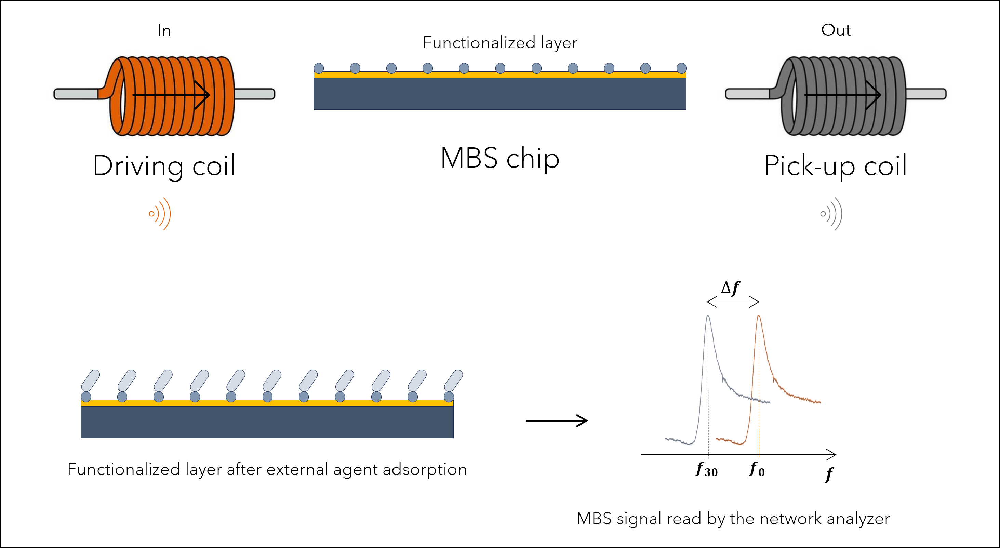
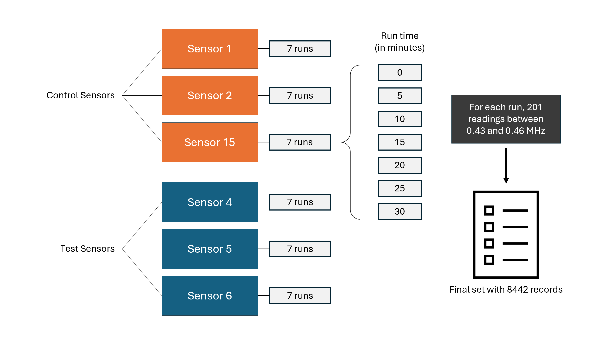
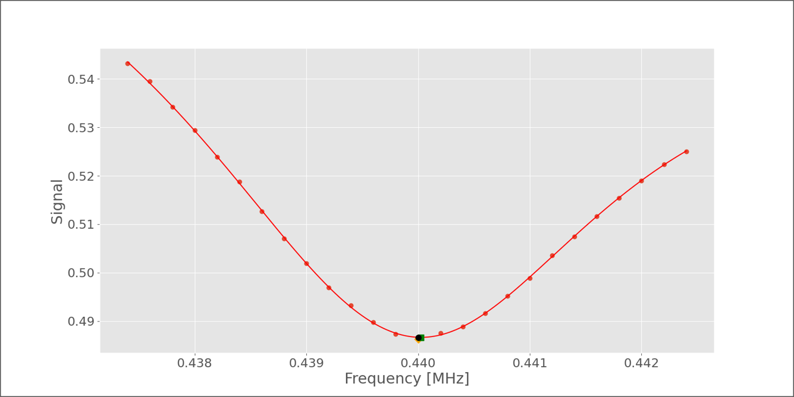
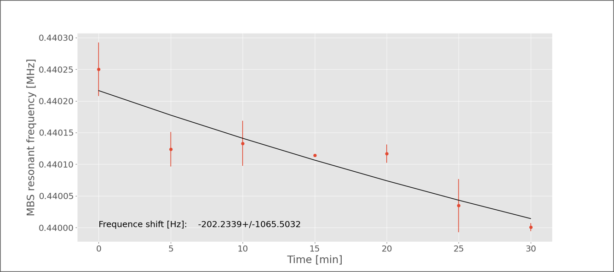
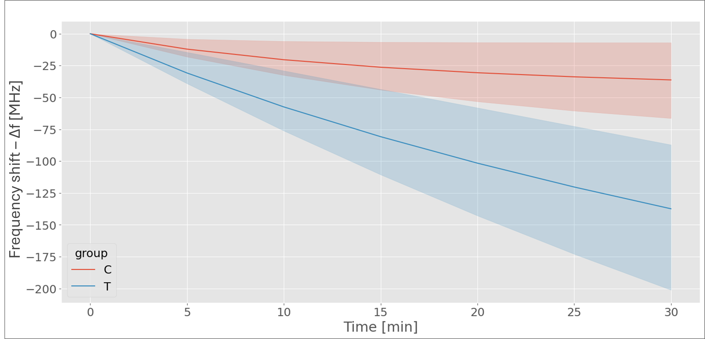

# Summary

Generating, plotting, and analyzing sensor's data is time-consuming. In a context where the demand for rapid diagnostics is increasing, the assistance of intelligent processes that abstract a significant portion of the work is essential. Analix is a software that analyzes data from magnetoelastic sensors subjected to an environment containing an external agent (such as the SARS-CoV-2 virus). Magnetoelastic sensors have a fundamental vibration frequency, which decreases as their mass increases. In developing magnetoelastic sensors with an active surface, these are divided into test and control groups. The test sensors are exposed to a medium containing recombinant protein of SARS-CoV-2, and their response in frequency spaceis registered. Control sensors are tested the same way, but exposed to a medium without the recombinant protein, so no major resonant frequency change is expected. The Analix software precisely determined the sensors' resonant frequency and this allow a safe and fast way to diagnose the presence of an external agent. A machine learning classifier generated a portable model applicable to different scenarios. 

# Statement of need

The primary objective of this work is to develop a software for analyzing data from magnetoelastic sensors, focusing on the efficient detection of pathogens. The software aims to provide a robust tool for rapidly and accurately identifying pathogens that threaten public health, such as viruses and bacteria, using advanced techniques such as statistical data analysis and machine learning algorithms.

The relevance of this approach is evident when considering the backdrop of the pandemic scenario that developed between 2020 and 2022, which continues to manifest its effects even today. Such a context has demonstrated the need for tools that enable the rapid diagnosis of certain diseases, such as COVID-19 and other viral infections, to be obtained swiftly, with high detection efficiency and at a reduced cost.

To achieve this overarching goal, the project aims to evaluate data from functionalized magnetoelastic sensors to detect the presence of recombinant protein of SARS-CoV-2 and to develop a predictive model, using Extreme Gradient Boosting algorithm on resonant frequency data from these sensors, capable of assessing the presence of recombinant proteins with high precision.


# A brief literature review

Over the past decade, several deadly viral epidemics have had a significant impact on global public health, including outbreaks of Ebola, Marburg, Nipah, Zika, Crimean-Congo hemorrhagic fever, COVID-19, and dengue. These epidemics underscore the need for rapid and accurate detection methods and the development of effective drugs and vaccines [@frieden1:2014; @cdc2:2023; @rougeron3:2015; @cdc4:2023; @yadav5:2019; @who6:2018; @leal7:2017; @paho15:2024].

Sensors made with magnetoelastic materials and machine learning models can be an ally in the race for rapid detection solutions. These sensitive, precise, and reliable sensors can operate over various temperatures and frequencies. They are also less susceptible to electromagnetic interference and can be integrated into devices with embedded electronics [@cdc8:2023; @bente9:2013; @who10:2022]. Magnetoelasticity, like magnetostriction, involves the change in magnetization of ferromagnetic materials due to the application of stress or strain. Magnetostriction, discovered by Joule in 1842, consists of the deformation of ferromagnetic materials when exposed to external magnetic fields [@vander32:2000;]. 

Magnetoelasticity is influenced by the magnetostriction constant $\lambda$, the anisotropic constant $K$, and the material magnetization $M$. On the magnetic permeability variation $\frac{d\mu}{d\sigma}$, magnetoelasticity sensitivity to stress is maximized when the applied stress $\lambda \sigma$ approaches $2K/3$, as in the equation [@ludwig33:2002]

$$ 
\frac{d\mu}{d\sigma} = \frac{3 \lambda \mu_0 M^2}{(2K - 3\lambda \sigma)^2}, \text{ to } 2K > 3\lambda \sigma.
$$

Magnetoelastic sensors (MES) utilize the magnetoelastic effect to measure physical quantities such as stress, pressure, temperature, strain, or electric current. They are usually manufactured from amorphous metal alloys, commercially known as Metglas 2826MB and Metglas 2605SC, and can detect mechanical vibrations induced by magnetic fields. These sensors have diverse applications, from wireless monitoring of tires and machine shafts to detecting vibrations in civil constructions and monitoring biological parameters, such as plasma pH in the human body [@grimes16:2011; @jackson17:2019; @ausanio18:2005; @cai34:2000; @baran35:2011; @engdahl36:2000; @sablik37:1993; @szewczyk38:2008; @cullen39:2001; @desmione40:2002; @grimes41:2002; @hernando42:1988; @modzelewski43:1981; @jain44:2001; @croce45:2014; @mori46:2021; @khan47:2017; @kouz48:2000; @narita49:2021].

Flat and rectangular magnetoelastic sensors exhibit a fundamental frequency $f_0$, which depends on the length $(L)$ of the sensor, its modulus of elasticity $(E)$, Poisson’s ratio $(\nu)$, and the density $(\rho)$ of the alloy from which it is made, and it is given by [@sisniega50:2020]

$$f_0 = \frac{1}{2L} \sqrt{\frac{E}{\rho(1 - \nu)}}.$$

Accordingly, magnetoelastic biosensors (MBS) can be applied in monitoring biological parameters and can be used to detect the presence of bacteria and viruses, such as the SARS-CoV-2 coronavirus. Using machine learning for classification can increase the sensitivity and accuracy of diagnosis [@cdc11:2023; @who12:2023; @ms13:2023; @barreto14:2008].

Artificial intelligence and machine learning are fundamental in enhancing MBS based diagnosis. Artificial intelligence enables the development of systems capable of performing tasks that require human intelligence, such as pattern recognition and decision-making. Machine learning, a subfield of artificial intelligence, focuses on developing algorithms that learn from data. Techniques like bootstrap and statistical resampling methods are used to estimate statistics from a data sample, contributing to the analysis and interpretation of sensor signals [@mellit51:2008; @moor52:2006; @mccarthy53:1956; @domingos54:2012; @nilsson56:2013; @bishop57:2006; @macario58:2009; @sas59; @mahesh60:2020; @shalev61:2014; @brownlee62:2016; @monard63:2003; @efron69:2000; @davison70:1997].

# Methodology

The sensors, obtained from Metglas 2826MB3 by Metglas Company, were fabricated into dimensions of 5 mm x 1 mm x 28 μm and coated with chrome and gold using magnetron sputtering [@luiza:2024]. Measurements were conducted using driving and pick-up coils connected to a Keysight E5061B network analyzer, that reads the sensors' response to a variable frequency. 

Figure 1 shows a schematic model of how the reading system is assembled and the measurement of frequency shift after external agents adsorption. 





A dataset comprising two groups, test and control, each containing data from three sensors, is used to illustrate the application of Analix. The test sensors were exposed to a medium containing recombinant proteins of the SARS-CoV-2 virus, whereas the control sensors were placed in an inert medium. Each sensor underwent a 30-minute measurement cycle using a network analyzer, with data collected every 5 minutes, including t = 0, resulting in 7 subsets of data per sensor, with 201 readings per group. The frequency range tested was between 430,000 Hz and 460,000 Hz, encompassing the characteristic resonance frequency of the sensors. The final dataset consisted of frequency and signal data from all sensor cycles for each group, totaling 8442 rows, as shown in Figure 2. 





A hash column was created as a reference field for analysis, combining the group (test or control), sensor number, and signal acquisition time (e.g., T-4-30). Custom software processed the signal versus frequency data, selecting values around the estimated peak and fitting an asymmetric Lorentzian model to the data, as shown in Figure 3. The curve's minimum value was the point of interest for analysis, as it measured the resonant frequency at a specific experiment time. The difference between this frequency and the one at t=0 was used to identify sensor mass changes caused by mass adsorption. Monte Carlo simulations were used to evaluate uncertainties of the point of interest, with 1000 iterations for each sensor in both groups at each time interval. The resulting dataset contained MBS resonant frequency values and their uncertainties, which can then be represented as a function of time, as in Figure 4. 



Lagergren’s model for pseudo-first order adsorption was employed to fit the frequency data over time, facilitating a precise comparison of frequency shifts between test and control sensors [@revellame71:2020]. With model appplied to data, as demonstrated by Figure 4, it is possible to obtain the resonant frequency at a certain time using parameters $f_0$, $a$ and $c$, from Lagergren's equation, given by  

$$
f(t) = f(0) \left(1 - ae^{-ct} \right).
$$

The displacement on resonant frequency was then estimated by $\Delta f_t = f_{30} - f_{0}$.



The bootstrap method was applied to obtain randomly selected data points for the classifier, generating an 8000-point dataset (4000 for each group). This dataset used 80% of the data as the training subset and the remaining 20% as the testing subset. An Extreme Gradient Boosting (XGBoost) algorithm was trained and tuned, considering various parameters such as maximum depth, learning rate, and number of estimators, with five-fold cross-validation [@chen67:2016; @xgboost68:2024].

# Usage

Analix is provided in a Jupyter notebook, and the application is divided in two parts. The first consists of a data analysis routine that captures data from folders and applies fitting techniques to obtain the difference between the resonant frequency t=0 and t=30 minutes. The second part is the classifier routine, which imports the dataset from the analysis script and trains the XGBost algorithm. It is then possible to use the trained model to obtain a diagnosis from newly acquired MBS data. Templates and examples can be found in the [project repository](https://github.com/andreatta-ale/external-agents-detector).

To use the software, network analizer results must be inside a folder, split into *C* and *T* subfolders (control and test). Once the notebook is started, after packages are imported, a window pops up, where it is possible to select the main folder where *C* and *T* subfolders are stored. The notebook can be run cell by cell or in run-all mode. A CSV file that can be imported to the classifier routine will be exported to the result folder. A file named *I_am_here_to_test_the_model.ipynb* is also available to evaluate results either from full experiments or random results from other sources. 


# Discussion

Figure 5 illustrates the separation of resonant frequency bands between the test and control sensors, becoming distinct after 15 minutes of measurement. These bands are delineated by three curves within each group. For the control group, the upper and lower boundaries are defined by the curves corresponding to sensors 1 and 2, respectively, while sensor 15 is represented by the central curve, highlighted in orange. Similarly, for the test group, the boundaries are formed by the curves of sensors 4 and 6, with the central curve, corresponding to sensor 5, highlighted in blue, effectively dividing the region.





This separation becomes even clearer in Figure 6, which demonstrates how the resonant frequency shift increases over time. On the left, it is noticeable that the frequency varies within the collected data, but this variation is not time-dependent. However, when viewed over time, the control sensors displayed a stable trend, whereas the test sensors exhibited significant variation in resonant frequency.  


The proposed strategy proved effective in differentiating test and control sensors groups, highlighting the importance of predictive technologies in the rapid diagnosis of viral diseases.

In this context, Analix can serve as a valuable tool in the development of MBS for detecting other recombinant proteins beyond SARS-CoV-2, with potential applications extending to the detection of harmful bacteria in medical and veterinary settings. Additionally, Analix can assist in interpreting results from experiments involving sensors of different formats, aiding in the assessment of sensitivity to MBS geometry variations. This opens up new avenues for future research and development in disease detection. The source code can be adapted to various sensing and measurement systems, further expanding the range of possible applications for Analix.

# Code review

#### Selecting data folder. It creates a result folder for output saving.


```python
root = Tk()
root.withdraw()
folder_path = filedialog.askdirectory()
print('Folder path: ', folder_path)

file_path = os.path.join(folder_path, '**/*.csv')
result_folder = 'res'
folder = os.path.join(folder_path, result_folder)

if os.path.isdir(folder):
    print('Result folder already exists, cleaning...')
    try:
        shutil.rmtree(folder)
    except OSError as e:
        print(f"Error: {folder} : {e.strerror}")
os.mkdir(folder)
print('Result folder created.')

print('-----------------------------------------\n')
print('Result folder path: ', folder)
print('-----------------------------------------\n')

### Logging
log_file = os.path.join(folder, 'log.txt')

with open(log_file, 'w') as f:
    f.write(f"{datetime.now()} - {folder}")
```


    Folder path:  C:/Users/my_user/Documents/Analix/...
    Result folder already exists, cleaning...
    Result folder created.
    -----------------------------------------
    
    Result folder path:  C:/Users/my_user/Documents/Analix/...
    -----------------------------------------
    
    
#### Acquiring individual file addresses. 
Splits into group, sensor and time, adding a hash column used for filtering data.


```python
files = pd.DataFrame(glob.glob(file_path,recursive = True),columns = ['Path'])

def extract_info(path):
    group = path.split('/')[-1].split('\\')[-3]
    sensor = path.split('/')[-1].split('\\')[-2]
    k = path.rfind('\\')
    time = int(path[k + 1:].replace('.CSV', ''))
    hash = f"{group}-{sensor}-{time}"
    return pd.Series([group, sensor, time, hash])

files[['group', 'sensor', 'time', 'hash']] = files['Path'].apply(extract_info)

addresses = files.rename(columns={'Path': 'address'}).sort_values(
    by=['group','sensor','time','address'], 
    ignore_index=True, 
    ascending=True
)

print('-----------------------------------------\n')

text = 'Analysis'

print(text + '\n')

print('-----------------------------------------\n')

addresses.head()
```

    -----------------------------------------
    
    Analysis
    
    -----------------------------------------


    +---------------------------------+----------+-------+-------+-------+
    |address                          |group     |sensor |time   |hash   |
    +:===============================:+:========:+:=====:+:=====:+:=====:+
    |./data/source_data/res/C/1/0.csv |C         |1      |0      |C-1-0  |
    +---------------------------------+----------+-------+-------+-------+
    |./data/source_data/res/C/1/5.csv |C         |1      |5      |C-1-5  |
    +---------------------------------+----------+-------+-------+-------+
    |./data/source_data/res/C/1/10.csv|C         |1      |10     |C-1-10 |
    +---------------------------------+----------+-------+-------+-------+
    |./data/source_data/res/C/1/15.csv|C         |1      |15     |C-1-15 |
    +---------------------------------+----------+-------+-------+-------+
    |./data/source_data/res/C/1/20.csv|C         |1      |20     |C-1-20 |
    +---------------------------------+----------+-------+-------+-------+


#### Scans the address data frame
The function reads data from each file and combines it into a single data frame that includes both frequency and signal data. It then rescales the frequency values to match the signal's magnitude (by multiplying by $1 \times 10^{-6}$)


```python
def process_path(path):
    group = addresses.loc[path,'group']
    sensor = addresses.loc[path,'sensor']
    time = addresses.loc[path,'time']
    hashed = addresses.loc[path,'hash']

    df_import = pd.DataFrame(pd.read_csv(path, skiprows=range(0, 2)))
    df_import.drop(df_import.columns[2], axis=1, inplace=True)
    df_import.columns.values[0] = 'frequency'
    df_import.columns.values[1] = 'signal'
    df_import['group'] = group
    df_import['sensor'] = sensor                                          
    df_import['time'] = time
    df_import['hash'] = hashed

    return df_import

dfs = addresses.index.map(process_path)
combined_df = pd.concat(dfs, ignore_index=True)

combined_df['frequency'] = combined_df['frequency'] * 1.e-6
combined_df.head()
```

    +----------------+-----------------+----------+-------+-------+-------+
    |frequency       |signal           |group     |sensor |time   |hash   |
    +:===============+================:+:========:+:=====:+:=====:+:=====:+
    |0.4200          |0.5571           |C         |1      |0      |C-1-0  |
    +----------------+-----------------+----------+-------+-------+-------+
    |0.4202          |0.5587           |C         |1      |0      |C-1-0  |
    +----------------+-----------------+----------+-------+-------+-------+
    |0.4204          |0.5601           |C         |1      |0      |C-1-0  |
    +----------------+-----------------+----------+-------+-------+-------+
    |0.4206          |0.5609           |C         |1      |0      |C-1-0  |
    +----------------+-----------------+----------+-------+-------+-------+
    |0.4208          |0.5612           |C         |1      |0      |C-1-0  |
    +----------------+-----------------+----------+-------+-------+-------+
    

Split Lorentzian function, used to fit the model to MBS signal vs frequency data, is given by

$$
f(x; A, \mu, \sigma, \sigma_r) = \frac{2 A}{\pi (\sigma+\sigma_r)} \big[\frac{\sigma^2}{(x - \mu)^2 + \sigma^2} * H(\mu-x) + \frac{\sigma_r^2}{(x - \mu)^2 + \sigma_r^2} * H(x-\mu)\big] + (m x + b).
$$

The function fits a Lorentzian model to each experimental dataset and generates an evaluation dataset based on this model. After fitting, it uses Monte Carlo simulation to optimize and identify the key point of interest: MBS resonant frequency, which assesses the displacement over time during the experiment.


#### Running the fit model builder and the first outputs:


```python
eval_df, param_df = process_data(combined_df, log_file)
```

    [[Model]]
        (Model(linear) + Model(split_lorentzian))
    [[Fit Statistics]]
        # fitting method   = leastsq
        # function evals   = 57
        # data points      = 26
        # variables        = 6
        chi-square         = 1.0762e-06
        reduced chi-square = 5.3809e-08
        Akaike info crit   = -430.004968
        Bayesian info crit = -422.456389
        R-squared          = 0.99987217
    [[Variables]]
        amplitude: -6.5548e-04 +/- 1.1665e-05 (1.78%) (init = 0.000562349)
        center:     0.43904624 +/- 6.0215e-06 (0.00%) (init = 0.4389636)
        sigma:      0.00229330 +/- 3.7278e-05 (1.63%) (init = 0.0025)
        sigma_r:    0.00216150 +/- 2.9597e-05 (1.37%) (init = 0.0025)
        fwhm:       0.00445480 +/- 4.0914e-05 (0.92%) == 'sigma+sigma_r'
        height:    -0.09367237 +/- 8.2562e-04 (0.88%) == 
            '2*amplitude/3.1415927/max(0.0000000, (sigma+sigma_r))'
        slope:     -4.08629682 +/- 0.23477583 (5.75%) (init = 0)
        intercept:  2.36979826 +/- 0.10330544 (4.36%) (init = 0.4819135)
    [[Correlations]] (unreported correlations are < 0.250)
        C(slope, intercept)     = -1.0000
        C(sigma, intercept)     = +0.8389
        C(sigma, slope)         = -0.8350
        C(amplitude, sigma)     = -0.7051
        C(sigma_r, slope)       = +0.6686
        C(sigma_r, intercept)   = -0.6631
        C(center, sigma_r)      = -0.5404
        C(amplitude, sigma_r)   = -0.4793
        C(center, sigma)        = +0.4013
        C(center, slope)        = -0.3272
        C(center, intercept)    = +0.3261
        C(amplitude, intercept) = -0.2817
        C(amplitude, slope)     = +0.2739
        C(sigma, sigma_r)       = -0.2681
    
    
    ----- Results -----
    ---------------------------------------------  ----------------------
    Optimized frequency mean (fmin)                0.4391199030496987
    Optimized frequency standard deviation (fmin)  2.1337644445234708e-05
    Optimized frequency standard error (fmin)      6.747555634978163e-07
    Optimized frequency mean with uncertainties    439120+/-21
    Accuracy of estimated frequency mean / SMC     0.9999343005633774
    ---------------------------------------------  ----------------------


    Eval appended.
    --------------------------------
    
    (...)


A Lagergren model is fitted to the MBS resonant frequency versus time data to obtain a model for frequency shift over time. A detailed report on the model's fit parameters is displayed.


    Summary - Sensor 1  - Control
    ----------------------  -------------------------
    Parameter f0            0.439119680+/-0.000003752
    Parameter a             (1.5927+/-0.9714)e-05
    Parameter c             0.1819+/-0.2855
    Frequency t = 30 [MHz]  0.439112716+/-0.000005673
    Frequency shift [Hz]    -6.9639640+/-4.2551698
    ----------------------  -------------------------
    
    [[Model]]
        Model(fit_model)
    [[Fit Statistics]]
        # fitting method   = leastsq
        # function evals   = 5
        # data points      = 7
        # variables        = 3
        chi-square         = 5.7280e-11
        reduced chi-square = 1.4320e-11
        Akaike info crit   = -172.702881
        Bayesian info crit = -172.865151
        R-squared          = 0.40421449
    [[Variables]]
        f0:  0.43911968 +/- 3.7519e-06 (0.00%) (init = 0.4391197)
        a:   1.5927e-05 +/- 9.7142e-06 (60.99%) (init = 1.592128e-05)
        c:   0.18193020 +/- 0.28553067 (156.95%) (init = 0.1820259)
    [[Correlations]] (unreported correlations are < 0.100)
        C(f0, a) = +0.8246
        C(f0, c) = +0.3355

#### Classification model

As a result, a CSV file containing delta frequency information is exported every time. Once the CSV file is imported into the *Classifier.ipynb* file, the Bootstrap method will be applied to data split into test and control subsets. It helps to keep the main dataset balanced at the end of the bootstrapping process. The model is trained.

```python
# Train-test split
X = bootstrapped.iloc[:, 1:]  # Features
y = bootstrapped.iloc[:, 0]   # Labels

X_train, X_test, y_train, y_test = train_test_split(X, y, test_size=0.20, random_state=42)

X_train

from xgboost import XGBClassifier
from sklearn.metrics import make_scorer, accuracy_score, precision_score, recall_score, f1_score
from sklearn.model_selection import GridSearchCV
import xgboost as xgb
import joblib

# Difining params for optimization
parameters = {
    'objective': ['binary:logistic'],
    'max_depth': [3, 4, 5, 6],
    'learning_rate': [0.001, 0.01, 0.1, 0.2],
    'n_estimators': [50, 100, 200, 300]
}

scoring = {
    'accuracy': 'accuracy',
    'precision': make_scorer(precision_score),
    'recall': make_scorer(recall_score),
    'f1': make_scorer(f1_score)
}

# Creating the model
xgb_clf = xgb.XGBClassifier()

# Creating GridSearchCV with diverse metrics
grid_search = GridSearchCV(
    estimator=xgb_clf, 
    param_grid=parameters, 
    scoring=scoring, 
    refit='accuracy', 
    cv=5
)

# Fitting train data to the model
grid_search.fit(X_train, y_train)

# Evaluation results
results = grid_search.cv_results_

# Best hyperparams
best_params = grid_search.best_params_
print(f'Melhores parâmetros: {best_params}')

# Printing scores
for scorer in scoring:
    print(f"{scorer} scores:")
    print(results[f'mean_test_{scorer}'])

# Saving XGBoost model 
joblib.dump(grid_search, './data/source_data/res/xgboost_model.joblib')
```

After training the classifier algorithm, it can be tested by importing the model to another Jupyter Notebook (*I_am_here_to_test_the_model.ipynb* file is available for that end).


```python
# Read the CSV file into a DataFrame
analysis_data = pd.read_csv('results_to_submit.csv')

# Convert the DataFrame to list
data_to_submit = analysis_data.values.tolist()

loaded_model = joblib.load('./data/source_data/res/xgboost_model.joblib')

# Convert the data to a numpy array and make a prediction
new_test_data = np.array(data_to_submit[5][-2:])

# Data sampling for testing model as imported 
#(delta frequency and standard deviation):
# data_to_submit = [-102.67478924215538, 23.69349016343144]


# Making predicions
prediction = loaded_model.predict(new_test_data.reshape(1, -1))

# Print the prediction
if prediction[0] == 1:
    print(f"External agent detected, prediction for XGB is {prediction.item()} - positive")
else:
    print(f"External agent not detected, prediction for XGB is {prediction.item()} - negative")
```
    External agent detected, prediction for XGB is 1.0 - positive

# Acknowledgements

The authors gratefully acknowledge support from the Brazilian agency Conselho Nacional de Desenvolvimento Científico e Tecnológico (CNPq), Grant No. 302705/2022-8 (C.A.P.), and Grant No. 304602/2022-1 (C.A.). This study was also financed in part by the Coordenação de Aperfeiçoamento de Pessoal de Nível Superior – Brasil (CAPES) – Finance Code 001. Thanks also due to Dr. Mariana Roesch-Ely (Instituto de Biotecnologia at Universidade de Caxias do Sul).

# References